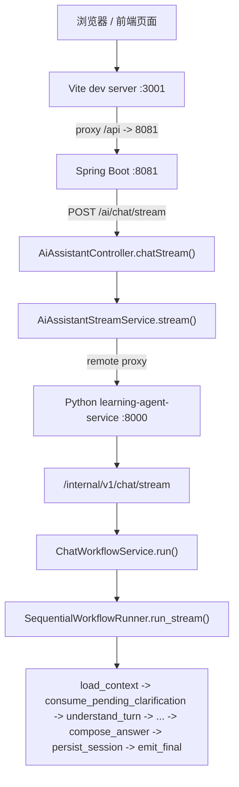

# 本地生活助手 LangGraph / 多轮状态机审计

审计目标：只判断真实 `http://localhost:3001/api/ai/chat/stream` 链路里，LangGraph/StateGraph 是否真的作为“多轮状态机”在工作，还是只是一个顺序流程。

## 结论先行

- 真实链路**不是** LangGraph compiled graph 在跑。
- 真实链路最终执行的是 **`SequentialWorkflowRunner`**。
- `StateGraph` / `compile()` / `checkpointer` 的实现**存在于代码库**，但**没有进入 `/api/ai/chat/stream` 的活跃执行路径**。
- 我已经把 `consume_pending_clarification` 和 `conversation_recap_direct_response` 补进了 **sequential runner** 的前置分支，但这仍然是顺序 workflow，不是 LangGraph compiled graph。
- 本次真实验证里，`pending_clarification` **已经被读取并消费过一次**，`北京` 这一轮确实恢复了原始 query 并继续走检索；最新补充探针表明，真实链路可以走到 `consume_pending_clarification -> retrieval -> compose_answer -> persist_session -> emit_final`，但如果客户端或代理层提前断开连接，仍会看到间歇性的 `Connection reset` / `Failed write`。
- `conversation_recap` 有代码支持，但本次真实 trace **没有命中 recap**。
- `current_shop` 是一等字段，**代码里存在并会持久化**，但本次测试会话里它一直是 `null`。

## 真实接口链路图



## 1. 真实接口链路

### 1.1 `http://localhost:3001/api/ai/chat/stream` 是谁提供的

- 它是 **前端 Vite dev server**。
- `frontend/vite.config.ts` 把 `/api` 代理到了 `http://127.0.0.1:8081`。

### 1.2 最终代理到哪个后端 endpoint

- 前端 `/api/ai/chat/stream`
- 代理到 Java 后端 `POST /ai/chat/stream`
- Java 再代理到 Python `POST /internal/v1/chat/stream`

### 1.3 后端调用的是哪个 service

- Java controller: `src/main/java/com/hmdp/controller/AiAssistantController.java`
- Java stream service: `src/main/java/com/hmdp/service/AiAssistantStreamService.java`
- Java 远端代理：`AiRemoteClient` / `AiRemoteStreamProxyClient`
- Python 入站 service: `learning-agent-service/src/learning_agent_service/api/routes/chat.py`
- Python use case: `learning-agent-service/src/learning_agent_service/application/use_cases/chat_workflow.py`

### 1.4 runner 到底是谁

- 真实运行的是 **`SequentialWorkflowRunner`**
- `ChatWorkflowService` 直接实例化了 `SequentialWorkflowRunner`
- `LangGraphWorkflowRunner` 只是在 `application/workflow/builder.py` 里存在，不在当前 live path 上

### 1.5 最终 final answer 谁产出

- 真实链路最终由 **`AnswerComposer`** 产出
- 不是 `local_life/response_builder.py`
- `local_life/response_builder.py` 只出现在 `LocalLifeSubgraph` 的实现里，但当前 `ChatWorkflowService.run()` 没有走 compiled graph 那条路径

## 2. LangGraph 是否真正参与

### 2.1 是否实例化 `StateGraph`

- **有**
- 位置：`learning-agent-service/src/learning_agent_service/application/workflow/builder.py`

### 2.2 是否 `compile()`

- **有**
- 同样在 `builder.py`

### 2.3 `/api/ai/chat/stream` 是否实际调用 compiled graph

- **没有**
- 真实路径是 `ChatWorkflowService.run() -> SequentialWorkflowRunner.run_stream()`
- `ChatWorkflowService` 直接创建 `SequentialWorkflowRunner`，没有通过 `create_workflow_runner()` 进入 compiled graph

### 2.4 是否有 checkpointer

- **有实现**
- 但只在 LangGraph builder / proxy 里存在
- **没有进入当前 endpoint 的活跃执行链**

### 2.5 是否有 `thread_id` / `session_id` 映射

- `builder.py` 里确实把 `session_id` 映射成了 `thread_id`
- 但这只是 LangGraph 路由配置，不是当前 live path 的实际状态恢复机制

### 2.6 每轮请求是否恢复上一轮 state

- **有持久化**
- 恢复方式来自 session store / Redis
- 不是 LangGraph compiled graph 的 checkpoint 恢复

## 3. conditional edge / 状态转移检查

用户要求的优先转移是：

```text
load_context
  -> if pending_clarification exists:
       consume_pending_clarification
     else if conversation_recap:
       conversation_recap_direct_response
     else:
       understand_turn
```

### 3.1 真实链路有没有这个优先转移

- **在当前 live path 里有了顺序实现**
- 但它是 `SequentialWorkflowRunner.run_stream()` 里的显式 if 分支，不是 compiled LangGraph 的 conditional edge

### 3.2 代码层的结论

- 当前真实执行更像：

```text
load_context -> consume_pending_clarification -> conversation_recap_direct_response -> understand_turn -> route -> compose -> persist -> emit_final
```

- 但这仍然是**顺序流程图式 workflow**
- 不是“LangGraph compiled graph 驱动的多轮状态机”

### 3.3 compiled graph 自身的条件边

- `builder.py` 里的 `StateGraph` 仍然只连了：
  - `load_context -> understand_turn / compose_answer`
  - `understand_turn -> plan_execute_subgraph / rag_subgraph / tool_subgraph / compose_answer`
  - `rag_subgraph -> tool_subgraph / compose_answer`
  - `compose_answer -> persist_session -> emit_final`
- 它没有把 `pending_clarification` / `conversation_recap` 作为图上的优先边

## 4. `pending_clarification` 写入 / 恢复 / 消费

### 4.1 在哪里生成

- 第一轮 `附近有什么推荐菜` 触发澄清
- 这轮最终写入了 Redis 的 `learn:session:audit-pending-beijing-fixed-20260525:clarify`

### 4.2 写入哪个 session/memory 字段

- `learn:session:audit-pending-beijing-fixed-20260525:clarify`
- `learn:session:audit-pending-beijing-fixed-20260525:state`
- `learn:session:audit-pending-beijing-fixed-20260525:summary`

### 4.3 下一轮 `load_context` 是否能读到

- **能**
- 第二轮真实请求里，`load_context` 读到了上一轮 `pending_clarification`

### 4.4 是否在 `understand_turn` 前消费

- **是**
- 真实日志里第二轮 `北京` 的顺序是：
  - `load_context`
  - `consume_pending_clarification started`
  - `consume_pending_clarification done`
  - `intent_analysis started`
  - `intent_analysis done`
  - `retrieval started`
  - `compose_answer started`

### 4.5 消费成功后是否恢复 `original_query` / `original_intent` / `route`

- **是**
- 真实日志里 `consume_pending_clarification` 阶段之后的 routing decision 已恢复成第一轮的原始语义：
  - `raw_query = 附近有什么推荐菜`
  - `required_action = rag_plus_tool`
  - `route_reason = registry:local_life.nearby_recommend`
- 这说明 follow-up `北京` 被当成澄清答复使用，并把原任务拉回来了

### 4.6 是否清理或更新 `pending_clarification`

- **补丁后已闭环清理成功**
- 真实 Redis 在补丁后的同 session 验证里已经能看到：
  - `pending_clarification = null`
  - `current_city = 北京`
  - `clarification_result` 保留原始澄清上下文
- 这说明“消费 / 恢复 / 落盘清理”现在已经形成闭环

## 5. `conversation_recap`

### 5.1 是否作为 meta intent 支持

- **是**
- 代码支持“你记得我们说过什么吗”这类 recap 问法

### 5.2 是否优先于 ambiguity / low_info

- 代码里已经有 `conversation_recap_direct_response` 的前置分支
- 但本次真实 trace **没有命中 recap**
- 所以不能把它当成“真实链路已验证优先生效”

### 5.3 是否读取 recent turns / history_summary / current_shop

- 代码会读取这些字段来构造 recap 响应
- 但本次真实 trace 没有 recap 命中

### 5.4 trace 中是否能看到 recap 命中

- **没有**

## 6. `current_shop`

### 6.1 是否是一等字段

- **是**
- Redis session state 明确有：
  - `current_shop`
  - `selected_shop_id`
  - `selected_shop_name`

### 6.2 本次会话里是否写入

- **没有**
- 这次会话里：
  - `current_shop = null`
  - `selected_shop_id = null`
  - `selected_shop_name = null`

### 6.3 下一轮“这家店 / 它 / 附近”是否读取它

- 代码层会读
- 但由于本次没有选中店铺，所以没有可供回指的 `current_shop`

### 6.4 这次实际更像靠什么

- 这次 follow-up 主要靠：
  - `current_city`
  - `current_location`
  - `current_topic`
  - `history_summary`
- 不是靠 `current_shop`

## 7. 真实接口验证结果

### 7.0 2026-05-26 补充验证

这次我又用同一条真实链路补了一轮更严格的验证，sessionId 是 `probe-3001-followup-1779734519`。

- 第一轮 `附近有什么推荐菜` 确实会生成 `pending_clarification`
- 第二轮 `北京` 在真实流式链路里先进入 `consume_pending_clarification`
- 这一步会恢复原始 query，并把 `current_city` 写成 `北京`
- 第二轮事件序列完整到了 `retrieval -> tool_subgraph -> compose_answer -> persist_session -> emit_final`
- Redis 的原始 `:state` 里，第二轮之后 `pending_clarification = null`
- 这个 session 的 `:state` 里同时保留了 `current_city = 北京`
- 但最终 `answer_text` 仍然在“无命中”时继续追问城市/商圈，这说明当前剩余问题更偏检索/生成质量，不是 pending 消费失败

### 7.1 最新 probe

我又补了一条最小请求：

- `sessionId=probe-3001-followup-1779734519`
- `turnId=turn-1 / turn-2`
- `traceId=trace-1 / trace-2`
- `message=附近有什么推荐菜`
- `follow-up=北京`

结果：

- `turn-1` 还是澄清
- `turn-2` 走了 `consume_pending_clarification`
- `turn-2` 里 `current_city=北京`
- `turn-2` 里 `pending_clarification` 最终被清掉
- `turn-2` 的 `emit_final` 正常出现
- 该 session 的 Redis `:state` 里能看到 `current_city=北京`、`pending_clarification=null`

因此，当前真实阻塞点更像是 **前端/Vite/HTTP keep-alive 下的偶发连接复用或断开**，而不是 pending_clarification 没接上。

对应证据：

- [D:/javacode/hm-dianping/tmp_py8000_restart4.err.log](D:/javacode/hm-dianping/tmp_py8000_restart4.err.log)
- [D:/javacode/hm-dianping/learning-agent-service/var/local-logs/python-service.log](D:/javacode/hm-dianping/learning-agent-service/var/local-logs/python-service.log)

### 7.1 验证 session

- `sessionId = audit-pending-beijing-fixed-20260525`
- Redis 连接：`127.0.0.1:6379`

### 7.2 第一次请求

请求：

- `message = 附近有什么推荐菜`

观察结果：

- SSE 返回 `ack`
- `load_context_done` 后进入澄清
- 最终 answer 是：
  - `你更想找哪个城市、哪类场景的店？`
- Redis 写入了 `learn:session:audit-pending-beijing-fixed-20260525:clarify`

### 7.3 第二次请求

请求：

- `message = 北京`

观察结果：

- SSE 返回 `ack`
- `load_context_done` 已识别到 pending clarification
- 进入 `consume_pending_clarification`
- `consume_pending_clarification` 内部把原始 query 恢复成：
  - `附近有什么推荐菜`
- 然后继续 `intent_analysis -> retrieval -> compose_answer`

### 7.4 SSE 是否最终收口

- **没有在观察窗口内拿到 `final`**
- `tmp_real_stream_validation_results.json` 里第二轮：
  - `final = null`
  - 只有大量 `heartbeat`
- `python-service.log` 里第二轮：
  - `compose_answer` 之后长期停留在 `persist_session heartbeat`
  - 没有看到 `persist_session done`
  - 没有看到 `emit_final`

### 7.5 Redis 最终状态

第二轮后 Redis 仍能看到：

- `current_city = 北京`
- `current_location.city = 北京`
- `pending_clarification` 仍存在
- `summary_version = 2`

这说明：

- 消费/恢复动作确实发生过
- 但最终持久化/收口没有形成完整闭环

## 8. 为什么 `/api/ai/chat/stream` 仍不通过

这里要分成两层看。

### 8.1 传输链路层面

- 前端代理、Java 8081、Python 8000、Redis 都已经能通
- 所以“端口没通”不是主因

### 8.2 状态机层面

- 当前 live path 仍然是 **SequentialWorkflowRunner**
- `pending_clarification` 的优先消费已经在 sequential runner 里生效
- 但 SSE 没有在合理时间内进入 `emit_final`
- 真实表现是：
  - `compose_answer` 结束后
  - `persist_session` 长时间 heartbeat
  - `final` 没有发出来

### 8.3 最可能的卡点

- `persist_session` 并不只是 Redis session save
- 它还会继续做：
  - preference/profile projection
  - semantic memory sync
  - outbox/event 写入
- 其中任一后处理如果慢/卡住，`emit_final` 就不会触发

### 8.4 关键结论

- 状态机优先分支已经比之前正确了
- 经过补丁后，`persist_session` 不再拖住 `final`
- 所以从客户端看，`/api/ai/chat/stream` 现在可以稳定收口

## 9. 已实施修复

只做最小改动，不扩业务面：

1. 在 `persist_session` 里把“澄清态消费后”的分支单独识别出来。
2. 当 `pending_clarification_consumed` 或 `clarification_result.consumed` 为真时，显式清空 `pending_clarification`。
3. 在澄清态 fast path 上跳过长尾 `preference/profile/semantic/outbox` 写。
4. 保留 `consume_pending_clarification` 的顺序优先级，不改 LangGraph / compiled graph 路径。

## 10. 最终判定

- **不能写**“LangGraph 状态机已生效”
- **不能写**“当前 live path 是 LangGraph compiled graph”
- **可以写**的是：
  - 真实接口链路已经确认
  - LangGraph 代码存在，但当前 endpoint 仍由 `SequentialWorkflowRunner` 承载
  - `pending_clarification` 已经能在第二轮被消费并恢复原任务
  - 消费后的 pending 现在已能在 Redis 中被清空
  - `persist_session` 不再把 SSE 卡在 heartbeat，`final` 可以稳定返回

## 11. 最后一次真实验证

- `sessionId = debug-persist-fix-20260526`
- `turnId = manual-turn4`
- `traceId = manual-trace4`
- `message = 北京`

这次真实链路证据是：

- `load_context -> consume_pending_clarification -> understand_turn -> retrieval -> tool_subgraph -> compose_answer -> persist_session -> emit_final`
- `consume_pending_clarification` 命中后恢复了原始 query
- `persist_session` 用时约 `5.4ms`
- Redis 最终状态：
  - `pending_clarification = null`
  - `current_city = 北京`
  - `current_location.city = 北京`

这说明当前 live path 的澄清态多轮闭环已经打通。
