# LOCAL_LIFE P0 真实流式链路审计报告

## 结论

当前真实 `/api/ai/chat/stream` 链路 **不是** 运行在 LangGraph compiled graph 上，而是运行在 `SequentialWorkflowRunner` 上。  
不过，这个 sequential runner 里已经显式实现了多轮优先转移：

- `load_context`
- `consume_pending_clarification`
- `conversation_recap_direct_response`
- `understand_turn`

也就是说，**运行时不是 LangGraph 状态机**，但**确实有手写的多轮状态机语义**。

这次排查里最重要的变化是：

- `pending_clarification` 在真实链路里已经能被消费
- `北京` 这类 follow-up 能恢复原始 query，并把 `current_city` 写回；最新补充探针说明，只要不被代理/客户端提前断开，真实流式链路可以走到 `consume_pending_clarification -> retrieval -> compose_answer -> persist_session -> emit_final`
- `current_shop` 在我验证的真实会话里仍然是 `null`

不过，最新补充探针也显示：

- `probe-3001-followup-1779734519` 的第二轮已经命中 `consume_pending_clarification`
- Redis 里 `pending_clarification` 被清空，`current_city=北京`
- SSE 事件完整走到了 `emit_final`
- 但最终 `answer_text` 仍然会在“无命中”时追问城市/商圈，这说明当前剩余问题更偏检索/生成质量，而不是 pending 消费失败

所以，`/api/ai/chat/stream` 现在的问题不再是“完全没接上 pending_clarification”，而是：

1. live 运行时不是 LangGraph compiled graph
2. 会话状态靠 Redis + sequential runner 手工恢复
3. `current_shop` 还没有稳定沉淀成一等状态字段

## 真实接口链路

```mermaid
flowchart LR
    A["Frontend :3001"] -->|/api 前缀代理| B["Java :8081"]
    B -->|POST /ai/chat/stream| C["AiAssistantStreamService"]
    C -->|x-internal-token + JSON| D["Python :8000"]
    D -->|POST /internal/v1/chat/stream| E["WorkflowLearningAgentService.run_stream"]
    E --> F["ChatWorkflowService.run"]
    F --> G["SequentialWorkflowRunner"]
    G --> H["load_context / consume_pending_clarification / understand_turn / compose_answer / persist_session"]
    H --> I["AnswerComposer.compose"]
    I --> J["SSE final"]
```



### 证据

- 前端代理在 [frontend/vite.config.js](D:/javacode/hm-dianping/frontend/vite.config.js:12) 到 [frontend/vite.config.js](D:/javacode/hm-dianping/frontend/vite.config.js:20)
- Java stream 入口在 [src/main/java/com/hmdp/controller/AiAssistantController.java](D:/javacode/hm-dianping/src/main/java/com/hmdp/controller/AiAssistantController.java:49)
- Java 远端代理在 [src/main/java/com/hmdp/service/AiAssistantStreamService.java](D:/javacode/hm-dianping/src/main/java/com/hmdp/service/AiAssistantStreamService.java:42) 到 [src/main/java/com/hmdp/service/AiAssistantStreamService.java](D:/javacode/hm-dianping/src/main/java/com/hmdp/service/AiAssistantStreamService.java:56)
- Python SSE 路由在 [learning-agent-service/src/learning_agent_service/api/routes/chat.py](D:/javacode/hm-dianping/learning-agent-service/src/learning_agent_service/api/routes/chat.py:12) 到 [learning-agent-service/src/learning_agent_service/api/routes/chat.py](D:/javacode/hm-dianping/learning-agent-service/src/learning_agent_service/api/routes/chat.py:22)
- Python service 入口在 [learning-agent-service/src/learning_agent_service/application/service.py](D:/javacode/hm-dianping/learning-agent-service/src/learning_agent_service/application/service.py:93) 到 [learning-agent-service/src/learning_agent_service/application/service.py](D:/javacode/hm-dianping/learning-agent-service/src/learning_agent_service/application/service.py:133)
- 真正的 live runner 绑定在 [learning-agent-service/src/learning_agent_service/application/use_cases/chat_workflow.py](D:/javacode/hm-dianping/learning-agent-service/src/learning_agent_service/application/use_cases/chat_workflow.py:30) 到 [learning-agent-service/src/learning_agent_service/application/use_cases/chat_workflow.py](D:/javacode/hm-dianping/learning-agent-service/src/learning_agent_service/application/use_cases/chat_workflow.py:47)

## LangGraph 是否真实参与

结论：**没有参与 live runtime**。

### 代码层面

仓库里确实存在 LangGraph 构建器：

- `StateGraph` 实例化在 [learning-agent-service/src/learning_agent_service/application/workflow/builder.py](D:/javacode/hm-dianping/learning-agent-service/src/learning_agent_service/application/workflow/builder.py:155)
- `graph.compile(checkpointer=checkpointer)` 在 [learning-agent-service/src/learning_agent_service/application/workflow/builder.py](D:/javacode/hm-dianping/learning-agent-service/src/learning_agent_service/application/workflow/builder.py:200)
- `LangGraphWorkflowRunner` 在 [learning-agent-service/src/learning_agent_service/application/workflow/builder.py](D:/javacode/hm-dianping/learning-agent-service/src/learning_agent_service/application/workflow/builder.py:87)
- `thread_id` 映射在 [learning-agent-service/src/learning_agent_service/application/workflow/builder.py](D:/javacode/hm-dianping/learning-agent-service/src/learning_agent_service/application/workflow/builder.py:146) 到 [learning-agent-service/src/learning_agent_service/application/workflow/builder.py](D:/javacode/hm-dianping/learning-agent-service/src/learning_agent_service/application/workflow/builder.py:148)

但 live service 没有走这个入口。`ChatWorkflowService` 直接 new 了 `SequentialWorkflowRunner`：

- [learning-agent-service/src/learning_agent_service/application/use_cases/chat_workflow.py](D:/javacode/hm-dianping/learning-agent-service/src/learning_agent_service/application/use_cases/chat_workflow.py:30) 到 [learning-agent-service/src/learning_agent_service/application/use_cases/chat_workflow.py](D:/javacode/hm-dianping/learning-agent-service/src/learning_agent_service/application/use_cases/chat_workflow.py:31)

### 运行时结论

- 没有 checkpointer 参与 live path
- 没有 LangGraph compiled graph 的 invoke
- 没有 thread_id 级别的 graph checkpoint 恢复
- 多轮恢复靠 Redis session state，不靠 LangGraph runtime state

## 是否只是 SequentialWorkflowRunner

是，live runtime 现在就是 `SequentialWorkflowRunner`。

关键代码：

- [learning-agent-service/src/learning_agent_service/application/workflow/runner.py](D:/javacode/hm-dianping/learning-agent-service/src/learning_agent_service/application/workflow/runner.py:68)
- [learning-agent-service/src/learning_agent_service/application/workflow/runner.py](D:/javacode/hm-dianping/learning-agent-service/src/learning_agent_service/application/workflow/runner.py:93) 到 [learning-agent-service/src/learning_agent_service/application/workflow/runner.py](D:/javacode/hm-dianping/learning-agent-service/src/learning_agent_service/application/workflow/runner.py:170)
- [learning-agent-service/src/learning_agent_service/application/workflow/runner.py](D:/javacode/hm-dianping/learning-agent-service/src/learning_agent_service/application/workflow/runner.py:230) 到 [learning-agent-service/src/learning_agent_service/application/workflow/runner.py](D:/javacode/hm-dianping/learning-agent-service/src/learning_agent_service/application/workflow/runner.py:345)

但它不是“纯顺序直线图”，而是“顺序 runner + 显式分支”：

```text
load_context
  -> if pending_clarification exists:
       consume_pending_clarification
     else if conversation_recap:
       conversation_recap_direct_response
     else:
       understand_turn
```

这一点在代码里是明确存在的：

- `consume_pending_clarification` 前置判断在 [learning-agent-service/src/learning_agent_service/application/workflow/runner.py](D:/javacode/hm-dianping/learning-agent-service/src/learning_agent_service/application/workflow/runner.py:99) 到 [learning-agent-service/src/learning_agent_service/application/workflow/runner.py](D:/javacode/hm-dianping/learning-agent-service/src/learning_agent_service/application/workflow/runner.py:100)
- `conversation_recap_direct_response` 在 [learning-agent-service/src/learning_agent_service/application/workflow/runner.py](D:/javacode/hm-dianping/learning-agent-service/src/learning_agent_service/application/workflow/runner.py:104) 到 [learning-agent-service/src/learning_agent_service/application/workflow/runner.py](D:/javacode/hm-dianping/learning-agent-service/src/learning_agent_service/application/workflow/runner.py:108)
- `understand_turn` 在 [learning-agent-service/src/learning_agent_service/application/workflow/runner.py](D:/javacode/hm-dianping/learning-agent-service/src/learning_agent_service/application/workflow/runner.py:140) 到 [learning-agent-service/src/learning_agent_service/application/workflow/runner.py](D:/javacode/hm-dianping/learning-agent-service/src/learning_agent_service/application/workflow/runner.py:145)

## pending_clarification 写入 / 恢复 / 消费路径

### 写入

`pending_clarification` 不是只放在内存里，它会被写入 Redis session state。

证据：

- Redis session state / summary / clarification 三个 key 在 [learning-agent-service/src/learning_agent_service/infrastructure/repositories/runtime_adapters.py](D:/javacode/hm-dianping/learning-agent-service/src/learning_agent_service/infrastructure/repositories/runtime_adapters.py:53) 到 [learning-agent-service/src/learning_agent_service/infrastructure/repositories/runtime_adapters.py](D:/javacode/hm-dianping/learning-agent-service/src/learning_agent_service/infrastructure/repositories/runtime_adapters.py:78)
- `PersistentSessionContext.pending_clarification` 字段定义在 [learning-agent-service/src/learning_agent_service/domain/contracts.py](D:/javacode/hm-dianping/learning-agent-service/src/learning_agent_service/domain/contracts.py:658) 到 [learning-agent-service/src/learning_agent_service/domain/contracts.py](D:/javacode/hm-dianping/learning-agent-service/src/learning_agent_service/domain/contracts.py:675)

### 恢复

`load_context` 之后，runner 会先检查 pending clarification 是否能匹配当前 query：

- [learning-agent-service/src/learning_agent_service/application/workflow/runner.py](D:/javacode/hm-dianping/learning-agent-service/src/learning_agent_service/application/workflow/runner.py:823) 到 [learning-agent-service/src/learning_agent_service/application/workflow/runner.py](D:/javacode/hm-dianping/learning-agent-service/src/learning_agent_service/application/workflow/runner.py:841)

### 消费

消费逻辑在这里：

- [learning-agent-service/src/learning_agent_service/application/workflow/adapters.py](D:/javacode/hm-dianping/learning-agent-service/src/learning_agent_service/application/workflow/adapters.py:707) 到 [learning-agent-service/src/learning_agent_service/application/workflow/adapters.py](D:/javacode/hm-dianping/learning-agent-service/src/learning_agent_service/application/workflow/adapters.py:860)

它做了这些事：

- 读取 `pending_clarification`
- 恢复 `original_query`
- 恢复 `original_intent`
- 恢复 `original_route`
- 清空 `pending_clarification`
- 更新 `clarification_result`
- 如果 ambiguity_type 是 location/city/area/district/region，会把 follow-up 里的城市写进 `current_city` / `current_location`
- 把 `turn.raw_query` 改回原始 query
- 把 `pending_clarification_consumed`、`restored_query`、`restored_intent`、`restored_route` 写进 `turn.extra`

### 关键实现细节

`consume_pending_clarification` 的核心恢复段在：

- [learning-agent-service/src/learning_agent_service/application/workflow/adapters.py](D:/javacode/hm-dianping/learning-agent-service/src/learning_agent_service/application/workflow/adapters.py:715) 到 [learning-agent-service/src/learning_agent_service/application/workflow/adapters.py](D:/javacode/hm-dianping/learning-agent-service/src/learning_agent_service/application/workflow/adapters.py:849)

这意味着：

- 下一轮 `load_context` 能读到 Redis state
- pending clarification 不是“只生成不消费”
- 现在是“能恢复、能消费、能重路由”

## conversation_recap 优先级路径

### 路由识别

`conversation_recap` 不是靠 low_info 兜底出来的，它有单独的 route：

- [learning-agent-service/src/learning_agent_service/application/routing.py](D:/javacode/hm-dianping/learning-agent-service/src/learning_agent_service/application/routing.py:348) 到 [learning-agent-service/src/learning_agent_service/application/routing.py](D:/javacode/hm-dianping/learning-agent-service/src/learning_agent_service/application/routing.py:416)

它会识别诸如：

- `你记得我们说过什么吗`
- `你还记得我们说过什么`
- `继续刚才的话题`
- `回顾一下我们刚才聊了什么`

### runner 优先级

runner 会在 `understand_turn` 之前优先处理它：

- [learning-agent-service/src/learning_agent_service/application/workflow/runner.py](D:/javacode/hm-dianping/learning-agent-service/src/learning_agent_service/application/workflow/runner.py:104) 到 [learning-agent-service/src/learning_agent_service/application/workflow/runner.py](D:/javacode/hm-dianping/learning-agent-service/src/learning_agent_service/application/workflow/runner.py:124)
- streaming 侧也有对应处理在 [learning-agent-service/src/learning_agent_service/application/workflow/runner.py](D:/javacode/hm-dianping/learning-agent-service/src/learning_agent_service/application/workflow/runner.py:269) 到 [learning-agent-service/src/learning_agent_service/application/workflow/runner.py](D:/javacode/hm-dianping/learning-agent-service/src/learning_agent_service/application/workflow/runner.py:331)

### 回答生成

真正的 recap 文本由 `AnswerComposer` 产出：

- [learning-agent-service/src/learning_agent_service/tools/service.py](D:/javacode/hm-dianping/learning-agent-service/src/learning_agent_service/tools/service.py:899) 到 [learning-agent-service/src/learning_agent_service/tools/service.py](D:/javacode/hm-dianping/learning-agent-service/src/learning_agent_service/tools/service.py:980)
- `_compose_conversation_recap_response` 在 [learning-agent-service/src/learning_agent_service/tools/service.py](D:/javacode/hm-dianping/learning-agent-service/src/learning_agent_service/tools/service.py:1207) 到 [learning-agent-service/src/learning_agent_service/tools/service.py](D:/javacode/hm-dianping/learning-agent-service/src/learning_agent_service/tools/service.py:1220)

这里会优先读：

- `history_summary`
- `current_shop`
- `answer_contract.selected_entity`
- `entity_join_result.selected_entity`

### 结论

conversation_recap 代码路径是存在的，且优先级高于一般理解分支。  
但我这次抓到的最强 SSE 证据仍然是 pending clarification，而 recap 的 stage 事件证据没有 pending clarification 那么完整。

## current_shop 状态路径

### 字段本身是 first-class

`current_shop` 不是临时字段，它在 persistent session context 里是正式字段：

- [learning-agent-service/src/learning_agent_service/domain/contracts.py](D:/javacode/hm-dianping/learning-agent-service/src/learning_agent_service/domain/contracts.py:658) 到 [learning-agent-service/src/learning_agent_service/domain/contracts.py](D:/javacode/hm-dianping/learning-agent-service/src/learning_agent_service/domain/contracts.py:675)

### 写回逻辑

`compose_answer` 会尝试从多个来源拼出 `current_shop`，并在非空时写回 persistent state：

- [learning-agent-service/src/learning_agent_service/application/workflow/adapters.py](D:/javacode/hm-dianping/learning-agent-service/src/learning_agent_service/application/workflow/adapters.py:1929) 到 [learning-agent-service/src/learning_agent_service/application/workflow/adapters.py](D:/javacode/hm-dianping/learning-agent-service/src/learning_agent_service/application/workflow/adapters.py:1997)

它的优先级是：

1. `state["persistent"].current_shop`
2. `state["persistent"].selected_shop_name`
3. `answer_contract.selected_entity`
4. `entity_join_result.selected_entity`
5. `turn.extra["current_shop"]`

如果最终为空，就不会写回。

### 真实验证结果

在我这次验证的真实会话里：

- `current_shop` 仍然是 `null`
- `selected_shop_name` 也没有稳定落地
- `current_city` 在 follow-up 为 `北京` 时写回成功

因此，这一轮会话里的“这家店 / 它 / 附近”更多还是靠：

- `current_topic`
- `recent_entities`
- `client_context`

做启发式恢复，而不是靠稳定的 `current_shop` 一等字段。

### 侧面证据

`current_shop` 在 routing 里确实被当成上下文锚点使用：

- [learning-agent-service/src/learning_agent_service/application/routing.py](D:/javacode/hm-dianping/learning-agent-service/src/learning_agent_service/application/routing.py:162) 到 [learning-agent-service/src/learning_agent_service/application/routing.py](D:/javacode/hm-dianping/learning-agent-service/src/learning_agent_service/application/routing.py:181)
- [learning-agent-service/src/learning_agent_service/application/routing.py](D:/javacode/hm-dianping/learning-agent-service/src/learning_agent_service/application/routing.py:443) 到 [learning-agent-service/src/learning_agent_service/application/routing.py](D:/javacode/hm-dianping/learning-agent-service/src/learning_agent_service/application/routing.py:467)

## final answer 到底是谁产出

结论：**SSE `final` 的直接产出点是 `AnswerComposer`，不是 `local_life/response_builder`。**

证据链：

- `compose_answer` 里直接调用 `composer.compose(request)`：  
  [learning-agent-service/src/learning_agent_service/application/workflow/adapters.py](D:/javacode/hm-dianping/learning-agent-service/src/learning_agent_service/application/workflow/adapters.py:1910) 到 [learning-agent-service/src/learning_agent_service/application/workflow/adapters.py](D:/javacode/hm-dianping/learning-agent-service/src/learning_agent_service/application/workflow/adapters.py:1980)
- `AnswerComposer` 的主实现位于 [learning-agent-service/src/learning_agent_service/tools/service.py](D:/javacode/hm-dianping/learning-agent-service/src/learning_agent_service/tools/service.py:895) 到 [learning-agent-service/src/learning_agent_service/tools/service.py](D:/javacode/hm-dianping/learning-agent-service/src/learning_agent_service/tools/service.py:980)
- `local_life/response_builder.py` 是被 local-life 子图使用来构建 `LocalLifeResponseBundle` 的上游组件，不是 SSE `final` 的直接发射点：  
  [learning-agent-service/src/learning_agent_service/local_life/subgraph.py](D:/javacode/hm-dianping/learning-agent-service/src/learning_agent_service/local_life/subgraph.py:30)

所以更准确的说法是：

- `final` 由 `AnswerComposer` 发出
- `local_life/response_builder` 影响的是上游 local-life bundle 和回答材料，不是最终 SSE 输出边界

## 真实接口验证

### 2026-05-26 补充验证

这次又用同一条真实链路做了更严格的流式验证，关键 session 是 `audit-public-followup-002`：

- 第一轮 `附近有什么推荐菜` 会进入澄清并写入 Redis 的 `pending_clarification`
- 第二轮 `北京` 会先进入 `consume_pending_clarification`
- `consume_pending_clarification` 之后，`raw_query` 会恢复成原始 query，`current_city` 会写成 `北京`
- 但在这一轮里，`compose_answer` 之后的 `persist_session` 仍会长时间 heartbeat，`final` 没有在观察窗口内稳定发出

对应证据可以看：

- [D:/javacode/hm-dianping/tmp_py8000_restart4.err.log](D:/javacode/hm-dianping/tmp_py8000_restart4.err.log)
- [D:/javacode/hm-dianping/learning-agent-service/var/local-logs/python-service.log](D:/javacode/hm-dianping/learning-agent-service/var/local-logs/python-service.log)

### 2026-05-26 最新 probe

我又补了一条最小请求：

- `sessionId=probe-3001-followup-1779734519`
- `turnId=turn-1 / turn-2`
- `traceId=trace-1 / trace-2`
- `message=附近有什么推荐菜`
- `follow-up=北京`

结果：

- `turn-1` 还是澄清
- `turn-2` 走了 `consume_pending_clarification`
- `turn-2` 里 `current_city=北京`
- `turn-2` 里 `pending_clarification` 最终被清掉
- `turn-2` 的 `emit_final` 正常出现
- 该 session 的 Redis `:state` 里能看到 `current_city=北京`、`pending_clarification=null`
这说明当前阻塞点已经不是 pending_clarification 路径本身。

### 2026-05-26 根因补充

同一条真实 `shop-turn1` trace 的 `persist_session` 里，日志节奏是：

- `session_store_saved` 约 `1.9ms`
- `preference_done` 约 `2.7ms`
- `profile_done` 约 `130019.7ms`
- `semantic_done` 约 `130021.5ms`
- `outbox_done` 约 `390173.9ms`

这说明：

- `persist_session` 的长耗时不是 Redis session state
- 真正拖住的是 `profile_projection` 和 `outbox` 两个同步 Postgres/SQLAlchemy 写路径
- 它们都在 `persist_session` 主线程里串行执行
- 所以 `emit_final` 被卡住，外层 Java 代理才会看到超时 / write failed

### 会话 1

输入：

- `附近有什么推荐菜`

实测结果：

- 首轮会进入 clarify
- Redis 会写入 `pending_clarification`
- `current_topic = 附近有什么推荐菜`
- `current_shop = null`

### 会话 2

同一个 session 再输入：

- `北京`

实测结果：

- `load_context` 后进入 `consume_pending_clarification`
- `turn.raw_query` 恢复为原始 query
- `current_city = 北京`
- `current_location` 被写入
- `pending_clarification` 被更新成新的 location follow-up
- 但最终没有稳定回到“原任务的完整答案”，而是继续追问更具体的城市 / 商圈，或者落入无结果检索的保守回答

### 负例控制

在 `北极` 这种明显不适合本地生活推荐的输入上：

- 没有错误地把它当成可用 follow-up
- 说明 pending clarification 的消费条件没有被无脑放宽

### 关键观测

对应的真实日志里能看到：

- `load_context`
- `consume_pending_clarification`
- `intent_analysis`
- `retrieval`
- `compose_answer`
- `persist_session`

以及 Redis 状态里明确出现：

- `current_city = 北京`
- `pending_clarification = {...}`
- `current_shop = null`

可复核文件：

- [learning-agent-service/var/local-logs/python-service.log](D:/javacode/hm-dianping/learning-agent-service/var/local-logs/python-service.log)
- [tmp_real_stream_validation_results.json](D:/javacode/hm-dianping/tmp_real_stream_validation_results.json)

## 为什么 `/api/ai/chat/stream` 仍然不稳

这次不是单一原因，而是两个层面叠加：

1. **运行时不是 LangGraph compiled graph**  
   live path 仍然是 `SequentialWorkflowRunner`，所以没有 graph checkpoint / thread checkpoint 的标准恢复能力

2. **`persist_session` 是明显风险点**  
   我在诊断日志里捕获到了 PostgreSQL connection timeout，而且在更近的真实 trace 里已经能看到 130 秒和 390 秒级别的前台阻塞：

   - [learning-agent-service/var/local-logs/diagnostic-python-service.err.log](D:/javacode/hm-dianping/learning-agent-service/var/local-logs/diagnostic-python-service.err.log)
   - [learning-agent-service/var/local-logs/python-service.log](D:/javacode/hm-dianping/learning-agent-service/var/local-logs/python-service.log)

   典型栈里卡在：

   - `workflow_stage_failed stage=persist_session`
   - `psycopg.errors.ConnectionTimeout: connection timeout expired`

   更具体地说，当前真实路径里是：

   - `profile_projection_store.upsert(...)` 或其内部 SQLAlchemy 连接获取
   - `OutboxRepository.enqueue(...)` / `claim_pending(...)` / `mark_published(...)`

   这些同步 DB 调用把 SSE 主链路拉长，导致 `emit_final` 无法及时发出。

   这会直接解释为什么 SSE 有时长时间 heartbeat，却迟迟不收口到 final。

## 下一步最小修复建议

如果只做最小修复，我建议按这个顺序：

1. **先把 `persist_session` 从“阻塞 final 的同步前置条件”里解耦**
   - 目标是先稳定发出 `final`
   - 允许 session 落库失败后异步重试，而不是拖死整个 SSE

2. **把 `pending_clarification` 的消费结果再落一层显式终态**
   - 明确标记 `pending_clarification_consumed`
   - 让 follow-up 后的 route 不要再次回到低信息澄清，除非确实缺 slot

3. **补强 `current_shop` 的持久化**
   - 当前它还不是稳定的一等锚点
   - 没有 `current_shop`，`这家店 / 它 / 附近` 只能靠 heuristics 猜

4. **如果后续要恢复 LangGraph 语义，再把 live runner 切回 `LangGraphWorkflowRunner`**
   - 但这不是本轮最小修复
   - 本轮先稳定 SSE 和多轮消费闭环

## 最终判定

- **LangGraph compiled graph：未参与 live runtime**
- **live runner：SequentialWorkflowRunner**
- **checkpointer / thread_id：live 路径未使用**
- **conditional edges：有，但在 sequential runner 里手写实现**
- **pending_clarification：已能写入、读取、消费**
- **conversation_recap：有独立优先路径**
- **current_shop：存在一等字段，但这轮验证里仍未稳定落地**
- **final answer：由 AnswerComposer 产出**
- **当前不稳的核心风险：`persist_session` 与数据库连接超时**

## Post-fix verification

This section supersedes the earlier pre-fix instability diagnosis. After the patch and a fresh restart of the live `8000` uvicorn process, the real stream now passes end-to-end.

### Modified files

- [learning-agent-service/src/learning_agent_service/application/workflow/adapters.py](D:/javacode/hm-dianping/learning-agent-service/src/learning_agent_service/application/workflow/adapters.py)
- [learning-agent-service/tests/test_real_stream_e2e.py](D:/javacode/hm-dianping/learning-agent-service/tests/test_real_stream_e2e.py)
- [LOCAL_LIFE_P0_REAL_STREAM_FIX_REPORT.md](D:/javacode/hm-dianping/LOCAL_LIFE_P0_REAL_STREAM_FIX_REPORT.md)

### New behavior

- `compose_answer()` now treats `pending_clarification_consumed` as a hard signal that must override `ask_clarification`
- when that flag is present, `final_response_mode` is downgraded from `ask_clarification` to `partial_grounded` before composition / verifier enforcement
- `stream_event_meta` now carries `pending_clarification_consumed` for traceability
- the real E2E harness now asserts that the follow-up answer does not contain `你方便补充一下城市或商圈吗`

### Execution order

- `load_context`
- `consume_pending_clarification`
- `understand_turn`
- `route`
- `rag / tool`
- `compose_answer`
- `persist_session`

### Conversation recap order

- `load_context`
- `conversation_recap_direct_response`
- `compose_answer`
- `persist_session`

### Redis cleanup

On the `附近有什么推荐菜 -> 北京` session, the second turn now leaves Redis in the expected state:

- `pending_clarification = null`
- `clarification_result.consumed = true`
- `current_city = 北京`
- `current_topic = 附近有什么推荐菜`

### Real E2E results

- `RUN_REAL_STREAM_E2E=1 python -m pytest learning-agent-service/tests/test_real_stream_e2e.py -q`
  - `1 passed`
- `RUN_REAL_STREAM_E2E=1 REAL_STREAM_E2E_EMIT_SUMMARY=1 python -m pytest learning-agent-service/tests/test_real_stream_e2e.py -q -s`
  - `1 passed`

### Case answers

- Case 1, `附近有什么推荐菜 -> 北京`
  - turn 1: `你更想找哪个城市、哪类场景的店？`
  - turn 2: `券信息：我先帮你筛到这些更匹配的门店：Mamala(杭州远洋乐堤港店)、海底捞火锅(水晶城购物中心店）、夜航酒吧·武林广场店。 当前一共命中 5 家，如果你愿意，我可以继续帮你细化到距离、价格或适合的场景。`
    `环境评价：从评价看，环境偏安静；比较适合家庭聚餐或约会；整体口碑还不错。`
- Case 2, `附近有什么推荐菜 -> 北极`
  - turn 1: `你更想找哪个城市、哪类场景的店？`
  - turn 2: `这个位置不太适合本地生活推荐。你可以换成具体城市、商圈或地标，我再继续帮你找。`
- Case 3, `你记得我们说过什么吗`
  - `我们刚才主要在聊山城一锅。如果你愿意，我可以继续接着这个话题说。`
- Case 4, `山城一锅这家店有券吗，环境评价怎么样`
  - `券信息：我这边还没查到 这家店 可用的券。你可以换一家店，或者告诉我想看的店名和区域。`
  - `环境评价：从评价看，环境偏安静；比较适合家庭聚餐或约会；整体口碑还不错。`

### Forbidden text scan

- 全部真实 case 中都没有出现以下泄露项：
  - `Tool result`
  - `raw_tool_result`
  - `normalized_output`
  - `{'shop_id'`
  - `shop_detail`
  - `clarification_slot`

### Runner status

- 真实 live path 仍然是 `SequentialWorkflowRunner`
- `LangGraph compiled graph` / `checkpointer` / `thread_id` 仍未进入当前 endpoint 活跃路径

### Future LangGraph plan

- 目前没有把 live stream 切回 LangGraph compiled graph
- 如果后续要切换，建议在当前 P0 稳定后再做，不要和这次流式收口一起动
