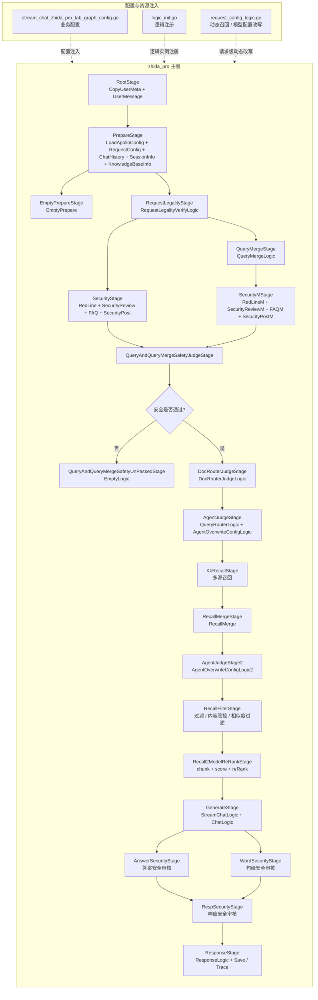

# zhida_pro 架构图

> 说明：
> - 这份文档用 Mermaid 画 `zhida_pro` 的架构，结构和前面的 `langgraph_architecture.txt` 保持一致。
> - 这里展示的是 `AispChatService -> 图配置 -> graph.RunGraph -> zhida_pro 主图` 的真实链路。
> - 其中 `zhida_pro` 是一条多阶段图编排链路，不是单个 LLM 问答节点。

## 1. 现网入口链路图

```mermaid
flowchart LR
  U[前端 / gRPC 调用] --> S[AispChatService.StreamChat()]
  S --> T{req.GetType()\n== ZHIDA_PRO_TAB ?}
  T -->|是| C[getConfigMap()\ngetAbParamMap()]
  C --> CFG[ChatZhidaProTabLogicConfig\n- GetGraphBizType()\n- GetBizConfigMap()\n- GetOverwriteBizConfigMap()\n- GetOverwriteStrategyId()]
  CFG --> R[graph.RunGraph()\nRunGraphByCallback()]
  R --> G[StreamChatZhidaProGraph()\nzhida_pro 主图]
  G --> O[输出 ChatResponse / stream event]
  T -->|否| X[走其他图配置]
```

### 1.1 入口说明

- `AispChatService.StreamChat()` 是统一入口。
- `req.GetType()` 命中 `proto.ChatType_ZHIDA_PRO_TAB` 时，会加载 `zhida_pro` 的专用图配置。
- 真正执行编排的是 `graph.RunGraph(...)`，底层对应 `StreamChatZhidaProGraph(...)`。

## 2. 内部模块图



### 2.1 核心阶段职责

- `RootStage`：补齐用户元信息和用户输入。
- `PrepareStage`：加载 Apollo 配置、请求配置、历史对话、会话信息、知识库信息。
- `RequestLegalityStage`：做请求合法性校验。
- `SecurityStage` / `SecurityMStage`：在不同阶段做查询安全审核。
- `QueryMergeStage`：对用户输入进行 query merge。
- `DocRouterJudgeStage`：判断是否走指定文档还是知识召回。
- `AgentJudgeStage`：选择路由策略，并按策略覆盖配置。
- `KbRecallStage`：执行多源召回，包括知乎、Arxiv、Wiki、个人知识库、内部知识库和指定文档。
- `RecallFilterStage`：做内容管控、空内容过滤、安全过滤、tag 过滤、simhash 过滤。
- `Recall2ModelReRankStage`：把召回结果切 chunk、打分、重排。
- `GenerateStage`：调用生成模型输出答案。
- `AnswerSecurityStage`、`WordSecurityStage`、`RespSecurityStage`：做答案、句子和响应层的安全审核。
- `ResponseStage`：构造最终响应，并保存对话记录、trace 和 query 结果。

## 3. 配置层关系

```mermaid
flowchart LR
  A[chat_service.go\n入口选择图] --> B[stream_chat_zhida_pro_tab_graph_config.go\n业务配置]
  B --> C[StreamChatZhidaProGraph()\n图结构编排]
  C --> D[logic_init.go\n逻辑注册到 logic_store]
  B --> E[RequestConfigLogic\n根据知识库 / 深度思考 / 内部 QA 动态改写配置]
  E --> C
```

## 4. 一句话总结

`zhida_pro` 不是一个简单的聊天 agent，而是一条以 `AispChatService` 为入口、以 `StreamChatZhidaProGraph()` 为主编排器、通过配置层动态控制召回 / 生成 / 安全审核 / 响应输出的多阶段图系统。

## 5. 代码位置

- [chat_service.go](D:/javacode/hm-dianping/aisp-core-master/pkg/portal/grpc/chat_service.go)
- [stream_chat_zhida_pro_graph.go](D:/javacode/hm-dianping/aisp-core-master/pkg/graph/graph/api/stream_chat_zhida_pro_graph.go)
- [stream_chat_zhida_pro_tab_graph_config.go](D:/javacode/hm-dianping/aisp-core-master/pkg/graph/graph/conf/stream_chat_default_tab_conf/stream_chat_zhida_pro_tab_graph_config.go)
- [logic_init.go](D:/javacode/hm-dianping/aisp-core-master/pkg/business/zhida_pro/graph/resources/logic_init.go)
- [request_config_logic.go](D:/javacode/hm-dianping/aisp-core-master/pkg/business/zhida_pro/graph/logic/prepare/request_config_logic.go)
