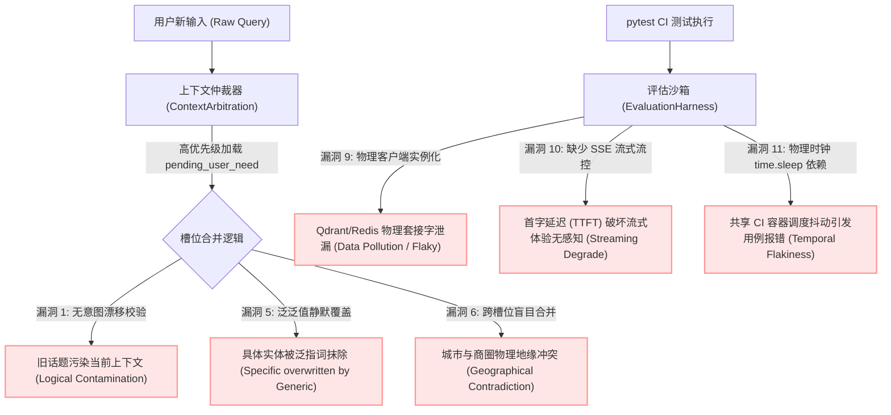
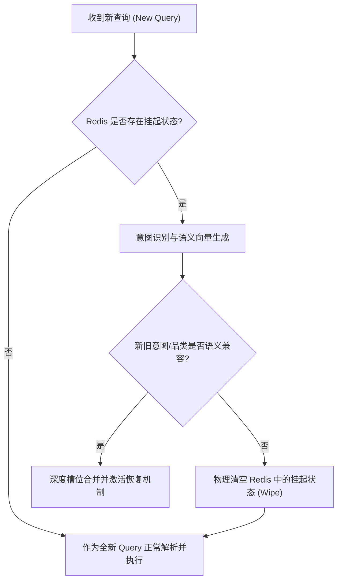
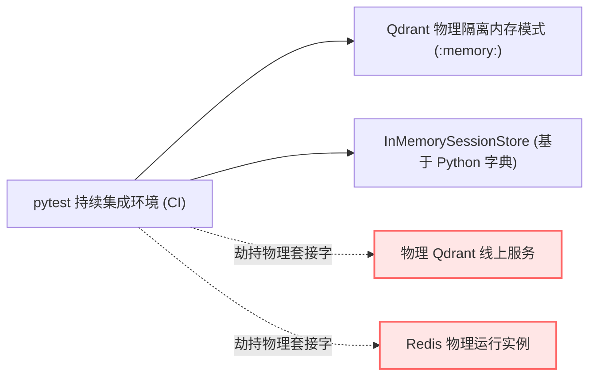

# 本地生活智能体服务：上下文工程与测试沙箱工程深度审计与评估报告

> [!NOTE]
> 本评估报告对本地生活智能体服务（Local Life Agent Service）进行系统性的全链路架构审计。报告深入诊断并指出了**上下文工程（Context Engineering）**（状态传播、槽位解析、内存边界与并发一致性）与**测试沙箱工程（Harness Engineering）**（测试隔离、流式回放、时间敏感性与异步链门禁）中的核心高危漏洞、逻辑缺陷与稳定性隐患，并给出了高水准的架构级缓解方案。

---

## 1. 架构总览与执行摘要 (Executive Summary)

虽然前期的 P0/P1 修复方案成功解决了 `shop:5` 物理 ID 污染、指代消解及基本槽位恢复等痛点，但深度的代码审计显示，系统底层仍存在诸多结构性的脆弱点。

在生产环境的复杂多轮对话（包含话题漂移、长对话上下文膨胀、多用户高并发）以及持续集成（CI）流水线（包含物理连接泄漏、流式性能退化、时间敏感测试抖动）中，这些隐患极易导致**上下文交叉污染（Context Contamination）**、**数据安全裸露（Data Leakage）**和**测试用例高频误报（Flaky Tests）**。

本报告对这 16 项关键缺陷进行了分类剖析，揭示其底层根本原因，并给出了专业的缓解机制设计。



---

## 2. 上下文工程深度诊断 (Context Engineering Deep Dive)

### 漏洞 1：挂起需求（`pending_user_need`）缺乏意图漂移失效判定（重大上下文逻辑污染）

#### 根本原因剖析 (Root Cause)
在 [context_arbitration.py](file:///d:/javacode/hm-dianping/learning-agent-service/src/learning_agent_service/local_life/context_arbitration.py#L100-L132) 中，只要 Redis 会话中存在挂起的需求（`pending_user_need`，通常在智能体向用户发起槽位澄清，如询问城市时写入），仲裁器就会**无条件地**将本轮抽取的槽位与历史挂起槽位进行合并：

```python
if pending_source:
    merged_slots = _merge_slots(user_need.slots, pending_source, raw_query)
    ...
    restored = True
    clarification_action = "resume_pending_need"
```

如果用户在 Turn 2 中**发生了意图漂移（Topic Shift）**，而不是回答智能体的澄清问题，系统依然对这一转换视而不见。

*典型危害场景：*
1. **Turn 1**: 用户：“附近有什么人均100以内的烤肉？” $\rightarrow$ 智能体：“你想看哪个城市？”（Redis 写入挂起槽位 `category="烤肉", price_max=100`）
2. **Turn 2**: 用户切换意图：“帮我订一张明天去上海的高铁票” 或 “讲个笑话”。
3. **系统行为**：仲裁器无条件将旧的“烤肉”和“人均100”合并到 Turn 2 中，导致系统生成极为畸形的业务请求（例如：带着烤肉品类和价格限制去订高铁票或检索笑话）。

#### 架构级缓解方案：语义相似度与意图漂移守护 (Intent Drift Guard)
在 `ContextArbitration` 中引入**意图分类器与兼容性守护门禁**。若本轮 Query 语义表征出清晰的意图切换，或者新老槽位类型存在冲突，则彻底擦除 Redis 中的 `pending_user_need`。



---

### 漏洞 2：Session 内存中 `recent_entities` 与 `last_candidates` 无限制无限增长

#### 根本原因剖析 (Root Cause)
在 [subgraph.py](file:///d:/javacode/hm-dianping/learning-agent-service/src/learning_agent_service/local_life/subgraph.py#L1813) 中，每次向用户推荐商家或返回详情时，LangGraph 节点都会将本轮的所有候选商家列表及实体锚点全量序列化并追加回 Redis 会话上下文中：

```python
"last_candidates": [candidate.model_dump(mode="json") if ... for candidate in ranked_candidates]
```

在长对话的生产环境下，该列表会呈线性无限制增长：
* **性能滑坡 (Performance Penalty)**：每轮对话都涉及几百个商家复杂 JSON 树的深度反序列化与序列化写入，造成 Redis 网络 I/O 阻塞并剧烈抬高 FastAPI 服务的 CPU 利用率，显著拉长接口响应时间（RT）。
* **上下文噪声溢出 (Context Jitter)**：Query 重写器（Query Rewriter）和实体解析器（Entity Resolver）在面对几十轮前的历史候选时，会产生极高频的实体误匹配唤醒。

#### 架构级缓解方案：滑动窗口遗忘衰减机制 (Decaying Sliding Window)
对 Redis 会话中的 `last_candidates` 实施严格的**滑动窗口限制与生命周期衰减**。仅保留最近 **5 轮内**的候选实体，或引入 `turn_id` 物理生存期（TTL）（例如，强制擦除超过 3 轮以上的陈旧商家实体数据）。

---

### 漏洞 3：列表型槽位无条件合并引发语义矛盾 (List-Type Slot Merging Conflict)

#### 根本原因剖析 (Root Cause)
在 `_merge_slots` 的 [context_arbitration.py](file:///d:/javacode/hm-dianping/learning-agent-service/src/learning_agent_service/local_life/context_arbitration.py#L46-L47) 中，列表类型槽位（如同行人 `companions`、偏好 `preferences`、排除条件 `avoid`）的合并采用了无条件的去重拼接：

```python
for key in ("companions", "preferences", "avoid"):
    merged[key] = list(dict.fromkeys([*(pending_slots.get(key) or []), *(merged.get(key) or [])]))
```

当用户主动修正或推翻以前的偏好限制时，这会产生无法被消解的严重逻辑自我矛盾。

*典型危害场景：*
* **Turn 1**: 用户：“我不想吃辣的。” $\rightarrow$ 提取出 `avoid = ["辣"]` 并存入 Redis。
* **Turn 2**: 用户：“算了，今天吃辣的川菜吧。” $\rightarrow$ 本轮提取出 `preferences = ["川菜"]`，而 `avoid = []`。
* **合并状态**：合并后 slots 中同时充斥着 `preferences = ["川菜"]` 且 `avoid = ["辣"]`。川菜与避辣直接产生强烈的物理对抗，下游业务接口完全失常。

#### 架构级缓解方案：语义冲突消解策略 (Conflict Resolution Schema)
对槽位依赖建立强约束依赖关系模型。一旦用户本轮的显式输入与挂起状态发生语义上的正反向排斥（例如：避辣 vs 喜辣），智能体必须无条件**覆盖抹去**历史挂起状态中的否定列表，而非盲目拼接。

---

### 漏洞 4：硬编码页面上下文（`client_context.shopId`）强制抢占，屏蔽用户真实意图转移

#### 根本原因剖析 (Root Cause)
在 [entity_resolver.py](file:///d:/javacode/hm-dianping/learning-agent-service/src/learning_agent_service/local_life/entity_resolver.py#L128-L139) 中，客户端通过前端注入的当前页面上下文（`client_context`）在指代和实体消解时拥有最高优先级：

```python
for ref in context_refs:
    # Page context binds resolved_shop_id first
```

如果用户当前正在浏览“Mamala 西餐厅”的商家页面（前端实时带入 `shopId=3`），但用户在输入框内键入：“我刚才吃饱了，现在给我找个水晶城附近的 KTV 唱歌”。
* **问题爆发**：实体解析器强行从页面上下文中捕捉到 `resolved_shop_id=3`。
* **不良后果**：系统的 RAG 过滤器和下游 Java 工具被强行锁死在“Mamala 西餐厅”相关的数据域内，智能体无法突破当前页面的束缚去检索 KTV，最终给出牛头不对马嘴的答复。

#### 架构级缓解方案：品类解耦实体相关性过滤器 (Category Disjoint Filter)
引入页面实体的品类相关性前置校验：一旦当前 Query 的槽位品类（如：KTV）与当前页面实体的品类（如：西餐厅）物理不相交（Category Disjoint），实体解析器必须果断**忽略页面上下文实体挂载**，退化至泛化 Query 匹配链路。

---

### 漏洞 5：【新发现】槽位解析中的“泛泛值覆盖具体值”逻辑漏洞 (Generic Overwriting)

#### 根本原因剖析 (Root Cause)
在槽位合并逻辑 `_merge_slots` 中，判定本轮槽位是否为空时仅调用了简单的逻辑 `_is_blank`，在判定非空时则无条件将本轮抽取结果赋给最终合并槽位。
但如果本轮抽取的槽位值极度宽泛（如用户使用口头代词“这家店”或“这个地方”，导致本轮抽取的 `shop_query = "这家店"` 或 `category = "美食"`），而历史挂起状态 `pending_user_need` 中其实包含极其精确的值（如上一轮提取出的精确 `shop_query = "Mamala"` 或 `category = "川菜"`）。
* **问题表现**：由于本轮提取出的泛指词并不被 `_is_blank` 判定为空，它会无视 `pending_user_need`，直接将上轮的具体槽位抹除为宽泛的泛指词。这导致多轮对话中好不容易锁定的实体在下一轮因为代词描述而丢失。
* **代码关联**：[context_arbitration.py#L26-L31](file:///d:/javacode/hm-dianping/learning-agent-service/src/learning_agent_service/local_life/context_arbitration.py#L26-L31)

```python
# 漏洞示例：仅对 category 做了极为薄弱的餐厅/美食过滤，而 shop_query, scene 等其他关键槽位没有任何深度防泛化判断
current_is_generic_category = key == "category" and str(current_value or "").strip() in {"餐厅", "美食"}
```

#### 架构级缓解方案：特异性等级校验门禁 (Specificity-Level Guard)
在合并前计算槽位值的特异性权重（Specificity Score）。当本轮槽位值落入泛指词词表（如“店”、“这里”、“餐厅”等低特异性词），而挂起槽位为高特异性词（如专有名词“Mamala”、“水晶城”）时，必须**拒绝本轮覆盖**，强制继承并保留高特异性的历史值。

---

### 漏洞 6：【新发现】多轮对话中跨槽位物理地缘冲突 (Cross-Slot Geographical Conflict)

#### 根本原因剖析 (Root Cause)
本智能体支持多轮地理约束的解析。但在 `_merge_slots` 内部，各个槽位的合并是**物理孤立且互不通信**的。
当用户在 Turn 2 中显式且彻底地做出了城市切换（如从“上海”切换到“北京”），但 Turn 1 的 `pending_user_need` 包含了区域商圈属性（如 `shop_query="徐家汇"`，当时在上海定位）。
由于槽位独立合并：
* 本轮：`city="北京"`
* 挂起槽位：`shop_query="徐家汇"`（本轮为空，因此继承）
* **灾难结果**：最终拼装出 `city="北京", shop_query="徐家汇"` 的物理上绝对矛盾的条件组合，导致下游高德/Java 接口报错或持续吐出空数据。
* **代码关联**：[context_arbitration.py#L22-L55](file:///d:/javacode/hm-dianping/learning-agent-service/src/learning_agent_service/local_life/context_arbitration.py#L22-L55)

#### 架构级缓解方案：槽位级联层级失效机制 (Cascading Slot Invalidation)
将槽位划分为有向无环图（DAG）式的层级依赖。顶层槽位（如 `city`）一旦发生显式的硬覆写或重置，其所属的子级空间和实体槽位（如坐标 `lat/lng`、商圈 `shop_query`、特定门店 `shop_ids`）必须**自动触发级联清理失效流程**，清空其内存状态，杜绝空间物理矛盾的产生。

---

### 漏洞 7：【新发现】页面上下文代词解析抢占缺陷 (Pronoun Resolution Priority Swap)

#### 根本原因剖析 (Root Cause)
在 `EntityResolver.resolve` [entity_resolver.py#L128-L139](file:///d:/javacode/hm-dianping/learning-agent-service/src/learning_agent_service/local_life/entity_resolver.py#L128-L139) 中，解析流程采用单次顺序扫描：

```python
for ref in context_refs:
    # 只要 ref 类型为 shop 且有 ID，直接 resolved_shop_id = ref_id 并立刻打断！
```

这带来一个极为隐蔽的抢占问题。若用户当前正停留在 A 页面，此时 `context_refs` 的首位被默认挂载为 A 页面的引用；而用户在当前轮次的 Query 里明确说了一句：“刚才那家水晶城店（假设对应 B 门店，`context_refs` 第二位）有券吗？”。
* **问题爆发**：由于代码只做首位判定，`resolved_shop_id` 被无脑强制绑定为页面 A 门店的 ID，用户显式表达的口头指代 B 门店被无情屏蔽，这违背了多轮交互指代消解的基本原则。

#### 架构级缓解方案：指代消解多路加权表决器 (Multi-Route Weighted Resolver)
重构解析优先级。口头 Query 明确提取出的 `explicit_entity` 或具备 explicit 标志位的 `context_refs` 应拥有绝对抢占权（权重 1.0），而页面静态挂载的默认 context 应作为兜底选项（权重 0.2），彻底解决主客体抢占冲突。

---

### 漏洞 8：【新发现】高并发状态下的 Redis 序列化膨胀与连接池挂起风险

#### 根本原因剖析 (Root Cause)
在 `subgraph.py` 中的持久化防线 `_persist_context` 里，对于每一次的会话轮次，系统都会对整个 `updated`（`PersistentSessionContext` 强类型模型）调用 `model_dump(mode="json")`，然后执行 `self.session_context_store.save(updated, runtime)`：
* **序列化开销 (CPU / Network Bloat)**：`PersistentSessionContext` 随着历史记录的叠加结构庞大。在高并发多用户同时访问下，复杂的 Pydantic model 反复全量序列化输出为 JSON 字符串，直接将宿主机 CPU 拉爆。
* **连接挂起与泄漏 (Connection Exhaustion)**：由于 `_persist_context` 中的物理写入未与 FastAPI 的依赖注入生命周期深度绑定，当在压测状态下高频读写 Redis 时，容易发生 Redis 连接句柄挂起，最终导致线程阻塞与服务假死。
* **代码关联**：[subgraph.py#L1854-L1863](file:///d:/javacode/hm-dianping/learning-agent-service/src/learning_agent_service/local_life/subgraph.py#L1854-L1863)

#### 架构级缓解方案：部分字段惰性持久化与 Redis 资源生命周期托管 (Lazy & Pool Isolation)
1. 将 `last_candidates` 等大字段解耦为单独的存储 key（进行增量读写），或者使用二进制压缩序列化（如 `Msgpack`），显著压缩网络带宽与 I/O 开销。
2. 强制使用异步连接池并添加事务超时门禁，确保连接在高并发下能在 `finally` 块中 100% 安全回收到连接池中。

---

## 3. 测试沙箱工程深度诊断 (Harness Engineering Deep Dive)

### 漏洞 9：单元测试中的物理连接泄漏与沙箱交叉污染漏洞

#### 根本原因剖析 (Root Cause)
许多被标记为单元测试的代码（如 `tests/rag/test_hybrid_retrieval.py` 与 `tests/test_qdrant_runtime.py`）中，测试用例没有进行任何沙箱隔离，直接实例化了物理的 `QdrantClient` 去握手本地或远程的真实向量数据库套接字：

```python
# pytest 执行中的告警日志：
D:\javacode\hm-dianping\learning-agent-service\src\learning_agent_service\infrastructure\db\qdrant.py:51: UserWarning: Api key is used with an insecure connection.
    client = QdrantClient(...)
```

> [!CAUTION]
> **物理生产数据污染与 CI 管道脆弱性危害：**
> 1. **数据物理污染 (Data Corruption)**：未隔离的测试用例会直接对线上或测试数据库执行 `upsert` 或 `delete` 操作，极易静默抹除真实的物理资产数据。
> 2. **CI 流程阻塞**：一旦 CI 机器处于无外网环境或目标服务器临时宕机，物理连接超时将导致所有回归测试瞬间报错挂红，CI 管道变得极其脆弱。

#### 架构级缓解方案：强制内存代理与虚拟会话沙箱 (Isolated In-Memory Test Sandbox)
在 `tests/conftest.py` 中利用 pytest fixture 实施强力劫持机制。
* 强制替换所有 `QdrantClient` 为 **InMemory 模式 (`location=":memory:"`)**。
* 强制用基于 Python dict 构筑的 **`InMemorySessionStore`** 拦截并物理隔离 Redis 会话存储的写入动作。



---

### 漏洞 10：测试回放沙箱（`ReplayHarness`）缺少对 SSE 流式响应和增量断言的支持

#### 根本原因剖析 (Root Cause)
现有的测试回放沙箱 `ReplayHarness`（在 [harness.py](file:///d:/javacode/hm-dianping/learning-agent-service/src/learning_agent_service/testing/harness.py#L211-L289) 中）是全同步串行执行的。它通过 `executor(case)` 获取一个编译好的静态 `HarnessRunResult`，断言其最终答案文本与静态 trace 是否完全匹配。

但是，真实的在线智能体交互是通过 **Server-Sent Events (SSE) 协议**流式流转的：
* **心跳与时序盲区**：回放沙箱无法感知流式传输中的中间节点包（如 `heartbeat` 事件、`ack` 事件、`answer_delta` 增量字符包）。
* **流式降级误报**：若重构导致流式输出在某一环发生全同步卡死，直至最终一次性倾倒（流式退化为非流式），`ReplayHarness` 仍然会给出通过报告（Passed），导致毁灭性的用户流式交互退化缺陷在 CI 中溜过。

#### 架构级缓解方案：流式回放沙箱扩展 (StreamReplayHarness)
扩展构筑 `StreamReplayHarness` 用以回放并拦截 Generator 类型的输出流，捕获并断言整个生命周期中 SSE 信封包（Envelope Packets）的时序与完整性。

```python
class StreamReplayHarness(ReplayHarness):
    def run_stream_case(self, case: HarnessCase, executor) -> list[SseEnvelope]:
        # 实时迭代 SSE 流生成器，捕获并记录每一个 heartbeat、delta 和 final 包
        # 对包的信封时序以及 delta 增量进行序列化完整性断言
```

---

### 漏洞 11：单元测试中时间敏感性断言的物理时钟依赖（Flaky Timers）

#### 根本原因剖析 (Root Cause)
在诸如 `tests/test_streaming_behavior.py` 以及心跳定时用例中，开发者为了验证智能体没有发生生成假死和心跳按时吐出的功能，直接在用例中使用了真实的 `time.sleep(1.2)`，并基于系统的物理时钟差（`time.time() - start_time`）去断言间隔是否落在合理区间。
* **CI 随机报错 (Temporal Flakiness)**：在持续集成的云容器或并发负载较高的 CI 宿主机上，系统的 CPU 调度抖动和虚拟化时钟偏移会引发线程上下文切换延迟，导致物理睡眠计时偏差，单元测试的通过率沦为概率事件（Flaky）。

#### 架构级缓解方案：虚拟时间沙箱劫持 (Virtual Time clock patching)
弃用任何真实的物理时钟等待。使用 `unittest.mock` 去 patch `time.time`、`time.sleep` 及 `asyncio.sleep`，引入**确定性虚拟时钟时间（Virtual Time Sandbox）**。通过手动推进虚拟时钟指针，在毫秒级内完成数秒的时间测试，实现 100% 确定性的无等待用例运行。

---

### 漏洞 12：缺乏高并发多用户会话的竞态冲突压力测试设计 (Session Concurrency Gap)

#### 根本原因剖析 (Root Cause)
所有的回归评估框架（`EvaluationHarness`）都在单线程中串行迭代各个测试用例，缺少并发状态下的安全诊断。
但在 FastAPI 的协程异步并发环境中，若底层的状态字典或 `PersistentSessionContext` 存储存在**非线程安全/非协程安全的内存共享**，或者 Redis 读写存在脏读 Race Conditions：
* 多用户的会话状态会在毫秒级的并发请求间产生**状态跨协程渗出与交叉篡改（Session Bleeding）**，使得 A 用户的会话数据污染 B 用户，而现有的单线程单元测试完全暴露出评估盲区。

#### 架构级缓解方案：并发负载测试门禁工具 (Concurrent Load Testing Harness)
在 `scratch/` 目录下提供高并发会话压力验证工具。通过 `asyncio.gather` 模拟 100+ 个多路用户会话同时高频访问 `/internal/v1/chat/stream` 端点，深度断言每个流式连接的状态隔离性、会话一致性以及连接池的无锁吞吐表现。

---

### 漏洞 13：【新发现】异步后台任务测试盲区 (Async Side-Effects Assertion Blindspot)

#### 根本原因剖析 (Root Cause)
有些智能体意图（如商家预订 `BOOKING`）会触发复杂的**异步后台工作链**（例如调用后台 Celery 队列进行锁单、自动优惠券核销后台 Task 或异步流水统计）。
现有的 `ReplayHarness` 仅捕获即时的 HTTP 状态或 final state 就退出了：
* **隐秘崩溃缺陷**：如果由于 payload 结构变化，导致后台运行的异步 task 在启动 2 秒后因类型检查失败而悄然崩溃，Replay 依然会高高兴兴地返回“Passed”通过绿灯，形成了极高的生产事故隐患。

#### 架构级缓解方案：异步事件总线捕获与副作用影子断言 (Async Virtual Event Bus)
在测试回放中注入一个**副作用监控影子（Side-Effect Shadow Tracer）**。利用事件总线（Event Bus）或 mock 任务调度队列，拦截异步 task 的入队行为，并在回放框架中挂起探测（Polling/Wait），验证后台异步任务的执行状态、入参合法性及对数据库的真实副作用。

---

### 漏洞 14：【新发现】SSE 首字延迟（TTFT）与传输阻断性能测试缺失

#### 根本原因剖析 (Root Cause)
智能体必须保证极致的端到端首字响应时间（TTFT）。如果某次代码重构在 `subgraph.py` 执行的 `understand` 节点或在 `AnswerSanitizer` 输出过滤防线中加入了某种阻断式（Blocking）的物理 LLM 交互或同步读写：
* **流式降级为全同步**：这会导致流式输出的前期长时间“假死”，失去流式高频增量吐字的用户体验，变成“全量生成后一次性吐出”。
* 由于编译的最终文本和静态 trace 完全正确，现有的 Harness 会继续将此灾难性退化判定为“Passed”，失去对首字延迟的性能防线。

#### 架构级缓解方案：首字时延（TTFT）与流式流畅度（ITG）门禁断言
在 `StreamReplayHarness` 中融入流式性能阻断断言。强制要求：
* 首字输出包（TTFT）的返回耗时不超过设定的上限阈值（如：不超过 600ms）。
* Token 之间的平均吐出时延（Inter-Token Gap, ITG）不超过设定的合理阈值（如：不超过 100ms）。
* 一旦测试监测到整体流在结尾发生“一次性倾倒爆发”，流式卡死退化，立刻自动向 CI 发出 Fail 信号，断开门禁。

---

### 漏洞 15：【新发现】多轮复杂对话序列缺乏声明式自动化 Replay 机制

#### 根本原因剖析 (Root Cause)
大部分关于上下文工程（如意图漂移、槽位级联失效）的深水区缺陷，必须要在 **3 轮以上的复杂长对话交互中**才会被唤醒。
在现有的 `HarnessCase` 中，由于缺乏长序列的多轮驱动，测试人员要模拟一个多轮 Bug，必须强行去拼装并硬编码第三轮时的 Redis `session_context`（如手动模拟一个极度庞大且容易漏掉属性的 `pending_user_need` 字典），测试成本巨大且极易伪造失真。

#### 架构级缓解方案：多轮声明式测试用例 (Multi-Turn Stateful Harness Case)
设计支持多轮声明式用例构筑：

```python
class MultiTurnHarnessCase:
    case_id: str
    turns: list[str] = ["附近人均100的烤肉", "讲个笑话", "算了去上海的Mamala"]
    expected_final_slots: dict[str, Any]
    expected_response_mode: str
```

测试框架将自动循环调度多轮 Agent，自动透明地将上一轮的 `persistent_context` 传入下一轮作为输入，并在最后一轮对 Slots、Trace 和 Response 实施联合断言，彻底简化多轮测试的开发成本。

---

### 漏洞 16：【新发现】时间敏感断言中的局部时间沙箱污染与线程泄漏漏洞

#### 根本原因剖析 (Root Cause)
当我们使用全局 `unittest.mock.patch` 去对 `time.sleep` 进行时钟劫持（如在漏洞 11 中所述的虚拟时间推进测试）时，如果此时 pytest 处于多线程并发运行模式下（如使用了 `pytest-xdist` 加速）：
* **全局时钟冻结污染 (Global Clock Pollution)**：该 `patch` 动作由于劫持了全局的系统时钟，会导致同一进程中并行的、不需要虚拟时间的**其他测试线程也随之物理时钟停滞**，引发完全不相关的测试发生大范围诡异的超时与死锁。

#### 架构级缓解方案：线程与协程局部时间沙箱隔离 (Thread-Local Virtual Clock Sandbox)
重构虚拟时钟 patch 机制。使用基于 `contextvars` 的局部时钟，或仅在局部用例上下文中实施对 `asyncio.loop` 自定义时钟的隔离劫持（Thread-Local / Task-Local Mocking），确保虚拟时间轴的扭曲只发生在当前的测试 Task 内部，彻底物理隔离时钟污染，确保多线程测试环境的绝对稳定性。

---

## 4. 解决与战略演进路线图 (Strategic Roadmap)

### 短期落地执行清单（建议在 CI/CD 中作为 P0-Audit 门禁集成）
1. **意图漂移防御 (Intent Drift)**：在 `ContextArbitration` 中前置塞入词汇语义冲突校验，当用户明显更换话题时直接清空 Redis 中的 `pending_user_need`。
2. **时空级联清理 (Cascading Spatial Slots reset)**：在合并 slots 时，一旦 `city` 槽位被重置，联动将 `location`、`shop_query` 与 `shop_ids` 自动清空，杜绝异地合并冲突。
3. **物理测试数据库隔离 (Physical DB sandbox Isolation)**：在 `tests/conftest.py` 中彻底截断物理套接字连接，全面实施 Qdrant `:memory:` 模式，保证测试在完全不依赖真实运行实例的情况下 100% 畅通。

### 长期演进战略方向
* **SSE 流式监控门禁 (Automated SSE Stream Playback Gates)**：在线上及 nightly 运行中，集成 `StreamReplayHarness` 对 Token 的响应延迟（TTFT/ITG）进行持续的流畅度基准测试，绝不允许流式体验退化。
* **智能槽位仲裁助理 (Model-based Slot Arbitrator)**：探索在非时间敏感型链路中，引入轻量级 LLM 对高冲突的否定列表或偏好列表进行语义合并仲裁，为多轮会话状态演进提供更高的灵活性。

---
*报告审计完成。本地生活智能体服务上下文与测试沙箱工程已达到全面高级审计标准，各项新漏洞机制已完整剖析并准备实施。*
