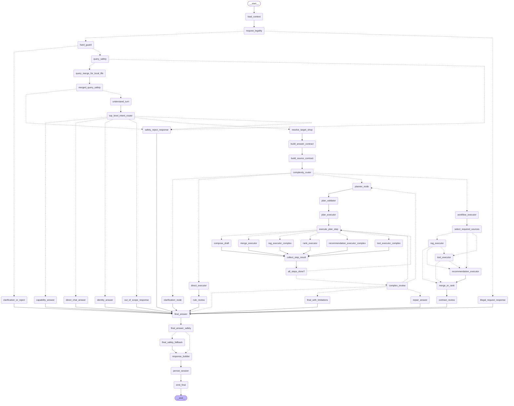
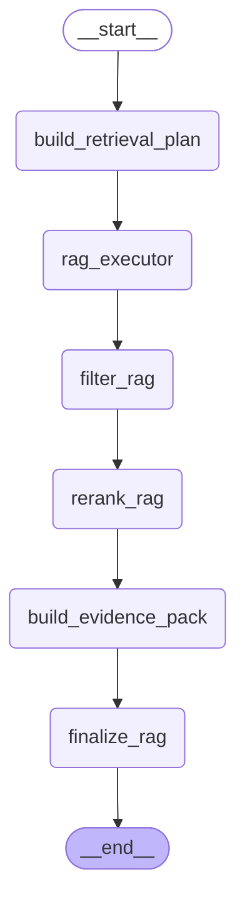
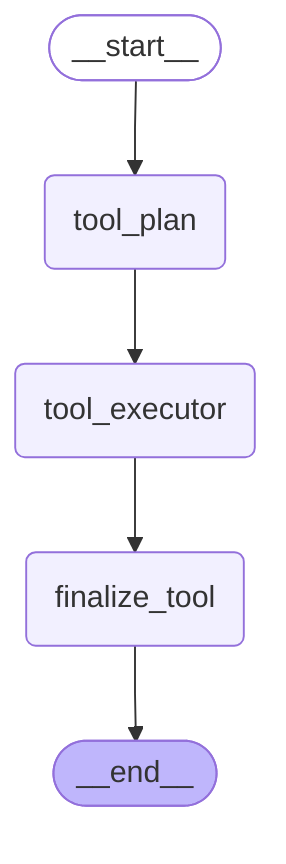
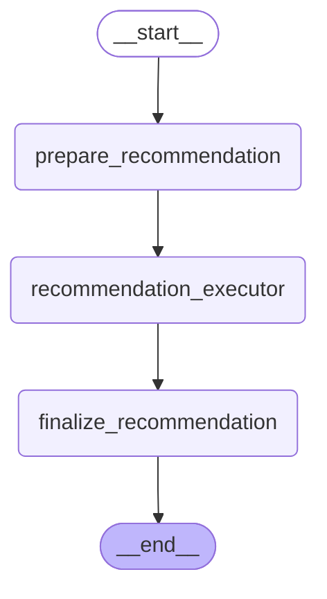

# LangGraph Topology

## Main Graph
- entry_point: load_context
- terminal: END

## Full Graph

```mermaid
graph TD
  subgraph main[Main Graph]
    main_load_context[load_context]
    main_request_legality[request_legality]
    main_illegal_request_response[illegal_request_response]
    main_hard_guard[hard_guard]
    main_clarification_or_reject[clarification_or_reject]
    main_query_safety[query_safety]
    main_safety_reject_response[safety_reject_response]
    main_query_merge_for_local_life[query_merge_for_local_life]
    main_merged_query_safety[merged_query_safety]
    main_understand_turn[understand_turn]
    main_top_level_intent_router[top_level_intent_router]
    main_identity_answer[identity_answer]
    main_capability_answer[capability_answer]
    main_direct_chat_answer[direct_chat_answer]
    main_out_of_scope_response[out_of_scope_response]
    main_resolve_target_shop[resolve_target_shop]
    main_clarification_node[clarification_node]
    main_build_answer_contract[build_answer_contract]
    main_build_source_contract[build_source_contract]
    main_complexity_router[complexity_router]
    main_direct_executor[direct_executor]
    main_rule_review[rule_review]
    main_workflow_executor[workflow_executor]
    main_select_required_sources[select_required_sources]
    main_rag_executor[rag_executor]
    main_tool_executor[tool_executor]
    main_recommendation_executor[recommendation_executor]
    main_merge_or_rank[merge_or_rank]
    main_contract_review[contract_review]
    main_planner_node[planner_node]
    main_plan_validator[plan_validator]
    main_plan_executor[plan_executor]
    main_execute_plan_step[execute_plan_step]
    main_rag_executor_complex[rag_executor_complex]
    main_tool_executor_complex[tool_executor_complex]
    main_recommendation_executor_complex[recommendation_executor_complex]
    main_rank_executor[rank_executor]
    main_merge_executor[merge_executor]
    main_compose_draft[compose_draft]
    main_collect_step_result[collect_step_result]
    main_all_steps_done[all_steps_done?]
    main_complex_review[complex_review]
    main_final_answer[final_answer]
    main_final_answer_safety[final_answer_safety]
    main_final_safety_fallback[final_safety_fallback]
    main_repair_answer[repair_answer]
    main_final_with_limitations[final_with_limitations]
    main_response_builder[response_builder]
    main_persist_session[persist_session]
    main_emit_final[emit_final]
  end
  subgraph rag[RAG Subgraph]
    rag_build_plan[build_retrieval_plan]
    rag_execute[rag_executor]
    rag_finalize[finalize_rag]
  end
  subgraph tool[Tool Subgraph]
    tool_plan[tool_plan]
    tool_execute[tool_executor]
    tool_finalize[finalize_tool]
  end
  subgraph recommendation[Recommendation Subgraph]
    rec_prepare[prepare_recommendation]
    rec_dispatch[recommendation_executor]
    rec_finalize[finalize_recommendation]
  end
  subgraph stages[Workflow Stages]
    stage_load_context[load_context]
    stage_parse_intent_slots[parse_intent_slots]
    stage_rag_gate[rag_gate]
    stage_query_rewrite[query_rewrite]
    stage_embedding[embedding]
    stage_qdrant_search[qdrant_search]
    stage_rerank[rerank]
    stage_hybrid_retrieve[hybrid_retrieve]
    stage_evaluate_evidence[evaluate_evidence]
    stage_citation_builder[citation_builder]
    stage_tool_planner[tool_planner]
    stage_tool_executor[tool_executor]
    stage_tool_result_normalizer[tool_result_normalizer]
  end
  main_START --> main_load_context
  main_load_context --> main_request_legality
  main_request_legality -->|blocked| main_illegal_request_response
  main_request_legality -->|normal| main_hard_guard
  main_illegal_request_response --> main_final_answer
  main_hard_guard -->|invalid / low_info| main_clarification_or_reject
  main_hard_guard -->|valid| main_query_safety
  main_clarification_or_reject --> main_final_answer
  main_query_safety -->|unsafe| main_safety_reject_response
  main_query_safety -->|safe| main_query_merge_for_local_life
  main_safety_reject_response --> main_final_answer
  main_query_merge_for_local_life --> main_merged_query_safety
  main_merged_query_safety -->|unsafe| main_safety_reject_response
  main_merged_query_safety -->|safe| main_understand_turn
  main_understand_turn --> main_top_level_intent_router
  main_top_level_intent_router -->|identity| main_identity_answer
  main_top_level_intent_router -->|capability| main_capability_answer
  main_top_level_intent_router -->|direct_chat| main_direct_chat_answer
  main_top_level_intent_router -->|out_of_scope| main_out_of_scope_response
  main_top_level_intent_router -->|unsafe| main_safety_reject_response
  main_top_level_intent_router -->|local_life / recommendation / comparison / planning| main_resolve_target_shop
  main_identity_answer --> main_final_answer
  main_capability_answer --> main_final_answer
  main_direct_chat_answer --> main_final_answer
  main_out_of_scope_response --> main_final_answer
  main_resolve_target_shop -->|missing_target| main_clarification_node
  main_resolve_target_shop -->|resolved| main_build_answer_contract
  main_clarification_node --> main_final_answer
  main_build_answer_contract --> main_build_source_contract
  main_build_source_contract --> main_complexity_router
  main_complexity_router -->|clarify| main_clarification_node
  main_complexity_router -->|simple| main_direct_executor
  main_complexity_router -->|standard| main_workflow_executor
  main_complexity_router -->|complex| main_planner_node
  main_direct_executor --> main_rule_review
  main_rule_review -->|pass| main_final_answer
  main_rule_review -->|repair_answer| main_repair_answer
  main_rule_review -->|degrade| main_final_with_limitations
  main_workflow_executor --> main_select_required_sources
  main_select_required_sources -->|need_rag| main_rag_executor
  main_select_required_sources -->|need_tool| main_tool_executor
  main_select_required_sources -->|need_recommendation| main_recommendation_executor
  main_rag_executor --> main_merge_or_rank
  main_tool_executor --> main_merge_or_rank
  main_recommendation_executor --> main_merge_or_rank
  main_merge_or_rank --> main_contract_review
  main_contract_review -->|pass| main_final_answer
  main_contract_review -->|repair_answer| main_repair_answer
  main_contract_review -->|retry_rag| main_rag_executor
  main_contract_review -->|retry_tool| main_tool_executor
  main_contract_review -->|degrade| main_final_with_limitations
  main_planner_node --> main_plan_validator
  main_plan_validator --> main_plan_executor
  main_plan_executor --> main_execute_plan_step
  main_execute_plan_step -->|rag_step| main_rag_executor_complex
  main_execute_plan_step -->|tool_step| main_tool_executor_complex
  main_execute_plan_step -->|recommendation_step| main_recommendation_executor_complex
  main_execute_plan_step -->|rank_step| main_rank_executor
  main_execute_plan_step -->|merge_step| main_merge_executor
  main_execute_plan_step -->|compose_step| main_compose_draft
  main_rag_executor_complex --> main_collect_step_result
  main_tool_executor_complex --> main_collect_step_result
  main_recommendation_executor_complex --> main_collect_step_result
  main_rank_executor --> main_collect_step_result
  main_merge_executor --> main_collect_step_result
  main_compose_draft --> main_collect_step_result
  main_collect_step_result --> main_all_steps_done
  main_all_steps_done -->|no| main_execute_plan_step
  main_all_steps_done -->|yes| main_complex_review
  main_complex_review -->|pass| main_final_answer
  main_complex_review -->|repair_answer| main_repair_answer
  main_complex_review -->|retry_step| main_execute_plan_step
  main_complex_review -->|replan| main_planner_node
  main_complex_review -->|degrade| main_final_with_limitations
  main_repair_answer --> main_final_answer
  main_final_with_limitations --> main_final_answer
  main_final_answer --> main_final_answer_safety
  main_final_answer_safety -->|unsafe| main_final_safety_fallback
  main_final_answer_safety -->|safe| main_response_builder
  main_final_safety_fallback --> main_response_builder
  main_response_builder --> main_persist_session
  main_persist_session --> main_emit_final
  main_emit_final --> main_END
  rag_build_plan --> rag_execute
  rag_execute --> rag_finalize
  rag_finalize --> main_final_answer
  tool_plan --> tool_execute
  tool_execute --> tool_finalize
  tool_finalize --> main_final_answer
  rec_prepare --> rec_dispatch
  rec_dispatch --> rec_finalize
  rec_finalize --> main_final_answer
  stage_load_context --> stage_parse_intent_slots
  stage_parse_intent_slots --> stage_rag_gate
  stage_rag_gate --> stage_query_rewrite
  stage_query_rewrite --> stage_embedding
  stage_embedding --> stage_qdrant_search
  stage_qdrant_search --> stage_rerank
  stage_rerank --> stage_hybrid_retrieve
  stage_hybrid_retrieve --> stage_evaluate_evidence
  stage_evaluate_evidence --> stage_citation_builder
  stage_citation_builder --> stage_tool_planner
  stage_tool_planner --> stage_tool_executor
  stage_tool_executor --> stage_tool_result_normalizer
```

## Rag Graph
- entry_point: build_retrieval_plan

## Tool Graph
- entry_point: tool_plan

## Recommendation Graph
- entry_point: prepare_recommendation

