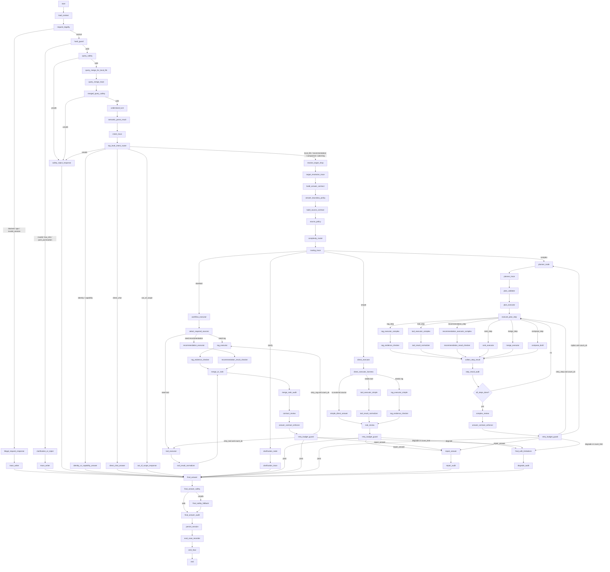

# P1.5 Orchestration Transition Plan（增强版）

目标：把当前 LangGraph 从 `route_gate -> rag/tool/recommendation/plan_execute -> compose_answer` 的粗路由结构，升级为：

```text
多层输入理解与安全兜底
+ 复杂度分流
+ Contract 驱动执行
+ RAG / Tool / Recommendation 能力节点化
+ Review / Repair / Retry / Degrade 闭环
+ Complex Path Plan-Execute-Review-Replan
```

本增强版在原 P1.5 方案基础上，补充了可借鉴的成熟问答 DAG 设计思想，重点增强：

1. 用户各种输入的覆盖能力；
2. 多轮 query merge / query rewrite；
3. out-of-scope / identity / direct chat 兜底；
4. 多层 safety；
5. 本地生活版 RAG pipeline；
6. tool result normalizer；
7. final response safety；
8. 全链路 trace / eval harness。

> 说明：目标不是让系统“任何问题都完美回答”，而是让本地生活范围内的问题稳定处理；范围外、信息不足、证据不足、工具失败时能澄清、降级或解释性兜底。

---

## 0. 总体架构原则

### 0.1 不再让 Router 承担全部理解

新的职责边界：

```text
understand_turn / semantic_parser
  负责理解用户说了什么

query_merge_for_local_life
  负责多轮上下文合并和指代补全

resolve_target_shop
  负责目标商家、候选商家、对比商家解析

build_answer_contract
  负责回答边界

build_source_contract
  负责数据源边界

complexity_router
  只负责执行模式：
  clarify / simple / standard / complex
```

### 0.2 不再把 RAG / Tool / Recommendation 当顶层 route

旧结构：

```text
route_gate
  ├─ rag_subgraph
  ├─ tool_subgraph
  ├─ recommendation_subgraph
  └─ rag_plus_toolcall
```

新结构：

```text
complexity_router
  ├─ simple -> direct_executor
  ├─ standard -> workflow_executor
  └─ complex -> planner_node

RAG / Tool / Recommendation 只是能力节点，
由 SourceContract 或 PlanStep 按需调用。
```

### 0.3 用户输入覆盖策略

系统至少覆盖以下输入类型：

| 输入类型 | 示例 | 目标处理 |
|---|---|---|
| 低信息 / 纯标点 | `，`、`嗯` | hard_guard / clarify |
| 身份能力询问 | `你是谁`、`你能做什么` | identity / capability answer |
| 闲聊确认 | `谢谢`、`好的` | direct_chat |
| 单店实时信息 | `海底捞有券吗`、`几点关门` | simple + tool |
| 单店评价/场景 | `这家适合约会吗` | simple/standard + RAG |
| 多属性混合 | `适合约会吗，有券吗，远不远` | standard + RAG/Tool |
| 推荐 | `附近推荐三家火锅店` | standard + recommendation/rag/tool |
| 对比 | `海底捞和西贝哪个适合带父母` | standard/complex |
| 复杂规划 | `规划周末约会路线，预算300` | complex |
| 多轮指代 | `第一家有券吗`、`那西贝呢` | query_merge + TargetShopPolicy |
| 范围外任务 | `帮我写论文`、`写代码` | out_of_scope / fallback |
| 风险输入 | prompt injection / unsafe | query_safety / reject |

---

## 1. 当前代码中的关键文件和节点位置

### 1.1 顶层图与路由

- `learning-agent-service/src/learning_agent_service/application/workflow/builder.py`
  - 现有 LangGraph 编译入口。
  - 当前旧拓扑：
    - `load_context`
    - `understand_turn`
    - `route_gate`
    - `plan_execute_subgraph`
    - `rag_subgraph`
    - `recommendation_subgraph`
    - `tool_subgraph`
    - `compose_answer`
    - `persist_session`
    - `emit_final`

- `learning-agent-service/src/learning_agent_service/application/workflow/subgraphs.py`
  - 当前路由与子图入口。
  - 关键位置：
    - `route_gate`
    - `route_decider`
    - `route_after_understand`
    - `route_after_rag`
    - `run_rag_subgraph`
    - `run_tool_subgraph`
    - `run_recommendation_subgraph`
    - `run_plan_execute_subgraph`

### 1.2 契约与答案生成

- `learning-agent-service/src/learning_agent_service/application/router/phase4_plan.py`
  - 当前 `AnswerContract` 与 answer verifier 的核心逻辑。
  - 关键函数：
    - `_build_entity_join_result`
    - `_build_answer_contract`
    - `_build_answer_verifier_result`
    - `_answer_verifier_repair_hint`

- `learning-agent-service/src/learning_agent_service/application/workflow/adapters/stages_back_core.py`
  - 当前 `compose_answer` 仍是 God Node。
  - 它同时承担：
    - 实体合并
    - 契约构建
    - 答案生成
    - 修复/重写
    - verifier 记录
    - 结果写回 `turn.extra`

### 1.3 复杂任务规划

- `learning-agent-service/src/learning_agent_service/application/router/phase7_compose.py`
  - 当前 `TaskPlan / PlanStep` 构造逻辑。
  - 复杂任务触发仍过度依赖 `rag_plus_toolcall`。
  - 关键函数：
    - `_task_plan_enabled`
    - `_task_plan_required_facets`
    - `_task_plan_step_payload`
    - `_build_task_plan`

- `learning-agent-service/src/learning_agent_service/application/workflow/plan_execute.py`
  - 当前复杂执行器。
  - 已有：
    - `plan_planner`
    - `plan_validator`
    - `step_executor`
    - `progress_checker`
    - `plan_reviewer`
    - `replanner`
  - 但目前仍服务旧 `plan_execute_subgraph`，不是仅服务 complex path 的新规划器。

### 1.4 领域模型与目标商家

- `learning-agent-service/src/learning_agent_service/domain/contracts.py`
  - 当前核心模型：
    - `AnswerContract`
    - `RoutingDecision`
    - `TaskPlan`
    - `PlanStep`
    - `StepResult`
    - `PlanExecutionSummary`
    - `ToolSelection`
    - `ToolExecutionResult`
    - `NormalizedToolResult`

- `learning-agent-service/src/learning_agent_service/local_life/target_shop_policy.py`
  - 当前目标商家消解中心。
  - 需要继续强化：
    - `target_shop_id`
    - `candidate_shop_ids`
    - `comparison_shop_ids`
    - `scope_kind`
    - `target_reference_source`

- `learning-agent-service/src/learning_agent_service/local_life/tool_planner.py`
  - 已有 `ToolPlan` 和 `LocalLifeToolPlanner.plan`。
  - 后续承接 `SourceContract -> ToolCall`。

---

## 2. 新增 / 修改的数据结构

### 2.1 ExecutionMode

```python
class ExecutionMode(str, Enum):
    clarify = "clarify"
    simple = "simple"
    standard = "standard"
    complex = "complex"
```

说明：

- `clarify`：信息不足或需要确认；
- `simple`：单目标、单意图、单步任务，但仍可 ToolCall；
- `standard`：多 facet 或多能力组合，但不需要 Planner；
- `complex`：多步骤、多约束、依赖中间结果，需要 Plan-Execute-Review-Replan。

---

### 2.2 TopLevelIntent

用于增强用户各种输入的覆盖能力。

```python
class TopLevelIntent(str, Enum):
    identity = "identity"
    capability = "capability"
    direct_chat = "direct_chat"
    local_life = "local_life"
    recommendation = "recommendation"
    comparison = "comparison"
    planning = "planning"
    document_or_knowledge = "document_or_knowledge"
    math_or_code = "math_or_code"
    out_of_scope = "out_of_scope"
    unsafe = "unsafe"
```

用途：

- `identity/capability`：不进入 RAG/Tool；
- `direct_chat`：简单自然回复；
- `local_life/recommendation/comparison/planning`：进入本地生活主链路；
- `out_of_scope`：解释能力边界；
- `unsafe`：安全拦截。

---

### 2.3 SemanticParseResult

```python
class SemanticParseResult(CoreModel):
    primary_intent: str | None = None
    top_level_intent: str | None = None
    sub_intents: list[str] = Field(default_factory=list)

    required_facets: list[str] = Field(default_factory=list)
    optional_facets: list[str] = Field(default_factory=list)
    forbidden_facets: list[str] = Field(default_factory=list)

    constraints: dict[str, Any] = Field(default_factory=dict)
    target_reference: dict[str, Any] = Field(default_factory=dict)

    confidence: float = 0.0
    missing_slots: list[str] = Field(default_factory=list)
    extra: dict[str, Any] = Field(default_factory=dict)
```

用途：

```text
understand_turn / query_merge 之后，
所有后续 contract / router 都基于 SemanticParseResult，
避免每个节点重复理解自然语言。
```

---

### 2.4 SourceContract

```python
class SourceContract(CoreModel):
    required_facets: list[str] = Field(default_factory=list)
    optional_facets: list[str] = Field(default_factory=list)
    forbidden_facets: list[str] = Field(default_factory=list)

    facet_source_map: dict[str, str] = Field(default_factory=dict)

    target_shop_id: int | None = None
    candidate_shop_ids: list[int] = Field(default_factory=list)
    comparison_shop_ids: list[int] = Field(default_factory=list)

    scope_kind: str | None = None
    extra: dict[str, Any] = Field(default_factory=dict)
```

默认映射：

| facet | source |
|---|---|
| coupon | tool |
| open_status | tool |
| distance | tool |
| price | tool_preferred |
| queue_status | tool |
| reservation | tool |
| scene_fit | rag |
| review_summary | rag |
| environment | rag |
| taste | rag |
| service | rag |
| parking | rag/tool |
| recommendation_reason | mixed/internal |

---

### 2.5 AnswerContract

```python
class AnswerContract(CoreModel):
    required_facets: list[str] = Field(default_factory=list)
    optional_facets: list[str] = Field(default_factory=list)
    forbidden_facets: list[str] = Field(default_factory=list)

    answer_style: str | None = None
    scope_kind: str | None = None
    facet_source_expectations: dict[str, str] = Field(default_factory=dict)

    forbidden_without_evidence: list[str] = Field(default_factory=list)
    extra: dict[str, Any] = Field(default_factory=dict)
```

约束：

```text
final_answer / repair_answer 必须根据 forbidden_facets 做裁剪。
如果回答中出现 forbidden facet，contract_review 必须触发 repair_answer。
```

---

### 2.6 ReviewReport

```python
class ReviewReport(CoreModel):
    decision: str = "pass"
    reason: str | None = None
    failed_facets: list[str] = Field(default_factory=list)
    repair_hint: str | None = None
    retry_target: str | None = None
    retry_count: int = 0
    max_retry_count: int = 0
    target_step_id: str | None = None
    extra: dict[str, Any] = Field(default_factory=dict)
```

允许的决策：

```text
pass
repair_answer
retry_rag
retry_tool
retry_step
replan
degrade
```

约束：

- `standard` review 不允许 `replan`；
- `complex` review 可以 `replan`；
- complex retry 优先 `retry_step`，不要直接跳孤立 RAG/Tool。

---

### 2.7 LoopCounter

```python
class LoopCounter(CoreModel):
    retry_rag: int = 0
    retry_tool: int = 0
    retry_step: int = 0
    repair_answer: int = 0
    replan: int = 0
```

建议默认上限：

```text
retry_rag <= 1
retry_tool <= 1
retry_step <= 1
repair_answer <= 1
replan <= 1
```

超限后进入 `degrade`。

---

### 2.8 中间态 ExecutionWorkspace

```python
class ExecutionWorkspace(CoreModel):
    merged_evidence: list[dict[str, Any]] = Field(default_factory=list)
    ranked_candidates: list[dict[str, Any]] = Field(default_factory=list)
    draft_answer: str | None = None
    review_report: ReviewReport | None = None
    repair_delta: dict[str, Any] = Field(default_factory=dict)
    extra: dict[str, Any] = Field(default_factory=dict)
```

---

## 3. 完整展开目标拓扑图

> 这张图是完整 harness 展开图。真正落地时，trace / audit / policy 类节点可以实现为节点内部函数或 middleware；review / retry / degrade / executor 类节点建议保留为显式节点。



---

## 4. 阶段迁移计划

### 4.0 Day 0：基线冻结

目标：先记录当前行为，避免后续不知道改坏了什么。

任务：

1. 导出当前 graph.png / Mermaid；
2. 跑现有测试；
3. 保存关键 case 的 response / trace / SSE；
4. 记录当前 `route_gate`、`compose_answer` 行为；
5. 明确必须持续绿色的测试。

验收：

- 当前测试结果有记录；
- 当前图有导出；
- 当前 SSE 样例有保存；
- 当前 10 个核心 case 有 baseline。

---

### 4.1 Day 1：Compatibility First

目标：旧拓扑先兼容新字段。

任务：

1. 新增 `SourceContract`；
2. 强化 `AnswerContract`；
3. 新增 `ReviewReport`；
4. 新增 `LoopCounter`；
5. 新增 `SemanticParseResult`；
6. 扩展 `TargetShopPolicy` 输出；
7. `compose_answer` 先双写新旧字段；
8. `turn.extra` 写入新字段镜像；
9. 不改变原有图结构和路由语义。

不做：

- 不删旧字段；
- 不改顶层图；
- 不强制启用 Review；
- 不让 Planner 介入更多场景。

验收：

- 旧路由矩阵测试绿色；
- 旧 SSE payload 不破坏；
- 新字段能在 state / trace / extra 看到；
- 新字段默认值不影响旧回答。

---

### 4.2 Day 2：Input Coverage & Query Merge

目标：增强用户各种输入的覆盖能力。

任务：

1. 增加 `request_legality`；
2. 增加 `query_safety`；
3. 增加 `query_merge_for_local_life`；
4. 增加 `merged_query_safety`；
5. 增加 `top_level_intent_router`；
6. 支持：
   - identity；
   - capability；
   - direct_chat；
   - out_of_scope；
   - unsafe；
   - local_life；
   - recommendation；
   - comparison；
   - planning。
7. query merge 必须结合：
   - current_shop；
   - last_candidates；
   - candidate_shop_ids；
   - comparison_shop_ids；
   - TargetShopPolicy。

验收：

| 用例 | 期望 |
|---|---|
| `你是谁` | identity/capability answer |
| `你能做什么` | capability answer |
| `谢谢` | direct_chat |
| `帮我写代码` | out_of_scope 或 fallback |
| `，` | hard_guard clarify/reject |
| `第一家有券吗` | query_merge 到候选店具体 shop |
| `那西贝呢` | target 切换到西贝 |
| unsafe/prompt injection | query_safety reject |

---

### 4.3 Day 3：Router Degradation

目标：`route_gate` 退化为 `complexity_router`。

任务：

1. 新增 `ExecutionMode`；
2. `route_gate` 开始写 `execution_mode`；
3. 旧 `RoutingDecision` 字段继续写；
4. `simple` 保证仍可 ToolCall；
5. `standard` 和 `complex` 的边界开始生效；
6. `rag_plus_toolcall` 降级为兼容别名。

验收：

- `execution_mode` 可见；
- 旧字段可读；
- `simple` 可直达 ToolCall；
- 顶层不再以 `rag_plus_toolcall` 作为 canonical 分支；
- 现有路由矩阵测试绿色。

---

### 4.4 Day 4：Standard Path Contract Review

目标：标准路径 Contract 驱动。

任务：

1. standard path 由 `SourceContract` 控制能力调用；
2. simple path 显式经过 `rule_review`；
3. standard path 显式经过 `contract_review`；
4. `recommendation_reason` 来源改成 `mixed/internal`；
5. `AnswerContract.forbidden_facets` 参与最终裁剪/修复；
6. standard review 不允许 `replan`；
7. `merge_or_rank` 只负责合并/排序，不做 Planner 级回退。

验收：

| 用例 | 期望 |
|---|---|
| `海底捞有券吗` | simple + tool + rule_review，不查 RAG |
| `这家适合约会吗` | rag 或 standard，不查 coupon |
| `这家适合约会吗，有券吗` | standard，scene_fit=RAG，coupon=Tool |
| `附近推荐三家火锅店` | recommendation + merge/rank + contract_review |
| 问券 | 最终答案不出现环境/口味/服务等 forbidden facets |
| 工具失败 | 不说“没有券”，进入 degrade |

---

### 4.5 Day 5：Complex Path Convergence

目标：旧 `plan_execute_subgraph` 收敛到 complex path。

任务：

1. 只有 `execution_mode=complex` 进入 Planner；
2. 拆出：
   - `planner_node`
   - `plan_executor`
   - `execute_plan_step`
   - `collect_step_result`
   - `complex_review`
3. complex review 支持：
   - pass；
   - repair_answer；
   - retry_step；
   - replan；
   - degrade。
4. 加入 `retry_step / replan` 上限；
5. `standard` 不允许回 Planner；
6. `compose_answer` 拆成：
   - merge/rank；
   - review；
   - repair/final_answer。

验收：

| 用例 | 期望 |
|---|---|
| `帮我规划周末约会路线，预算300` | complex path |
| `预算300，要火锅电影奶茶，有券最好` | planner -> execute_step -> complex_review |
| 中间工具失败 | retry_step 一次，失败后 degrade |
| 约束无法满足 | replan 一次，仍失败则 final_with_limitations |
| standard 任务 | 不进入 Planner |

---

### 4.6 Day 6：RAG Pipeline Upgrade

目标：借鉴成熟问答 DAG 的 RAG 分层，但改成本地生活版。

结构：

```text
recall
→ meta_fetch
→ merge
→ filter
→ rerank
→ evidence_pack
```

任务：

1. dense recall；
2. sparse recall；
3. metadata recall；
4. parent-child recall；
5. shop_id filter；
6. facet filter；
7. stale_data_filter；
8. duplicate_review_filter；
9. low_relevance_filter；
10. rerank；
11. evidence checker；
12. evidence_pack 输出。

验收：

- RAG 不串店；
- 问券不召回环境；
- 问环境不混入券；
- 低相关证据被过滤；
- 空证据进入 degrade；
- evidence_pack 可被 review 使用。

---

### 4.7 Day 7：Tool Harness & Final Response Safety

目标：补齐工具和最终响应兜底。

任务：

1. tool_result_normalizer；
2. tool_error_classifier；
3. realtime_result_degrade_policy；
4. final_answer_safety；
5. final_answer_audit；
6. eval_case_recorder；
7. trace_writer 全链路覆盖。

工具错误分类：

```text
timeout
not_found
empty_result
permission_error
invalid_params
service_unavailable
```

验收：

- 工具超时不能回答“没有券”；
- empty_result 和 tool_error 区分；
- final answer 不暴露内部字段；
- final answer 不违反 contract；
- eval case 自动记录关键路径。

---

## 5. 每阶段必须兼容的旧字段

### 5.1 不能直接删除

- `RoutingDecision.required_action`
- `RoutingDecision.should_retrieve`
- `RoutingDecision.should_call_tool`
- `RoutingDecision.route_candidate`
- `RoutingDecision.blocked`
- `RoutingDecision.missing_slots`

### 5.2 不能直接复用字段含义

- `TaskPlan.execution_mode`
  - 不能拿来当新 Router 的 `ExecutionMode`。
  - 它现在是 planner 内部语义，不是顶层复杂度语义。

### 5.3 不能停写的 trace 镜像

- `turn.extra["routing_decision"]`
- `turn.extra["route_gate"]`
- `turn.extra["task_plan"]`
- `turn.extra["answer_contract"]`
- `turn.extra["answer_verifier_result"]`
- `phase3_trace`
- `phase4_trace`
- `runtime.metrics["route_gate"]`

### 5.4 需要保留的兼容别名

- `forbidden_without_evidence`
  - 先作为 `forbidden_facets` 兼容别名。

- `rag_plus_toolcall`
  - 不能立刻全删；
  - 先降级为兼容值，不再作为 canonical 主拓扑分支。

### 5.5 不能直接取消的持久化字段

- `selected_shop_id`
- `selected_shop_name`
- `current_shop`

---

## 6. 全量验收矩阵

| 类别 | 输入 | 预期 |
|---|---|---|
| 低信息 | `，` | hard_guard -> clarify/reject |
| 身份 | `你是谁` | identity answer |
| 能力 | `你能做什么` | capability answer |
| 闲聊 | `谢谢` | direct_chat |
| 范围外 | `帮我写论文` | out_of_scope/fallback |
| 查券 | `海底捞有券吗` | simple/tool/rule_review |
| 营业 | `现在营业吗` | simple/tool |
| 距离 | `离我多远` | simple/tool |
| 环境 | `这家环境怎么样` | RAG/scene evidence |
| 约会 | `适合约会吗` | RAG/scene_fit |
| 混合 | `适合约会吗，有券吗` | standard/RAG+Tool |
| 推荐 | `附近推荐三家火锅店` | recommendation + merge/rank |
| 对比 | `海底捞和西贝哪个适合带父母` | comparison |
| 规划 | `规划周末约会路线，预算300` | complex/planner |
| 指代 | `第一家有券吗` | query_merge + candidate target |
| 换店 | `那西贝呢` | target 切换 |
| 工具失败 | 券接口 timeout | degrade，不说无券 |
| RAG 空 | 无评价证据 | degrade，不编 |
| forbidden | 问券时出现环境 | repair_answer |
| 循环 | retry 超限 | degrade |
| 安全 | prompt injection | query_safety / reject |

---

## 7. 最终结论

增强后的 P1.5 不只是把图换成更复杂的图，而是补齐了用户输入覆盖、业务边界、证据边界和兜底闭环：

```text
request_legality / query_safety / query_merge
负责覆盖各种用户输入；

SemanticParseResult / TargetShopPolicy
负责理解意图、约束和目标商家；

AnswerContract / SourceContract
负责回答边界和数据源边界；

ComplexityRouter
只负责 simple / standard / complex / clarify；

RAG / Tool / Recommendation
降级为能力节点；

Review / Retry / Repair / Degrade
负责错误兜底；

Planner
只服务复杂任务；

Trace / Eval / Safety
负责可观测、可回放和最终安全。
```

最终目标：

```text
本地生活范围内：
能答的问题准确答；
需要实时信息的查工具；
需要评价场景的查 RAG；
复杂任务会规划；
信息不足会澄清；
证据不足会降级；
工具失败不胡说；
范围外问题能礼貌说明边界；
所有关键路径可追踪、可评测、可回放。
```
