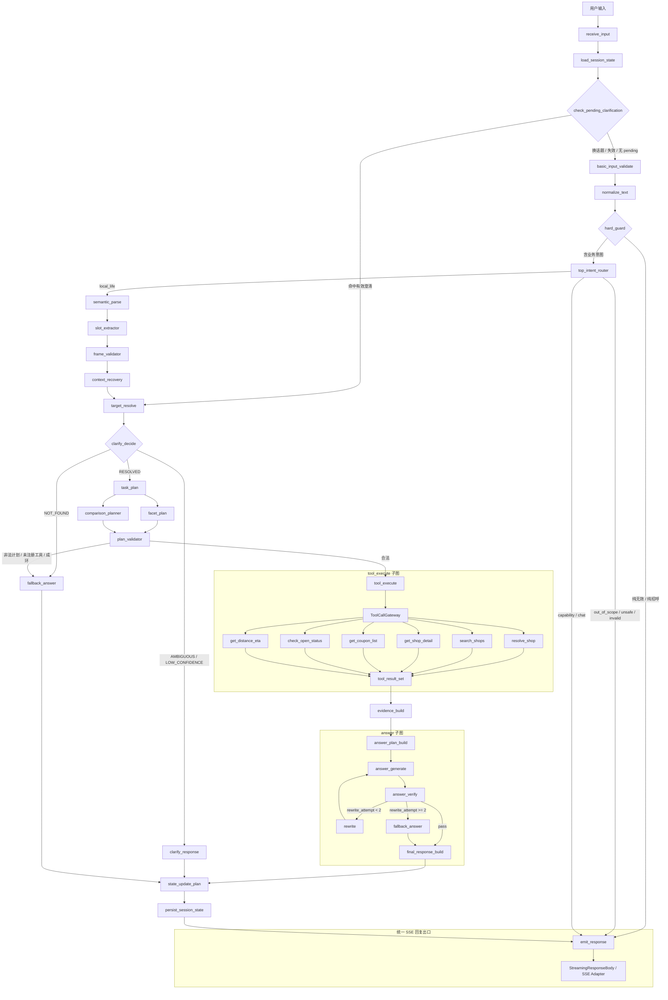

# 本地生活 Agent 架构图

## 目标

本文档描述当前 `todo/01` 到 `todo/17` 全部落实后的**规划态 LangGraph 编排控制架构**。

它不是纯 DAG，而是一个带状态、条件边、回边和统一出口的 `LangGraph StateGraph`。

## 设计原则

1. **单一职责**
   - 每个节点只做一件事。
   - 路由、语义、工具、回答、状态写入、流式输出分别由不同节点负责。

2. **决策唯一归属**
   - `top_intent` 只由 `top_intent_router` 决定。
   - `task_type` 只由 `semantic_parse` 决定。
   - `shop_id` 只由 `resolve_shop` 决定。
   - `ranking` 只由 `RankingPolicy` 决定。
   - `state_update` 只由 `state_update_plan` 决定。

3. **事实与回答分离**
   - 事实只能来自工具和证据包。
   - LLM 只允许做计划内的自然语言润色，不得重排、补事实、改 `shop_id`。

4. **统一 SSE 出口**
   - 图内节点不直接写 HTTP 流。
   - 只保留一个统一的 `emit_response` 节点 / 适配层作为 SSE 出口。

## 总体架构

## 图形态说明

- 这不是纯 DAG。
- 这是一个允许条件边和回边的 `StateGraph`。
- `answer_verify -> rewrite -> answer_generate`、澄清恢复、失败降级都要求回跳。
- 如果未来要画 DAG，只能作为“单轮无重试快照图”，不能替代真实运行图。

## 关键节点职责

| 节点 | 职责 |
| --- | --- |
| `receive_input` | 组装回合上下文，生成基础追踪字段。 |
| `load_session_state` | 读取 `SessionState`。 |
| `check_pending_clarification` | 优先恢复挂起澄清。 |
| `hard_guard` | 拦截纯无效输入、纯招呼。 |
| `top_intent_router` | 识别顶层意图。 |
| `semantic_parse` | 提取 `task_type`、`facets`、`merchant_mentions` 等语义帧。 |
| `context_recovery` | 结合会话状态恢复上下文。 |
| `target_resolve` | 解析商户、候选和歧义状态。 |
| `clarify_decide` | 决定澄清、继续执行或降级。 |
| `task_plan` | 选择业务任务子路径。 |
| `facet_plan` | 构建单店 facet 计划。 |
| `comparison_planner` | 构建多店对比计划。 |
| `plan_validator` | 校验工具、参数、预算和依赖。 |
| `tool_execute` | 执行工具子图。 |
| `evidence_build` | 汇聚证据包。 |
| `answer_plan_build` | 生成受约束回答计划。 |
| `answer_generate` | 只做计划内自然语言润色。 |
| `answer_verify` | 事实一致性和幻觉校验。 |
| `rewrite` | 基于校验结果重写。 |
| `final_response_build` | 组装最终结构化响应。 |
| `state_update_plan` | 决定 Session 写法。 |
| `persist_session_state` | 落库 / 保存会话状态。 |
| `emit_response` | 唯一 SSE 出口。 |

## 统一 SSE 出口

统一出口只存在一个，职责如下：

1. 接收 LangGraph 最终态和中间态摘要。
2. 统一封装 `trace_started / tool_call_started / tool_call_finished / answer_delta / final / error`。
3. 保证所有事件携带同一组 `trace_id / session_id / turn_id`。
4. 将 `ack` 作为兼容事件保留，但内部语义统一映射到 `trace_started`。
5. 不允许业务节点直接写流。

## 状态与决策归属

| 决策项 | 唯一负责人 |
| --- | --- |
| `top_intent` | `top_intent_router` |
| `task_type` | `semantic_parse` |
| `facets` | `semantic_parse / slot_extractor` |
| `shop_id` | `resolve_shop` |
| 推荐排序 | `RankingPolicy` |
| `state_update` | `state_update_plan` |
| SSE 输出 | `emit_response` |

## 子图边界

### tool 子图

- 只负责工具注册、参数校验、调用、归一化和并发控制。
- 不负责语义、不负责回答、不负责状态写入。

### answer 子图

- 只负责证据约束下的回答生成和校验。
- 不负责工具调用、不负责路由、不负责会话读取。

### SSE 适配层

- 只负责把结构化结果写成流。
- 不负责业务推理。

## 与现有 Java 入口的关系

- 当前 Java 入口已经有 `/ai/chat/stream` 和 `AiAssistantStreamService` 的流式适配。
- 规划落地后，它应当退化成最外层适配器。
- 真正的编排控制应由 LangGraph 图来完成。

## 验收标准

1. 每个节点职责单一。
2. 决策归属唯一。
3. 允许回边，但回边原因明确。
4. 统一 SSE 出口只有一个。
5. 事实、证据、回答、状态更新、流式输出五层分离。
