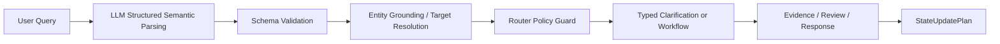

# LLM Semantic Capability Enablement TODO

## 1. 结论

当前仓库已经具备一部分语义能力骨架，但整体仍是 `PARTIAL`，还不能直接进入 `P15-P26`。

现状判断：

- 语义解析已经有统一入口，`local_life_agent/semantic/intent_parser.py::parse_semantic_frame` 会调用 LLM 并回填 `SemanticFrame`。
- 但是语义层、路由层、引用解析、澄清恢复、状态回写之间 هنوز还存在若干关键词 / 正则 / 硬规则兜底。
- `comparison target grounding`、`clarification resume`、`exploration planning`、`evidence review`、`answer verify` 这几条链路已经有结构，但还没有完全做到“LLM 负责理解，deterministic 负责落地”。
- 由于仍有部分路径依赖文本模式和局部启发式，`CHAT_E2E_ROUTE_GATE` 仍应视为 `PARTIAL`，`CAN_ENTER_P15_P26` 仍为 `false`。

本轮建议：

1. 先做 Phase 0 现状矩阵，补齐事实核查。
2. 再做 Phase 1 和 Phase 2，把语义解析和 schema 约束收敛到可验证状态。
3. 最后再做 router / grounding / clarification / review / e2e 的联动收口。

## 2. 当前问题

当前还没有充分发挥 LLM 语义能力，主要因为下面几类问题仍然存在：

### 2.1 语义入口已经有，但语义字段还不完整

`local_life_agent/domain/schemas.py` 里的 `SemanticFrame` 已经包含 `task_type`、`primary_task`、`comparison_targets`、`comparison_focus`、`preferences`、`filters`、`missing_slots`、`exploration_stages` 等字段，但对下面这些语义还没有形成稳定的一等字段：

- `parse_source` / `semantic_parse_source`
- `discourse_marker`
- `constraint_update`
- `new_task_override`
- `cancel_intent`
- `grounding_status`
- `location_reference`
- `shop_reference`
- `ordinal_reference`

### 2.2 仍有一些语义判断靠关键词 / 正则兜底

可以直接在代码里看到的事实包括：

- `local_life_agent/semantic/intent_parser.py` 里还有 `_fallback_intent` 和 `_safe_extract_slots`。
- `local_life_agent/semantic/slot_extractor.py` 仍然负责大量 `keyword / substring` 的启发式抽取。
- `local_life_agent/planning/orchestration_router.py` 仍然收集 `RouterRuleSignal`，并且对 `comparison`、`clarification`、`forbidden` 等路径做文本级弱信号分析。
- `local_life_agent/target/reference_resolver.py` 里有 `_infer_comparison_mentions_from_text`、`_resolve_deictic_reference`、`_resolve_ordinal_reference` 这类基于文本模式的补充逻辑。
- `local_life_agent/target/clarification.py` 里 `_infer_missing_slot_type` 和 `_should_treat_as_topic_switch` 仍然依赖文本启发式。

这些逻辑不是不能存在，但它们应该逐步降级为“兜底补救”，而不是主语义来源。

### 2.3 Router 还没有完全做到“消费语义帧，而不是消费词面”

当前 router 已经能消费 `SemanticFrame`，但它仍然会把部分词面信号合并进决策。对本项目来说，这会带来三个风险：

- `性价比`、`比较便宜` 之类的偏好词容易误导成比较意图。
- `这家`、`第一家`、`海底捞` 之类的引用词，可能因为 grounding 不稳而进入错误的澄清分支。
- `deterministic_tool`、`discovery_decision`、`clarification_fallback` 的边界会被文本细节放大，导致 chat E2E 不稳定。

### 2.4 Grounding 仍然是当前最脆弱的链路之一

`local_life_agent/target/reference_resolver.py` 已经做了很多结构化解析，但 explicit mention、ordinal reference、deictic reference、last recommendation list 的组合场景仍容易出现：

- 只能命中一个商家
- 命中多个候选但无法唯一确定
- 需要澄清，但澄清类型没有完全表达
- comparison target 数量满足，但 target resolution 仍然部分 unresolved

### 2.5 Review / Verifier / Answer 还没有统一地消费语义元信息

现在已有：

- `local_life_agent/llm/prompts/evidence_sufficiency_review.md`
- `local_life_agent/llm/prompts/answer_verifier.md`
- `local_life_agent/llm/prompts/answer_verbalizer.md`

但它们还没有统一消费足够丰富的语义元信息，例如：

- `semantic_parse_source`
- `grounding_status`
- `router_policy_decision`
- `router_policy_conflicts`
- `clarification resume` 的状态分类
- `unknown / failed / empty / partial` 的稳定映射

## 3. 目标架构

目标链路应收敛为：



对应的职责边界应固定如下：

- `LLM` 负责理解、抽取、归纳、补全结构。
- `schema` 负责格式、类型和最小可表达能力。
- `grounding` 负责把候选文本绑定到真实 `shop_id` / `target_id`。
- `policy guard` 负责决定是否放行到 workflow。
- `typed clarification` 负责缺什么就问什么。
- `evidence / review / answer verify` 负责事实校验和禁止编造。
- `state_update_plan` 负责安全写回，不能由 LLM 裸决定。

## 4. 阶段计划

### Phase 0：事实核查与现状矩阵

**目标**

- 找出现有代码中所有仍由 keyword / substring / hard rule 承担语义理解的地方。
- 区分“应该 LLM 化”的语义判断和“必须 deterministic”的安全判断。

**要改的文件**

- 主要是读，不急着改：
  - `local_life_agent/semantic/intent_parser.py`
  - `local_life_agent/semantic/slot_extractor.py`
  - `local_life_agent/planning/orchestration_router.py`
  - `local_life_agent/target/reference_resolver.py`
  - `local_life_agent/target/clarification.py`
  - `local_life_agent/planning/plans/state_update_planner.py`
  - `local_life_agent/engine/subgraphs/active_turn_resolver.py`
  - `local_life_agent/engine/workflow_runner.py`
  - `local_life_agent/engine/workflow_registry.py`
  - `local_life_agent/engine/workflows/deterministic_tool_workflow.py`
  - `local_life_agent/engine/workflows/exploration_planning_workflow.py`
  - `local_life_agent/engine/workflows/clarification_fallback_workflow.py`
  - `local_life_agent/engine/workflows/direct_response_workflow.py`
  - `local_life_agent/llm/prompts/local_life_parser.md`
  - `local_life_agent/llm/prompts/evidence_sufficiency_review.md`
  - `local_life_agent/llm/prompts/answer_verifier.md`
  - `local_life_agent/llm/prompts/answer_verbalizer.md`

**允许改什么**

- 只补审计注释、TODO 标注、测试断言和报告。
- 如果发现明显的路径名错配，可以改 TODO 文档中的引用，不要大改代码。

**禁止改什么**

- 不要重写 graph builder。
- 不要新增平行路由链。
- 不要把 keyword rule 直接改成更复杂的 keyword rule。
- 不要在这一阶段修所有实现。

**具体任务**

- 输出四张矩阵：
  - `LLM Semantic Responsibility Matrix`
  - `Deterministic Boundary Matrix`
  - `Keyword Semantic Misuse Matrix`
  - `SemanticFrame Gap Matrix`
- 记录每个字段、每个函数、每个 workflow 的真实职责。
- 标明哪些场景已经是结构化语义，哪些仍是启发式兜底。

**验收标准**

- 能明确列出“应 LLM 化”与“必须 deterministic”的分界。
- 能指出当前 chat E2E、grounding、resume、review 的最大风险点。

**必须新增/修改的测试**

- `local_life_agent/tests/test_semantic_router_policy_alignment.py`
- `local_life_agent/tests/test_router_rule_policy_guard.py`
- `local_life_agent/tests/test_chat_interface_full_e2e.py`

**回归命令**

```bash
pytest local_life_agent/tests/test_semantic_router_policy_alignment.py -q
pytest local_life_agent/tests/test_router_rule_policy_guard.py -q
pytest local_life_agent/tests/test_chat_interface_full_e2e.py -q
```

**风险**

- 容易把“临时兜底”误判成“应删除逻辑”。

**是否阻塞下一阶段**

- 是，Phase 1 和 Phase 2 前必须先完成。

### Phase 1：SemanticFrame schema 补齐

**目标**

- 让 LLM 解析结果有地方落。
- 让语义层的字段足以表达本地生活核心语义，而不是靠字符串碎片拼接。

**要改的文件**

- `local_life_agent/domain/schemas.py`
- `local_life_agent/domain/graph_state.py`
- `local_life_agent/domain/graph_state_model.py`
- `local_life_agent/domain/state.py`

**允许改什么**

- 小范围补字段、补枚举、补 `model_validator` / `field_validator`。
- 保持已有字段兼容，不大规模重命名。

**禁止改什么**

- 不要把 `SessionState` 扩成无边界大对象。
- 不要为了 schema 好看做大重构。
- 不要破坏现有测试的序列化契约。

**具体任务**

- 补齐或标准化以下语义字段：
  - `intent`
  - `task_type`
  - `workflow_hint`
  - `location`
  - `category`
  - `shop_target`
  - `reference`
  - `preferences`
  - `ranking_policy`
  - `filters`
  - `comparison_intent`
  - `comparison_targets`
  - `comparison_facets`
  - `exploration_stages`
  - `missing_slots`
  - `confidence`
  - `parse_source` / `semantic_parse_source`
  - `grounding_status`
- 如果现有字段已有可复用语义，优先复用，不新增重复字段。

**验收标准**

- `SemanticFrame` 可以稳定承载：
  - `value_for_money`
  - `relative_price_preference`
  - `scene_preference`
  - `quality_preference`
  - `coupon_filter`
  - `open_now_filter`
  - `distance_preference`
  - `location_reference`
  - `shop_reference`
  - `ordinal_reference`
  - `constraint_update`
  - `new_task_override`
  - `cancel_intent`
  - `discourse_marker`
  - `comparison_structure`
  - `comparison_targets`
  - `comparison_facets`
  - `exploration_stages`
  - `missing_slot_type`
  - `grounding_status`
  - `confidence`
  - `semantic_parse_source`

**必须新增/修改的测试**

- `local_life_agent/tests/test_domain_schemas.py`
- `local_life_agent/tests/test_semantic_parser.py`
- `local_life_agent/tests/test_semantic_router_policy_alignment.py`

**回归命令**

```bash
pytest local_life_agent/tests/test_domain_schemas.py -q
pytest local_life_agent/tests/test_semantic_parser.py -q
pytest local_life_agent/tests/test_semantic_router_policy_alignment.py -q
```

**风险**

- 字段一多容易和 `GraphState`、`SessionState` 发生重复表达。

**是否阻塞下一阶段**

- 是。

### Phase 2：LLM Structured Semantic Parser

**目标**

- 建立或收敛一个统一 semantic parser，让 LLM 输出结构化 `SemanticFrame`。

**要改的文件**

- `local_life_agent/semantic/intent_parser.py`
- `local_life_agent/llm/prompts/local_life_parser.md`
- `local_life_agent/semantic/slot_extractor.py`
- `local_life_agent/domain/schemas.py`

**允许改什么**

- 调整 prompt。
- 调整 schema validation。
- 调整 LLM JSON 解析和 fallback 行为。

**禁止改什么**

- 不要让 LLM 直接决定 workflow。
- 不要让 LLM 直接写 session。
- 不要把解析失败静默成成功。

**具体任务**

- 统一 `local_life_parser` 输出协议。
- 输出必须经过 `SemanticFrame` 校验。
- parse 失败时走 structured recovery / fallback。
- 增加对以下示例的稳定解析：
  - `推荐北京邮电大学附近的火锅或烧烤，要性价比高的`
  - `推荐几家比较便宜的烧烤`
  - `比如北邮附近，有没有烧烤推荐`
  - `推荐附近有券的餐厅`
  - `海底捞西直门店有券吗`
  - `第一家和第二家比一下`
  - `这附近有什么好吃的`
  - `这家有券吗`
  - `不要烧烤了，推荐咖啡`
  - `帮我安排一个先吃饭再喝咖啡的约会路线`

**验收标准**

- `semantic_source` / `parse_source` 在 trace 中可见。
- LLM 解析出的结构能区分：
  - 推荐
  - 单店查询
  - 比较
  - 澄清回复
  - 多阶段探索

**必须新增/修改的测试**

- `local_life_agent/tests/test_semantic_parser.py`
- `local_life_agent/tests/test_semantic_router_policy_alignment.py`
- `local_life_agent/tests/test_llm_semantic_capability_usage_audit.py`

**回归命令**

```bash
pytest local_life_agent/tests/test_semantic_parser.py -q
pytest local_life_agent/tests/test_semantic_router_policy_alignment.py -q
pytest local_life_agent/tests/test_llm_semantic_capability_usage_audit.py -q
```

**风险**

- prompt 改动容易引入 schema mismatch。

**是否阻塞下一阶段**

- 是。

### Phase 3：Router 使用 SemanticFrame，而不是 keyword

**目标**

- router policy guard 消费 `SemanticFrame + grounding + session_context`。

**要改的文件**

- `local_life_agent/planning/orchestration_router.py`
- `local_life_agent/engine/workflow_runner.py`
- `local_life_agent/engine/workflow_registry.py`
- `local_life_agent/engine/workflows/deterministic_tool_workflow.py`
- `local_life_agent/engine/workflows/exploration_planning_workflow.py`
- `local_life_agent/engine/workflows/clarification_fallback_workflow.py`
- `local_life_agent/engine/workflows/direct_response_workflow.py`
- `local_life_agent/domain/schemas.py`

**允许改什么**

- 让 router 更严格地看结构化语义。
- 让 `workflow_name` 只从 whitelist 里选。
- 让 deterministic / comparison / exploration 的前置条件更清晰。

**禁止改什么**

- 不要恢复 keyword direct workflow。
- 不要把所有 query 路由到 discovery。
- 不要让 LLM 裸决定 `workflow_name`。

**具体任务**

- `comparison` 只能来自 `comparison_structure` / `comparison_targets` / `comparison_intent`，不能来自单字 `比`。
- `deterministic_tool` 必须有单店事实结构和明确目标。
- `discovery` 中 `coupon / open_now / price / distance` 只是 facets，不是 workflow 触发词。
- `exploration` 必须由 `exploration_stages` 或 multi-step intent 判定。
- forbidden / safety 保留 hard guard。

**验收标准**

- `性价比` 不再把推荐误导成比较。
- `比较便宜` 不再把推荐误导成比较。
- `deterministic_tool` 只在满足单店目标时放行。

**必须新增/修改的测试**

- `local_life_agent/tests/test_router_rule_policy_guard.py`
- `local_life_agent/tests/test_orchestration_router.py`
- `local_life_agent/tests/test_workflow_registry.py`
- `local_life_agent/tests/test_workflow_runner.py`

**回归命令**

```bash
pytest local_life_agent/tests/test_router_rule_policy_guard.py -q
pytest local_life_agent/tests/test_orchestration_router.py -q
pytest local_life_agent/tests/test_workflow_registry.py -q
pytest local_life_agent/tests/test_workflow_runner.py -q
```

**风险**

- router 改动最容易影响主链路分发。

**是否阻塞下一阶段**

- 是。

### Phase 4：Reference / Clarification Resume 语义化

**目标**

- 让 LLM 理解多轮补充到底是在补什么。

**要改的文件**

- `local_life_agent/target/clarification.py`
- `local_life_agent/target/reference_resolver.py`
- `local_life_agent/engine/subgraphs/active_turn_resolver.py`
- `local_life_agent/engine/subgraphs/state_update_plan.py`
- `local_life_agent/domain/state.py`
- `local_life_agent/domain/schemas.py`

**允许改什么**

- 用类型化 clarification 取代泛化追问。
- 让 resume 语义显式表达补充、取消、新任务、约束覆盖。

**禁止改什么**

- 不要污染 `current_shop`。
- 不要污染 `last_recommendation_list`。
- 不要把上下文恢复做成无条件继承。

**具体任务**

- 区分：
  - `missing_location`
  - `missing_shop`
  - `missing_comparison_targets`
  - `missing_exploration_location`
  - `cancel`
  - `new_task_override`
  - `constraint_update`
- `pending_clarification` 清理和恢复要严格按类型执行。
- clarification resume 的结果要能回写清晰的 `task_type_source` / `resume_strategy`。

**验收标准**

- 能正确处理：
  - `推荐几家烧烤` -> `北邮附近`
  - `这家有券吗` -> `海底捞西直门店`
  - `这两家哪个好` -> `第一家和第二家`
  - `帮我安排先吃饭再喝咖啡` -> `五道口附近`
  - `推荐几家烧烤` -> `不要烧烤了，推荐咖啡`
  - `推荐几家烧烤` -> `算了`

**必须新增/修改的测试**

- `local_life_agent/tests/test_chat_clarification_resume_e2e.py`
- `local_life_agent/tests/test_active_turn_resolver.py`
- `local_life_agent/tests/test_context_recovery_clarification.py`
- `local_life_agent/tests/test_router_rule_policy_guard.py`

**回归命令**

```bash
pytest local_life_agent/tests/test_chat_clarification_resume_e2e.py -q
pytest local_life_agent/tests/test_active_turn_resolver.py -q
pytest local_life_agent/tests/test_context_recovery_clarification.py -q
pytest local_life_agent/tests/test_router_rule_policy_guard.py -q
```

**风险**

- 多轮恢复最容易把“新任务”误判成“补充旧任务”。

**是否阻塞下一阶段**

- 是。

### Phase 5：Exploration Planning 语义拆解

**目标**

- 让 LLM 负责多阶段本地生活任务拆解。

**要改的文件**

- `local_life_agent/engine/workflows/exploration_planning_workflow.py`
- `local_life_agent/planning/evidence/evidence_planner.py`
- `local_life_agent/planning/plans/state_update_planner.py`
- `local_life_agent/semantic/intent_parser.py`
- `local_life_agent/llm/prompts/local_life_parser.md`

**允许改什么**

- 补 `exploration_stages`、`scene`、`time`、`constraints` 的语义表达。
- 让探索规划走明确的子目标拆解。

**禁止改什么**

- 不要把探索规划抢成 deterministic 或 comparison。
- 不要不经 grounding 就生成路线结论。

**具体任务**

- 支持：
  - `帮我安排先吃饭再喝咖啡的约会路线`
  - `北邮附近亲子半日游`
  - `五道口附近晚上约会怎么安排`
  - `先吃火锅再找个咖啡店坐坐`
- 让 `SemanticFrame` 能表达：
  - `stages = [eat, coffee]`
  - `scene = date / parent_child / friends`
  - `time = evening / weekend`
  - `location = ...`
  - `constraints = ...`

**验收标准**

- `exploration_planning` 的触发依赖 stage 语义，不依赖单纯文本关键词。
- 缺 location 时进入 typed clarification。

**必须新增/修改的测试**

- `local_life_agent/tests/test_exploration_planning_workflow.py`
- `local_life_agent/tests/test_p7_exploration_protocol.py`
- `local_life_agent/tests/test_chat_interface_full_e2e.py`

**回归命令**

```bash
pytest local_life_agent/tests/test_exploration_planning_workflow.py -q
pytest local_life_agent/tests/test_p7_exploration_protocol.py -q
pytest local_life_agent/tests/test_chat_interface_full_e2e.py -q
```

**风险**

- 容易过度拆分，导致 stage 数量和约束数量失真。

**是否阻塞下一阶段**

- 是。

### Phase 6：Evidence Review / Answer Verify 使用语义约束

**目标**

- 让 LLM 用于语义审查，而不是工具事实创造。

**要改的文件**

- `local_life_agent/llm/prompts/evidence_sufficiency_review.md`
- `local_life_agent/llm/prompts/answer_verifier.md`
- `local_life_agent/llm/prompts/answer_verbalizer.md`
- `local_life_agent/answer/b2_mini_verifier.py`
- `local_life_agent/answer/llm_verbalizer.py`
- `local_life_agent/planning/evidence/evidence_review.py`
- `local_life_agent/planning/evidence/evidence_builder.py`

**允许改什么**

- 强化 review / verifier 的输入字段。
- 增加对 unknown / failed / empty / partial 的稳定判定。

**禁止改什么**

- 不要凭空补店铺信息。
- 不要凭空补优惠。
- 不要凭空补营业状态。
- 不要把 failed 当 no。
- 不要把 unknown 当 false。

**具体任务**

- 让 LLM 可以判断：
  - 证据是否覆盖用户约束
  - 推荐理由是否 grounded
  - comparison 结论是否有证据
  - answer 是否把 unknown / failed 编造成 false
  - 是否需要澄清 / 降级 / 重写
- 让 verifier 输入里带上 `conversation_continuity`、`semantic_parse_source`、`grounding_status`、`router_policy_decision`。

**验收标准**

- `unknown_as_false`、`comparison_winner_unsupported`、`ranking_changed` 这类违规能稳定识别。

**必须新增/修改的测试**

- `local_life_agent/tests/test_evidence_review.py`
- `local_life_agent/tests/test_p4_evidence_decision_answer_protocol.py`
- `local_life_agent/tests/test_llm_main_path_verification.py`
- `local_life_agent/tests/test_e2e_context_and_verifier.py`

**回归命令**

```bash
pytest local_life_agent/tests/test_evidence_review.py -q
pytest local_life_agent/tests/test_p4_evidence_decision_answer_protocol.py -q
pytest local_life_agent/tests/test_llm_main_path_verification.py -q
pytest local_life_agent/tests/test_e2e_context_and_verifier.py -q
```

**风险**

- verifier 过严会误伤正常的降级回答。

**是否阻塞下一阶段**

- 是。

### Phase 7：Entity Grounding / Target Resolution 对齐

**目标**

- 解决 comparison target grounding 不稳定问题。

**要改的文件**

- `local_life_agent/target/reference_resolver.py`
- `local_life_agent/core/candidate_core.py`
- `local_life_agent/target/shop_resolver.py`
- `local_life_agent/tools/db_tools.py`
- `local_life_agent/tools/db_client.py`
- `local_life_agent/engine/workflows/deterministic_tool_workflow.py`

**允许改什么**

- 让 LLM 只负责抽候选名称。
- 让 DB / catalog / fixture 验证 `shop_id`。
- 让歧义和缺失回到 typed clarification。

**禁止改什么**

- 不要硬编码具体店名。
- 不要把 comparison target 失败退化成 missing_shop_target。
- 不要让 partial match 冒充 resolved。

**具体任务**

- 对齐：
  - alias normalization
  - named pair comparison target parsing
  - ordinal reference resolution
  - last_recommendation_list grounding
  - ambiguous target handling
  - no result target handling
  - runtime fixture / fake backend stability
- 明确 `comparison_target_resolution`、`resolved_target`、`pending_clarification` 三者之间的状态转换。

**验收标准**

- 单店 / 双店 / 序号引用 / 指代引用都能稳定落到真实 `shop_id`。

**必须新增/修改的测试**

- `local_life_agent/tests/test_candidate_resolver.py`
- `local_life_agent/tests/test_comparison_flow.py`
- `local_life_agent/tests/test_chat_interface_full_e2e.py`
- `local_life_agent/tests/test_chat_clarification_resume_e2e.py`

**回归命令**

```bash
pytest local_life_agent/tests/test_candidate_resolver.py -q
pytest local_life_agent/tests/test_comparison_flow.py -q
pytest local_life_agent/tests/test_chat_interface_full_e2e.py -q
pytest local_life_agent/tests/test_chat_clarification_resume_e2e.py -q
```

**风险**

- 这一阶段最容易引入 fixture 和真实 DB 行为不一致。

**是否阻塞下一阶段**

- 是。

### Phase 8：Chat E2E Gate

**目标**

- 建立真正的 chat full E2E 验收。

**要改的文件**

- `local_life_agent/tests/test_chat_interface_full_e2e.py`
- `local_life_agent/tests/test_chat_clarification_resume_e2e.py`
- `local_life_agent/tests/test_semantic_router_policy_alignment.py`
- `local_life_agent/tests/test_llm_semantic_capability_usage_audit.py`
- `local_life_agent/tests/chat_e2e_utils.py`

**允许改什么**

- 补端到端断言。
- 补必要的 fake / spy 仅用于测试。

**禁止改什么**

- 不要直接进入 P15-P26。
- 不要靠 hardcoded 店名绕过 grounding。
- 不要让测试依赖脆弱的字符串片段。

**具体任务**

- 至少覆盖：
  - `北邮附近火锅/烧烤性价比推荐`
  - 缺位置推荐
  - 推荐附近有券餐厅
  - 明确店名单店事实
  - 推荐后第一家有券
  - `current_shop` 有券/营业
  - 第一家和第二家比较
  - 这两家无上下文比较
  - exploration 有位置
  - exploration 缺位置
  - direct response
  - forbidden scope
  - no_result / degraded
  - unknown vs failed
  - clarification resume
  - cancel / new task override

**验收标准**

- `CHAT_E2E_ROUTE_GATE = PASS`。
- 关键路径在整链路下稳定。

**必须新增/修改的测试**

- `local_life_agent/tests/test_chat_interface_full_e2e.py`
- `local_life_agent/tests/test_chat_clarification_resume_e2e.py`
- `local_life_agent/tests/test_llm_semantic_capability_usage_audit.py`

**回归命令**

```bash
pytest local_life_agent/tests/test_chat_interface_full_e2e.py -q
pytest local_life_agent/tests/test_chat_clarification_resume_e2e.py -q
pytest local_life_agent/tests/test_llm_semantic_capability_usage_audit.py -q
```

**风险**

- E2E 容易因为任何一层微小改动而抖动。

**是否阻塞下一阶段**

- 是，但它可以和 Phase 9 并行推进。

### Phase 9：Observability / Debug Trace

**目标**

- 能证明 LLM semantic parser 真正发挥作用。

**要改的文件**

- `local_life_agent/agent.py`
- `local_life_agent/engine/graph_builder.py`
- `local_life_agent/engine/workflow_runner.py`
- `local_life_agent/observability/file_logger.py`
- `local_life_agent/domain/graph_state.py`

**允许改什么**

- 增加 test-only debug capture 或低风险 trace 字段。
- 增加语义链路的可观测字段。

**禁止改什么**

- 不要记录隐私敏感信息。
- 不要破坏生产协议。
- 不要把 trace 做成难以维护的平行协议。

**具体任务**

- trace 中至少能看到：
  - `raw_input`
  - `semantic_frame`
  - `schema_validation_result`
  - `semantic_parse_source`
  - `rule_pattern_signals`
  - `router_policy_decision`
  - `router_policy_conflicts`
  - `grounding_result`
  - `missing_slot_type`
  - `workflow_name`
  - `evidence_status`
  - `answer_verify_result`
  - `state_update_plan`

**验收标准**

- 从 trace 能证明“哪一层决定了什么”。

**必须新增/修改的测试**

- `local_life_agent/tests/test_trace_observability.py`
- `local_life_agent/tests/test_p11_observability_streaming.py`
- `local_life_agent/tests/test_chat_interface_full_e2e.py`

**回归命令**

```bash
pytest local_life_agent/tests/test_trace_observability.py -q
pytest local_life_agent/tests/test_p11_observability_streaming.py -q
pytest local_life_agent/tests/test_chat_interface_full_e2e.py -q
```

**风险**

- 观测字段过多会拖慢链路。

**是否阻塞下一阶段**

- 是，但它可以和 Phase 8 并行推进。

## 5. 文件级 TODO

| Phase | File | Change | Risk | Test |
| --- | --- | --- | --- | --- |
| 0 | `local_life_agent/semantic/intent_parser.py` | 盘点 fallback 语义兜底和 LLM 结构化输出的边界 | 误判兜底为主路径 | `test_semantic_parser.py` |
| 0 | `local_life_agent/semantic/slot_extractor.py` | 盘点仍在承担语义职责的关键词 / 正则分支 | 词面规则误导路由 | `test_semantic_router_policy_alignment.py` |
| 0 | `local_life_agent/planning/orchestration_router.py` | 盘点 router rule signal、policy guard、fallback 的职责 | 路由边界误读 | `test_router_rule_policy_guard.py` |
| 0 | `local_life_agent/target/reference_resolver.py` | 盘点 grounding 的 text fallback | 把启发式当确定解析 | `test_comparison_flow.py` |
| 1 | `local_life_agent/domain/schemas.py` | 补 semantic 字段和校验 | schema 膨胀 | `test_domain_schemas.py` |
| 1 | `local_life_agent/domain/state.py` | 收敛 `StateUpdatePlan` / `SessionState` 表达 | 写回字段失配 | `test_p5_session_state_writeback.py` |
| 1 | `local_life_agent/domain/graph_state.py` | 对齐运行时状态字段与 schema | 状态重复表达 | `test_05_graph.py` |
| 2 | `local_life_agent/llm/prompts/local_life_parser.md` | 增加语义槽约束和更多结构字段 | prompt 过拟合 | `test_semantic_parser.py` |
| 2 | `local_life_agent/semantic/intent_parser.py` | LLM parse validate / fallback 收口 | schema mismatch | `test_semantic_parser.py` |
| 3 | `local_life_agent/planning/orchestration_router.py` | 只消费 semantic frame 和 grounding | keyword 回潮 | `test_router_rule_policy_guard.py` |
| 3 | `local_life_agent/engine/workflow_runner.py` | 强化 registry whitelist / validator 失败路径 | 错 workflow 放行 | `test_workflow_runner.py` |
| 3 | `local_life_agent/engine/workflow_registry.py` | 保持 workflow 白名单不放宽 | 未注册 workflow 进入主链路 | `test_workflow_registry.py` |
| 4 | `local_life_agent/target/clarification.py` | 类型化澄清原因和 resume 策略 | 错误追问店名 | `test_chat_clarification_resume_e2e.py` |
| 4 | `local_life_agent/engine/subgraphs/active_turn_resolver.py` | 恢复澄清语义并清理 pending | 污染 current_shop / list | `test_active_turn_resolver.py` |
| 5 | `local_life_agent/engine/workflows/exploration_planning_workflow.py` | 多阶段任务拆解 | 抢占比较 / 推荐 | `test_exploration_planning_workflow.py` |
| 5 | `local_life_agent/planning/plans/state_update_planner.py` | 探索结果写回策略 | 写回误删 | `test_p5_session_state_writeback.py` |
| 6 | `local_life_agent/llm/prompts/evidence_sufficiency_review.md` | 让 review 消费语义约束 | 误把 partial 当 sufficient | `test_evidence_review.py` |
| 6 | `local_life_agent/llm/prompts/answer_verifier.md` | 强化 unknown / failed / unsupported 判定 | 误伤正常降级 | `test_e2e_context_and_verifier.py` |
| 6 | `local_life_agent/llm/prompts/answer_verbalizer.md` | 只根据 DecisionPlan 输出 grounded 回复 | 编造成确定事实 | `test_answer_verifier.py` |
| 7 | `local_life_agent/target/reference_resolver.py` | 实体 grounding 和 reference resolution 收口 | comparison target 不稳 | `test_comparison_flow.py` |
| 7 | `local_life_agent/core/candidate_core.py` | 对齐 candidate / comparison / pending 产物 | 比较候选落错 | `test_candidate_resolver.py` |
| 8 | `local_life_agent/tests/test_chat_interface_full_e2e.py` | 端到端固定 gate | 回归漂移 | 见本页回归命令 |
| 8 | `local_life_agent/tests/test_llm_semantic_capability_usage_audit.py` | 语义能力使用审计 | 容易漏边界 | 见本页回归命令 |
| 9 | `local_life_agent/agent.py` | trace 输出语义字段 | 隐私与性能风险 | `test_trace_observability.py` |
| 9 | `local_life_agent/engine/graph_builder.py` | 记录 workflow 级事件和状态变化 | 事件顺序错乱 | `test_p11_observability_streaming.py` |

## 6. Schema TODO

### 需要新增或标准化的字段

- `intent`
- `task_type`
- `workflow_hint`
- `location`
- `category`
- `shop_target`
- `reference`
- `preferences`
- `ranking_policy`
- `filters`
- `comparison_intent`
- `comparison_targets`
- `comparison_facets`
- `exploration_stages`
- `missing_slots`
- `confidence`
- `parse_source` / `semantic_parse_source`
- `grounding_status`
- `discourse_marker`
- `constraint_update`
- `new_task_override`
- `cancel_intent`

### 建议复用的现有字段

- `primary_task`
- `merchant_mentions`
- `brand_mentions`
- `branch_mentions`
- `ordinal_references`
- `deictic_references`
- `comparison_focus`
- `hard_constraints`
- `soft_preferences`
- `ranking_signals`
- `follow_up`
- `need_context`
- `semantic_source`
- `fallback_reason`
- `llm_called`
- `llm_backend`

### 建议废弃的表达方式

- 把 `keyword` / `substring` 直接当作 workflow 决策源。
- 把 `task_type` 的字符串拼接当作完整语义。
- 把 `current_shop` / `last_recommendation_list` 当作无约束继承源。

## 7. Prompt TODO

### 需要新增或修改的 prompt

- `local_life_agent/llm/prompts/local_life_parser.md`
- `local_life_agent/llm/prompts/evidence_sufficiency_review.md`
- `local_life_agent/llm/prompts/answer_verifier.md`
- `local_life_agent/llm/prompts/answer_verbalizer.md`

### 语义解析 prompt 要补的内容

- 明确 `性价比高 -> value_for_money`。
- 明确 `比较便宜 -> relative_price_preference`。
- 明确 `适合聚餐 / 适合约会 / 适合带家人` 等 scene preference。
- 明确 `这附近 / 北邮附近` 等 location reference。
- 明确 `这家 / 第一家 / 第二家` 等 shop / ordinal reference。
- 明确 `不要烧烤了，推荐咖啡` 是 `new_task_override` 或 `constraint_update`。
- 明确 `算了` 是 cancel。
- 明确 `先吃饭再喝咖啡` 是 `exploration_stages`。

### clarification resume prompt 要补的内容

- 补充、取消、新任务、约束覆盖必须分类。
- 不要只依赖“回复编号 / 店名”这一种回答模式。

### exploration decomposition prompt 要补的内容

- 把单轮查询拆成多个阶段。
- stage 必须携带 location / scene / time / constraints。

### evidence review prompt 要补的内容

- 只能判断证据是否足够。
- 不能把 tool unknown / failed 直接当作 no / false。

### answer verify prompt 要补的内容

- 只根据 `DecisionPlan`、`EvidencePack`、`ConversationContinuity` 判断。
- 不允许补店名、补券、补营业状态。

## 8. Policy Guard TODO

### 必须明确的 deterministic validation 规则

1. `SemanticFrame` 必须先通过 schema validation，才能进入 router policy guard。
2. `workflow_name` 只能来自 `workflow_registry` 白名单。
3. `deterministic_tool` 必须满足：
   - 单店事实结构
   - 显式 target 或 `current_shop`
   - 或已解析的 reference
4. `comparison` 必须满足：
   - `comparison_intent = true`
   - `comparison_targets` 至少 2 个
   - grounding 后仍然保留足够目标
5. `exploration_planning` 必须满足：
   - `exploration_stages` 非空，或
   - LLM 已明确多阶段意图
6. `clarification_fallback` 必须只在缺参、歧义、失败、低置信等明确条件下触发。
7. `pending_clarification` 的清理和恢复必须由 `StateUpdatePlan` 控制。
8. `current_shop`、`last_recommendation_list`、`comparison_targets` 只能在明确写回场景更新。
9. `failed / unknown / empty / partial` 的映射必须由工具语义和 review 结果决定，不能由 LLM 主观猜。
10. safety / forbidden hard guard 必须高于业务路由。

## 9. Grounding TODO

### 必须做的 grounding 工作

- 商家别名归一化。
- 显式店名候选的 `shop_id` 验证。
- 序号引用解析到上轮推荐列表。
- 指代引用解析到 `current_shop` 或上一轮候选。
- ambiguous target 必须转 typed clarification。
- no result 不能伪装成 resolved。
- `comparison_target_resolution` 需要和 `resolved_target`、`pending_clarification` 协调。

### 需要特别关注的稳定点

- `resolve_comparison_targets`
- `resolve_references`
- `build_pending_clarification`
- `handle_clarification_reply`
- `CandidateCore`
- `deterministic_tool_workflow`

### 不允许的方向

- 不要 hardcode 店名。
- 不要把 partial match 当成唯一命中。
- 不要让 fixture 比真实 DB 更有权威。

## 10. Test TODO

### 必须新增或修改的测试

- `local_life_agent/tests/test_semantic_router_policy_alignment.py`
- `local_life_agent/tests/test_router_rule_policy_guard.py`
- `local_life_agent/tests/test_chat_interface_full_e2e.py`
- `local_life_agent/tests/test_chat_clarification_resume_e2e.py`
- `local_life_agent/tests/test_llm_semantic_capability_usage_audit.py`
- `local_life_agent/tests/test_candidate_resolver.py`
- `local_life_agent/tests/test_comparison_flow.py`
- `local_life_agent/tests/test_exploration_planning_workflow.py`
- `local_life_agent/tests/test_active_turn_resolver.py`
- `local_life_agent/tests/test_evidence_review.py`
- `local_life_agent/tests/test_answer_verifier.py`
- `local_life_agent/tests/test_workflow_registry.py`
- `local_life_agent/tests/test_workflow_runner.py`

### 建议补的断言方向

- `性价比` 只进推荐偏好，不进比较意图。
- `比较便宜` 只进价格偏好，不进比较意图。
- `comparison_targets` 与 `comparison_facets` 必须结构化。
- `clarification` 必须类型化。
- `current_shop` 不被错误污染。
- `last_recommendation_list` 只在推荐成功后写入。
- `unknown` 不能在 verifier 里变成 false。
- `partial` 不能在 verifier 里被抹成 ok。

## 11. Regression Commands

```bash
python -m compileall local_life_agent
pytest local_life_agent/tests/test_semantic_router_policy_alignment.py -q
pytest local_life_agent/tests/test_router_rule_policy_guard.py -q
pytest local_life_agent/tests/test_chat_interface_full_e2e.py -q
pytest local_life_agent/tests/test_chat_clarification_resume_e2e.py -q
pytest local_life_agent/tests/test_llm_semantic_capability_usage_audit.py -q
pytest local_life_agent/tests/test_candidate_resolver.py -q
pytest local_life_agent/tests/test_comparison_flow.py -q
pytest local_life_agent/tests/test_exploration_planning_workflow.py -q
pytest local_life_agent/tests/test_active_turn_resolver.py -q
pytest local_life_agent/tests/test_evidence_review.py -q
pytest local_life_agent/tests/test_workflow_registry.py -q
pytest local_life_agent/tests/test_workflow_runner.py -q
```

## 12. 禁止事项

- 不要新增新的平行 workflow 主链路。
- 不要重写 graph builder。
- 不要删掉 policy guard。
- 不要删掉 schema validation。
- 不要删掉 grounding。
- 不要删掉 state_update_plan。
- 不要让 LLM 裸决定 workflow、工具或状态写回。
- 不要把 keyword / substring 再包装成“智能规则”。
- 不要 hardcode 店名、券、营业状态、距离、评分。
- 不要把 `partial`、`unknown`、`failed` 混成一个状态。
- 不要在没有 evidence 的情况下编造最终回复。

## 13. 进入 P15-P26 的 gate

只有满足下面条件，才能把 `CAN_ENTER_P15_P26` 设为 `true`：

1. 语义理解类 keyword rule 已迁移或清晰收口。
2. `SemanticFrame` 能表达主要本地生活语义。
3. LLM structured parser 通过 schema validation。
4. Router policy guard 真正消费 `SemanticFrame`。
5. `deterministic_tool` / `comparison` / `discovery` / `exploration` 都有明确前置条件。
6. clarification resume 能理解补充、取消、新任务、约束覆盖。
7. target grounding 稳定。
8. evidence / review / answer verify 不编造。
9. chat E2E gate 通过。
10. P2 / P3 / P6 / recommendation / comparison / deterministic / exploration 回归通过。
11. 没有硬编码。
12. 没有重写 graph_builder。
13. 没有新增不必要 workflow。
14. 没有让 LLM 裸决定工具、状态写回或 workflow。
15. 没有进入 P15-P26 之外的扩展能力。

### 最终验收标准

- `LLM_SEMANTIC_CAPABILITY_ENABLEMENT = PASS`
- `SEMANTIC_TASKS_RULE_BASED = false`
- `SEMANTIC_FRAME_SCHEMA_READY = true`
- `LLM_STRUCTURED_PARSE_READY = true`
- `ROUTER_CONSUMES_SEMANTIC_FRAME = true`
- `CLARIFICATION_RESUME_SEMANTIC_READY = true`
- `EXPLORATION_STAGE_SEMANTIC_READY = true`
- `EVIDENCE_REVIEW_SEMANTIC_READY = true`
- `TARGET_GROUNDING_STABLE = true`
- `CHAT_E2E_ROUTE_GATE = PASS`
- `CAN_ENTER_P15_P26 = true`

