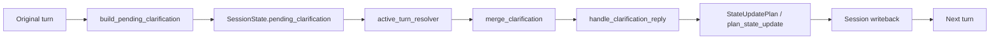

# Phase 4 Reference / Clarification Resume Report
## 1. Conclusion
- PHASE_4_STATUS: PASS
- CLARIFICATION_RESUME_SEMANTIC_READY: true
- TYPED_PENDING_CLARIFICATION_READY: true
- STATE_UPDATE_PLAN_CONTROLS_RESUME_WRITEBACK: true
- CURRENT_SHOP_NOT_POLLUTED: true
- LAST_RECOMMENDATION_LIST_NOT_POLLUTED: true
- CAN_ENTER_PHASE_5: true
- CAN_ENTER_PHASE_6: false
- CAN_ENTER_PHASE_7: false
- Main conclusion: Phase 4 的 typed clarification / resume_strategy / pending 清理恢复链路已接通，`active_turn_resolver`、`clarification`、`merge_clarification`、`state_update_plan` 与 `state_update_planner` 已形成可观测、可验证的恢复闭环。单店、比较、探索、取消、新任务覆盖、约束更新都已在直接恢复测试中覆盖。

## 2. Scope
本轮只做 Phase 4，不做 Phase 5/6/7/8。

## 3. Files Changed
| File | Change | Reason | Risk |
| --- | --- | --- | --- |
| `local_life_agent/domain/enums.py` | 扩充 `MissingSlotType` 类型枚举 | 支持 typed clarification / resume 分类 | 低 |
| `local_life_agent/domain/schemas.py` | 补充 missing slot 类型别名与校验对齐 | 让 schema 接受 Phase 4 新类型 | 低 |
| `local_life_agent/domain/graph_state.py` | 增加 `clarification_resolution`、`resume_strategy` | 让 graph state 可观测恢复策略 | 低 |
| `local_life_agent/domain/graph_state_model.py` | 增加 `clarification_resolution`、`resume_strategy` | 与 graph state 保持一致 | 低 |
| `local_life_agent/engine/subgraphs/active_turn_resolver.py` | 语义优先消费 `new_task_override` / `constraint_update`，并弱化文本 topic-switch | 收敛 active turn recovery 边界 | 中 |
| `local_life_agent/engine/subgraphs/merge_clarification.py` | 透传 `resume_strategy`、`task_type_source`、`clarification_resolution` | 让 pending 恢复结果可写回 | 中 |
| `local_life_agent/engine/subgraphs/state_update_plan.py` | 将恢复相关字段带入 turn_context | 供 state writeback planner 决策 | 低 |
| `local_life_agent/planning/plans/state_update_planner.py` | 合并 `active_constraints`，并兼容无显式 status 的已解析 shop 结果 | 避免写回丢失与 current_shop 漏写 | 中 |
| `local_life_agent/target/clarification.py` | typed pending clarification / resume_strategy / clarification_resolution 主实现 | Phase 4 核心 | 中 |
| `local_life_agent/tests/test_chat_clarification_resume_e2e.py` | 新增 Phase 4 恢复 e2e 测试 | 覆盖恢复契约 | 低 |
| `local_life_agent/tests/test_active_turn_resolver.py` | 增加语义 override 与 constraint update 测试 | 验证 active turn 消费 SemanticFrame | 低 |
| `local_life_agent/tests/test_context_recovery_clarification.py` | 补充 clarification resume / 不污染状态的回归 | 覆盖 context recovery 边界 | 低 |
| `local_life_agent/tests/test_router_rule_policy_guard.py` | 校验 typed clarification 与语义优先路由 | 防止回退到关键词主导 | 低 |
| `local_life_agent/tests/test_semantic_router_policy_alignment.py` | 补 typed prompt 与语义标志对齐 | 锁住 Phase 2/3/4 语义边界 | 低 |
| `local_life_agent/tests/test_p5_session_state_writeback.py` | 对齐 typed `resume_strategy` 断言 | 防止旧 `resume_original_task` 回流 | 低 |

## 4. Pending Clarification Protocol
当前协议是：
1. pending clarification 由 `build_pending_clarification()` 创建。
2. 创建时写入 `missing_slot_type`、`resume_strategy`、`reason`、`candidate_targets`、`original_semantic_frame`。
3. pending 存在于 `SessionState.pending_clarification`，并通过 `StateUpdatePlan` / `SessionWriteDirective` 写回。
4. 用户回复先进入 `active_turn_resolver`，再进入 `merge_clarification`。
5. `handle_clarification_reply()` 负责 typed resume 判定，返回：
   - `status`
   - `resume_strategy`
   - `task_type_source`
   - `missing_slot_type`
   - `clarification_resolution`
6. `state_update_plan` 负责把恢复结果写回 session，不能由 LLM 直接改 session。
7. `pending_clarification` 的清理只在明确的 `restore / topic_switch / cancelled / expired` 路径发生。

状态流转图：

## 5. Resume Strategy Contract
| Strategy | Trigger | State Impact | Tests |
| --- | --- | --- | --- |
| `fill_missing_location` | 补位置 / 商圈 / 附近范围 | 继承 category，补齐 location，清 pending | `test_chat_clarification_resume_e2e.py` |
| `fill_missing_shop` | 补完整店名 | 进入单店事实查询，更新 shop target / current_shop | `test_chat_clarification_resume_e2e.py` |
| `fill_missing_comparison_targets` | 补比较目标 | 写回 comparison_targets，清 pending | `test_chat_clarification_resume_e2e.py` |
| `fill_missing_exploration_location` | 补探索位置 | 保留 exploration_stages，补 location | `test_chat_clarification_resume_e2e.py` |
| `resolve_shop_reference` | 明确店名 / 候选项 / 单店引用 | 绑定 deterministic shop target | `test_chat_clarification_resume_e2e.py` |
| `resolve_ordinal_reference` | 第一家 / 第二家等 | 绑定上次推荐列表中的序号目标 | `test_chat_clarification_resume_e2e.py` |
| `resolve_deictic_reference` | 这家 / 那家，且 current_shop 存在 | 绑定 current_shop，不默认第一家 | `test_chat_clarification_resume_e2e.py` |
| `apply_constraint_update` | 更便宜一点 / 更近一点 / 约束补充 | 继承原任务，更新约束，不污染上下文 | `test_chat_clarification_resume_e2e.py` |
| `start_new_task` | 不要了，换任务 | 清旧 pending，旧 category 不继承 | `test_chat_clarification_resume_e2e.py` |
| `cancel_pending_task` | 算了 / 取消 | 清 pending，终止旧任务 | `test_chat_clarification_resume_e2e.py` |
| `ask_clarification_again` | 仍然缺槽 / 无法解析 | 保留 pending，继续 typed clarification | `test_chat_clarification_resume_e2e.py` |
| `reject_invalid_reply` | 无法归类且无安全风险 | 保留 pending 或输出澄清 | `test_active_turn_resolver.py` |
| `safe_direct_response` | 安全/拒答类 direct response | 走 direct response，不继续业务 workflow | `test_router_rule_policy_guard.py` |

## 6. Typed Clarification Coverage
| Missing Slot Type | Supported? | Resume Behavior | Tests |
| --- | --- | --- | --- |
| `missing_location` | Yes | 继承 category，补 location，清 pending | `test_chat_clarification_resume_e2e.py` |
| `missing_shop` | Yes | 单店查询恢复，写回 current_shop | `test_chat_clarification_resume_e2e.py` |
| `missing_comparison_targets` | Yes | 写回 comparison_targets；无上下文则继续 typed clarification | `test_chat_clarification_resume_e2e.py` |
| `missing_exploration_location` | Yes | 保留 exploration_stages，补 location | `test_chat_clarification_resume_e2e.py` |
| `missing_category` | Yes | 继续追问，不伪装成已解析 | `test_semantic_router_policy_alignment.py` |
| `ambiguous_shop` | Yes | 走 `resolve_shop_reference`，仅在明确候选时恢复 | `test_chat_clarification_resume_e2e.py` |
| `ambiguous_comparison_targets` | Yes | 比较目标不明确时继续 typed clarification | `test_chat_clarification_resume_e2e.py` |
| `unresolved_deictic_reference` | Yes | current_shop 存在时才恢复，否则继续 typed clarification | `test_chat_clarification_resume_e2e.py` |
| `unresolved_ordinal_reference` | Yes | last_recommendation_list 存在时才恢复，否则继续 typed clarification | `test_chat_clarification_resume_e2e.py` |
| `low_confidence_semantic_parse` | Yes | 继续澄清，不冒充 resolved | `test_semantic_router_policy_alignment.py` |
| `cancel` | Yes | 清 pending，终止旧任务 | `test_chat_clarification_resume_e2e.py` |
| `new_task_override` | Yes | 清旧 pending，开始新任务 | `test_chat_clarification_resume_e2e.py` |
| `constraint_update` | Yes | 继承原任务，更新 active constraints | `test_chat_clarification_resume_e2e.py` |

## 7. Reference Resume Findings
- shop reference：
  - 直接店名可以恢复为单店查询。
  - 候选项匹配优先于自由猜测。
  - partial match 不冒充唯一命中。
- ordinal reference：
  - 有 `last_recommendation_list` 时可以恢复序号目标。
  - 没有上下文时继续 typed clarification。
- deictic reference：
  - `current_shop` 存在时可恢复为当前店。
  - 没有 `current_shop` 时不默认第一家。
  - 这是 Phase 4 的关键边界之一。
- `last_recommendation_list`：
  - 仅在明确序号 / 比较上下文时参与恢复。
  - 不作为无条件继承的当前店。
- `current_shop`：
  - 只在明确 resolved shop 后写回。
  - 没有明确 target 时不能污染。
- ambiguous / unresolved / partial：
  - 不冒充 resolved。
  - 必须继续 typed clarification 或返回 invalid/ask again。

## 8. Cancel / New Task / Constraint Update Findings
- cancel：
  - 会清 pending clarification。
  - 不继续业务 workflow。
  - 不污染 current_shop / last_recommendation_list / comparison_targets。
- new_task_override：
  - 会退出旧任务并清旧 pending。
  - 旧 category 不继承。
  - 新任务重新进入正常 router。
- constraint_update：
  - 更新 active constraints。
  - 继承原任务上下文，但不覆盖整段 session。
  - 不误判 comparison。

## 9. StateUpdatePlan Findings
- pending clarification set / clear：
  - 由 `StateUpdatePlan` / `SessionWriteDirective` 统一处理。
  - `merge_clarification` 只产出恢复结果，不直接改 session。
- current_shop 更新条件：
  - 只在确定 resolved shop 后写回。
  - 已兼容无显式 `status` 但含 shop_id/shop_name 的确定性结果。
- last_recommendation_list 更新条件：
  - 仅在推荐成功时更新。
  - cancel / new_task_override 不会污染推荐历史。
- comparison_targets 更新条件：
  - 仅在明确比较目标后更新。
  - 比较失败时保留 typed clarification。
- active constraints 更新条件：
  - 合并 turn_context 中的约束与 semantic_frame 的 hard/soft preference。
  - 不覆盖无关上下文。

## 10. Active Turn Resolver Findings
- `active_turn_resolver.py` 已显式消费 `SemanticFrame` 的：
  - `new_task_override`
  - `constraint_update`
- 语义 override 优先于弱文本规则。
- 规则仍保留为 fallback，不覆盖高置信结构化语义。
- `reply_frame` 已进入 topic-switch 判定，避免纯文本规则劫持补槽回复。

## 11. Test Coverage
| Test | Scenario | Result |
| --- | --- | --- |
| `local_life_agent/tests/test_chat_clarification_resume_e2e.py` | missing location / missing shop / comparison / exploration / new task / cancel / ordinal / deictic / constraint update | PASS |
| `local_life_agent/tests/test_active_turn_resolver.py` | semantic new task override / constraint update short-circuit | PASS |
| `local_life_agent/tests/test_context_recovery_clarification.py` | clarification resume / current_shop safety / pending handling | PASS |
| `local_life_agent/tests/test_router_rule_policy_guard.py` | router policy guard + typed clarification | PASS |
| `local_life_agent/tests/test_semantic_router_policy_alignment.py` | semantic frame alignment + typed prompts | PASS |
| `local_life_agent/tests/test_p5_session_state_writeback.py` | typed resume_strategy persisted | PASS |
| `local_life_agent/tests/test_semantic_parser.py` | phase 2 regression | PASS |
| `local_life_agent/tests/test_orchestration_router.py` | phase 3 regression | PASS |
| `local_life_agent/tests/test_workflow_runner.py` | workflow execution regression | PASS |
| `local_life_agent/tests/test_workflow_registry.py` | registry regression | PASS |
| `local_life_agent/tests/test_chat_interface_full_e2e.py` | full chat e2e optional | SKIPPED (17) |
| `local_life_agent/tests/test_candidate_resolver.py` | candidate resolver optional | PASS |
| `local_life_agent/tests/test_comparison_flow.py` | graph-level comparison E2E optional | FAIL (4) |

## 12. Regression Commands Run
- `python -m compileall local_life_agent` -> PASS
- `pytest local_life_agent/tests/test_chat_clarification_resume_e2e.py -q` -> PASS, 11 passed
- `pytest local_life_agent/tests/test_active_turn_resolver.py -q` -> PASS, 30 passed
- `pytest local_life_agent/tests/test_context_recovery_clarification.py -q` -> PASS, 24 passed
- `pytest local_life_agent/tests/test_router_rule_policy_guard.py -q` -> PASS, 44 passed
- `pytest local_life_agent/tests/test_semantic_router_policy_alignment.py -q` -> PASS, 8 passed
- `pytest local_life_agent/tests/test_semantic_parser.py -q` -> PASS, 37 passed
- `pytest local_life_agent/tests/test_orchestration_router.py -q` -> PASS, 9 passed
- `pytest local_life_agent/tests/test_workflow_runner.py -q` -> PASS, 3 passed
- `pytest local_life_agent/tests/test_workflow_registry.py -q` -> PASS, 5 passed
- `pytest local_life_agent/tests/test_chat_interface_full_e2e.py -q` -> SKIPPED, 17 skipped
- `pytest local_life_agent/tests/test_candidate_resolver.py -q` -> PASS, 23 passed
- `pytest local_life_agent/tests/test_comparison_flow.py -q` -> FAIL, 4 failed

## 13. Known Remaining Issues
- Phase 5：exploration planning 子目标拆解仍需增强。
- Phase 6：evidence review / answer verify 仍需统一消费更多语义元信息。
- Phase 7：entity grounding / target resolution 仍需稳定。
- Phase 8：chat E2E gate 仍需完整收口。
- Optional graph-level `test_comparison_flow.py` 仍有 4 个失败，用于后续 comparison E2E 的进一步收口。

## 14. Final Gate
- PHASE_4_COMPLETE: true
- CLARIFICATION_RESUME_SEMANTIC_READY: true
- TYPED_CLARIFICATION_READY: true
- RESUME_STRATEGY_VISIBLE: true
- PENDING_CLARIFICATION_CLEARING_TYPED: true
- CANCEL_INTENT_CLEARS_PENDING: true
- NEW_TASK_OVERRIDE_CLEARS_OLD_PENDING: true
- CONSTRAINT_UPDATE_DOES_NOT_POLLUTE_CONTEXT: true
- CURRENT_SHOP_NOT_POLLUTED: true
- LAST_RECOMMENDATION_LIST_NOT_POLLUTED: true
- STATE_UPDATE_PLAN_CONTROLS_WRITEBACK: true
- CAN_START_PHASE_5: true
- CAN_START_PHASE_6: false
- CAN_START_PHASE_7: false
