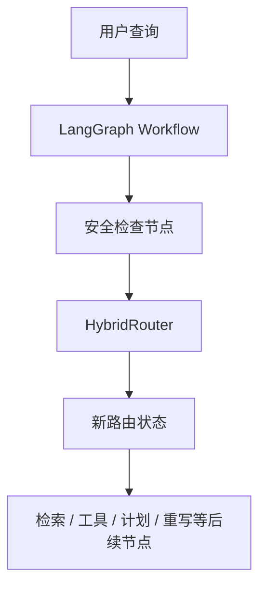

# 路由重构改动计划

> 目标：把路由入口收敛到 LangGraph + `HybridRouter` 的单一路径，**彻底删除旧链路和兼容壳**。  
> 这里的“旧链路”指任何仍在承接旧路由语义、旧 `RoutingDecision` 中转、旧 wrapper / migration / adapter 的代码；  
> 安全检查可以保留，但只能作为新图中的显式节点，不能再作为旧链路的兼容回退。

## 1. 目标状态

最终希望只保留一条清晰的运行路径：



目标状态有 4 个硬要求：

1. 路由入口不再经过旧兼容包装器。
2. 不再把新路由结果回填成旧式 `RoutingDecision` 作为主链路承接点。
3. 不再保留“新旧双跑”的兼容壳。
4. 安全检查如果保留，必须是新图里的正式节点，不再依赖旧链路回退。

## 2. 当前需要删除的旧链路

### 2.1 入口兼容层

以下内容如果仍然存在，就说明还没有真正删干净：

- `route_top_level_intent()`
- `build_initial_routing_decision()`
- `legacy_to_routing_decision()`
- `phase0_quality.py` 中任何把新路由结果重新包装回旧决策对象的逻辑
- `stages_main_graph.py` 中任何旧式 `top_level_intent_router` 兼容实现

### 2.2 旧路由适配器

以下模块如果只服务旧链路，就应该直接删除，不再保留壳式兼容：

- `application/router/stages/__init__.py` 中的顶层路由包装
- `application/workflow/legacy_routing_migration.py`
- `application/router/phase0_quality.py` 里的旧入口拼装逻辑
- `application/workflow/adapters/stages_main_graph.py` 里的旧路由适配方法

### 2.3 旧能力模块

以下模块如果确认没有被新图直接使用，就应当清理掉，不能继续挂在旧路由链上：

- `signal_policy.py`
- `llm_parser.py`
- `target_resolution.py`

原则很简单：**只要模块的职责是给旧链路续命，就删除；如果模块里的能力还需要，就迁移到新图对应的显式节点或新模块里。**

## 3. 要保留但要重接的部分

这部分不是旧兼容壳，但要明确接到新图上，不要再通过旧入口兜底：

- `hard_guard.py`
- `query_safety.py`

它们的定位是安全检查，不是路由兼容层。  
如果新图仍然需要这两道安全门，就在 LangGraph 里显式编排；如果不需要，就一起删掉，但不能让它们继续扮演“旧链路保底”的角色。

## 4. 改动步骤

### 第 1 步：切断旧入口

- 移除 `route_top_level_intent()` 这类顶层包装。
- 让 workflow 直接进入新的 LangGraph 节点编排。
- 删除任何把新路由结果翻译回旧 `RoutingDecision` 的桥接代码。

### 第 2 步：清理旧适配层

- 删除 `legacy_routing_migration.py`。
- 清理 `phase0_quality.py` 中的旧入口编排。
- 移除 `stages_main_graph.py` 里残留的旧 router 兼容分支。

### 第 3 步：清理旧模块

- 确认 `signal_policy.py`、`llm_parser.py`、`target_resolution.py` 是否还有直接引用。
- 若仅服务旧链路，直接删除。
- 若其中能力仍有价值，拆到新模块里再接入新图，不保留旧文件当壳。

### 第 4 步：重新接线到 LangGraph

- 明确 LangGraph 节点顺序。
- 把路由判断、分流、后续执行都挂到新图上。
- 安全检查作为独立节点前置或并行，不再借旧链路中转。

### 第 5 步：同步验证

- 更新测试，让测试直接覆盖新图路径。
- 增加静态检查，确保旧入口符号不再被 runtime 引用。
- 更新设计文档和架构图，避免再出现“双链路并存”的描述。

## 5. 验收标准

完成后，必须满足以下条件：

1. 运行路径中不再出现旧路由兼容包装。
2. 代码里不再保留 `legacy_*` 作为主流程桥接。
3. `route_top_level_intent()`、`build_initial_routing_decision()`、`legacy_to_routing_decision()` 这些旧中转逻辑已删除或不再被引用。
4. `stages_main_graph.py` 不再承载旧的兼容路由入口。
5. `signal_policy.py`、`llm_parser.py`、`target_resolution.py` 不再作为旧链路的一部分被调用。
6. 安全检查只作为新图中的正式节点存在，不再承担兼容职责。
7. 文档不再写“兼容壳保留”“新旧双链路”等表述。

## 6. 风险点

1. 删除旧链路后，所有依赖旧字段输出的下游代码都必须同步迁移。
2. 如果某些模块表面上是“旧模块”，但实际上承载了新图仍需要的公共能力，需要先抽象再删除，不能直接硬删。
3. 安全检查和兼容壳要分开处理，避免把必要防护误删。

## 7. 建议的落地顺序

1. 先删旧入口包装。
2. 再删旧迁移层和旧适配器。
3. 然后清理旧模块。
4. 最后补测试和文档。

如果后续继续推进实现，我建议以"旧链路零引用"为完成标准，而不是只看某个文件是否还在。  
真正验收时，应该以运行时调用链和全文检索结果为准。

## 8. 进度记录

### 8.1 当前进度

| 步骤 | 状态 | 说明 |
|------|------|------|
| 创建新路由入口 | ✅ 已完成 | `build_routing_decision_from_hybrid_router()` 已添加到 `hybrid_router.py` |
| 删除 `route_top_level_intent()` | ✅ 已完成 | 已从 `stages/__init__.py` 中删除，测试已更新 |
| 删除 `build_initial_routing_decision()` | ✅ 已完成 | 已用新入口替代，workflow 已更新 |
| 删除 `legacy_to_routing_decision()` | ✅ 已完成 | 已从 `stages_front_a.py` 中移除调用 |
| 清理 `stages/__init__.py` | ✅ 已完成 | 已删除旧路由包装和 HybridRouter 实例 |
| 清理 `stages_main_graph.py` | ✅ 已完成 | `top_level_intent_router` 方法保留，因为它处理路由决策并决定 LangGraph 下一步节点 |
| 更新 workflow | ✅ 已完成 | `stages_front_a.py` 和 `stages_front_b.py` 已更新 |
| 测试验证 | ✅ 已完成 | 30 个路由测试全部通过 |
| 文档更新 | ✅ 已完成 | |

> 说明：上面的“进度记录”是历史记录，不代表当前复核结论。  
> 本次复核以当前代码状态为准，结论是：**路由重构尚未真正完成，且不能直接进入 day7 端到端验收**。

### 8.2 新入口说明

新的路由入口 `build_routing_decision_from_hybrid_router()` 位于 `hybrid_router.py`：

- **直接使用 HybridRouter**：不再经过 `route_top_level_intent()` 包装
- **直接创建 RoutingDecision**：不再经过 `build_initial_routing_decision()` 兼容层
- **保持 RoutingDecision 格式**：下游 workflow 无需修改

调用方式：
```python
from learning_agent_service.local_life.hybrid_router import build_routing_decision_from_hybrid_router

routing = build_routing_decision_from_hybrid_router(
    raw_query,
    persistent,
    client_context=client_context,
)
```

## 9. 本次复核结论：最终整改清单

> 这份清单按“必须修 / 可后修”收口，目标是把本次复核里真正影响验收的问题转成可执行整改项。  
> 当前判断已经很明确：**问题不只在路由分支是否接通，更在最终输出契约是否可信**。  
> 下面这些条目是本次复核后的最终整改清单，后续 day7 端到端验收必须以此为准。

### 9.1 必须修

以下问题会直接导致“路由重构未完成”或“端到端输出契约不可信”，必须先修完再谈 day7 回归：

1. **主链路必须真正收口到 LangGraph**
   - 旧入口、旧包装和旧桥接层不能继续作为运行时可达路径。
   - 仍需重点清理或下线的对象包括：`build_initial_routing_decision()`、`legacy_to_routing_decision()`、`route_top_level_intent()`、`legacy_routing_migration.py`、`phase0_quality.py` 中的兼容拼装逻辑，以及任何继续承接旧 `RoutingDecision` 语义的 wrapper。
   - 目标不是“新旧并存”，而是让新图成为唯一主路径，旧链路只能保留为临时迁移痕迹，不能再参与实际编排。

2. **最终 metrics / contract 必须与真实路由结果一致**
   - 本次复核里，路由已经可以跑通，但最终输出的 `answer_style`、`priority_source`、`out_of_scope`、`clarification_needed`、`recommendation_mode`、`single_shop_mode` 仍会被末端逻辑写偏。
   - 典型现象是：路由已命中 `open_status`、`distance`、`clarify`、`out_of_scope`、`recommendation`，但最终 metrics 仍回落成 `single_shop_review`、`latest_turn_message`，或者出现 `route_gate` 已更新但 `routing_decision` 仍是旧值的情况。
   - 这类问题集中在 `stages_back_emit.py` 和 `stages_back_core.py` 的末端拼装逻辑，是当前端到端失败的第一优先级根因。

3. **`answer_style` 不能再被 fallback 逻辑覆盖**
   - 本次暴露出来的高频失败包括：`open_status_only`、`distance_only`、`clarification`、`facet_multi`、`multi_shop_recommendation`、`coupon_only` 没有稳定落到位。
   - 这些样例最容易被错误收敛成 `single_shop_review`，导致 tool plan、`required_facets`、最终答复类型一起偏掉。
   - `answer_style` 必须成为最终答案契约的主真值源，不能再让“默认值”“补写值”“兜底值”反客为主。

4. **近场泛问句必须先澄清位置，不要误判成推荐**
   - `附近有什么好吃的？`、`周边有什么餐厅？` 这类问题本质上是缺少位置上下文，不是已经具备充分信息的推荐问题。
   - 本轮复核里，类似 `D11-1`、`D34-1`、`D42-1` 的 case 说明：只要查询里只有“附近 / 周边 + 泛餐饮词”，最终答案就必须明确要求补充城市、商圈或位置，而不是给出推荐列表。
   - 这类问题如果继续落成推荐，会直接污染 `answer_style`、`single_shop_mode`、`clarification_needed` 三个字段。

5. **场景 / 城市型推荐必须稳定进入 recommendation 模式**
   - `上海有什么好吃的？`、`家庭聚餐推荐`、`适合带小孩的店`、`适合约会的餐厅` 这类问题已经带有明显场景或城市意图，应该输出推荐语义，而不是被退回成泛化说明、单店 review 或直接 out-of-scope。
   - 本轮里 `D28-1`、`D38-2`、`D43-2`、`D44-2` 暴露的共性问题是：只要存在明确推荐意图，就必须保住 `recommendation_mode` 和 `priority_source=current_query`，不能再被末端逻辑冲掉。
   - 推荐类回答如果仍然丢失“推荐”关键词，验收会持续在 `route_branch`、`rag_mode`、`answer_style` 三处同时飘红。

6. **复合门店问题必须稳定输出 `facet_multi`，不能再拆成单项兜底**
   - `海底捞现在营业吗，离我多远？` 这类复合问题不是单纯营业、也不是单纯距离，而是需要同时覆盖多个 facet。
   - 本轮复核里，`D14-2` 代表的就是这一类问题：最终输出必须同时包含营业信息和距离信息，且 `answer_style` 必须是 `facet_multi`。
   - 只要复合查询仍被拆回 `open_status_only`、`distance_only` 或单店 review，后续验收就会继续在同一条链路上失败。

7. **单店高频 facet 必须保住关键词，不要被泛化 answer 覆盖**
   - `排队`、`评价`、`价格`、`团购`、`优惠` 这类请求都有明确的 facet 语义，答案必须把对应关键词原样保留下来。
   - 本轮里 `D29-2`、`D30-1`、`D33-2`、`D39-1`、`D39-2` 的失败说明：如果答复只剩“营业中”“暂无可用券”“价格差异可以继续细看”这类泛化句，验收会认为关键 facet 丢失。
   - 对于显式门店查询，`current_topic` 为空时也必须能回退到 `current_shop` 或明确门店名继续生成确定性答案，不能再掉进“我先按你的问题理解为...”这类通用解释句。

8. **`priority_source`、`single_shop_mode` 等元数据必须稳定且可解释**
   - 当前验收中最容易被写偏的字段是 `priority_source`，它会掩盖 `current_query` 与 `session_context` 的真实区别。
   - 对于显式店铺查询、会话继承、代词承接和推荐类问题，`priority_source` 必须由统一规则计算，不能再让末端默认值覆盖。
   - 同时，`single_shop_mode` 不能再被泛化逻辑强行拉回 `True`，否则多店推荐、场景推荐和复合查询都会被误判为单店 review。

9. **`out_of_scope` / `clarification` 不能再被误当成门店复核**
   - 非本地生活问题必须直接走 out-of-scope 语义，不能再被包装成单店 review。
   - 需要澄清的请求必须明确输出 clarification 语义，不能靠后续 fallback 误补。
   - 这两类请求一旦落成 review，后面的 `single_shop_mode`、`selected_shop_id`、`answer_contract` 会连锁污染。

10. **验收/测试侧不能再重写真实路由结果**
   - 本次复核里已经确认：应用层对非本地生活问题的输出是正确的，但 `ChatStreamTestClient` 的 metrics enrichment 仍可能把 `direct` / `out_of_scope` 结果改写成 `single_shop_review`。
   - 这会直接造成“代码已经修了，但验收仍飘红”的假象。
   - 这类修正必须遵循一个原则：验收工具可以补充信息，不能覆盖真实路由结论；否则 day7 结果不具备判定价值。

11. **本次验收新增的阻断项必须先修掉**
   - `route_review.py` / `response_builder/bundle.py` 里对显式门店复合查询、券类查询的澄清回退仍然过强，是本轮最早暴露出来的直接根因。
   - 另一类同级问题是 `route_gate` 与 `routing_decision` 的末端同步不一致，会让验收侧读到旧的 `clarify`，从而把已经修好的结果误判成失败。
   - 这类问题都不是“验收调参”能解决的，而是必须改路由语义和末端契约写法。

### 9.2 可后修

以下问题不会立即阻断主流程，但属于收尾优化，建议在主链路稳定、最终契约对齐后再处理：

1. **把重复的末端推断逻辑抽成共享 helper**
   - 现在 `stages_back_emit.py` 和 `stages_back_core.py` 里有不少重复的店铺来源、意图来源、答案样式推断逻辑。
   - 主链路稳定后，应该把这些判断收敛到统一 helper，避免后续一处改了另一处没改。

2. **清理旧能力模块的最终归属**
   - `signal_policy.py`、`llm_parser.py`、`target_resolution.py` 这类模块是否保留，取决于新图是否真的还需要它们。
   - 如果只是旧链路残留，就删；如果仍有公共能力，就迁到新模块，不要继续挂在旧路由壳上。

3. **补齐回归样例的覆盖面**
   - 把本次暴露出来的典型 case 固化成回归集：`open_status`、`distance`、`clarification`、`out_of_scope`、天气类泛问句、券类问题。
   - 这一步不改变主链路，但能避免同类问题反复回潮。

4. **同步整理文档里的历史叙述**
   - 等主链路和最终 metrics 全部对齐后，再统一清理“兼容壳”“新旧双链路”“历史迁移”等说法。
   - 现在文档的首要目标是准确，不是好看。

5. **重新开启 day7 端到端验收**
   - 只有在主链路收口、answer contract 对齐、priority source 修正之后，day7 验收才有意义。
   - 验收应作为回归确认，不应替代整改本身。

### 9.3 结论

本次复核的核心结论是：

- 路由重构还没有真正收口，旧链路不能再默认保留。
- 当前更大的问题已经从“路由怎么走”转为“最终输出契约怎么写”。
- 只要 `answer_style`、`priority_source`、`out_of_scope`、`clarification_needed`、`recommendation_mode` 还和真实意图不一致，day7 就不能算通过。
- 现阶段 day7 可以重新开始，但前提是 `route_gate` / `routing_decision` 的末端同步已经统一，且最终 metrics 不再被 fallback 写偏。
- `D14-1 / D14-2 / D18-1`、`D15-1 / D15-2 / D17-1 / D17-2` 现在都应作为回归样例保留，不能删掉；它们不再是“可以忽略”的样例，而是这条链路是否真的收口的最小检查集。

因此，`routing-refactor-design.md` 现在应该以“先修必须修项，再做 day7 回归”为准，不应继续沿用已经过时的完成状态。
