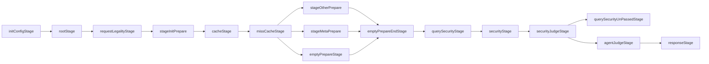

# zhida_agent 路由层总结

> 说明：本文总结的是 `zhida_agent` 的实际代码结构，不是理想化设计稿。  
> 重点回答三个问题：
> 1. 它是不是路由 agent
> 2. 它怎么把请求分到不同线路
> 3. 哪些节点用了 LLM，哪些节点是检索 / 规则 / 安全 / 后处理

## 1. 一句话结论

`zhida_agent` 是一个**带 LLM 决策的路由型 agent**。  
它自己不负责把所有事情做完，而是先做合法性和安全前置判断，再通过 `AgentRouterLogic` 选择进入不同子线路：

- `direct_chat_sub_graph`：直答 / 轻量处理
- `research_chat_sub_graph`：深搜 / 检索增强 / 综合回答
- 以及 `profile`、`jailbreak`、`clarify` 等工具型线路

换句话说，它的核心作用是：**选路、分流、下放执行**，不是单一的大一统回答器。

---

## 2. 主图编排结构

主入口在：

- [stream_chat_zhida_agent_graph.go](D:/桌面/BUPT/JAVA/知乎/aisp-core-master/remote-aisp-core/aisp-core-master/pkg/graph/graph/api/stream_chat_zhida_agent_graph.go#L39)

从代码看，`zhida_agent` 的主干 stage 大致是：

### 2.1 结构解读

这条主图可以理解成四层：

1. **入口和合法性层**
   - 初始化配置
   - 请求合法性判断
   - 缓存命中判断

2. **准备层**
   - 处理上下文
   - 构建 base info
   - 整理 source / search source

3. **安全与路由层**
   - 查询安全
   - 内容安全
   - 通过 `AgentRouterLogic` 选择线路

4. **执行与响应层**
   - 进入不同子图
   - 汇总结果
   - 构建响应并返回

它不是“一个节点里做完所有事”，而是明确拆成了前置处理、路由决策、子图执行三段。

---

## 3. 它是不是路由 agent

是，而且是**典型的路由型 agent**。

### 3.1 路由发生在哪里

路由核心在：

- [agent_router_logic.go](D:/桌面/BUPT/JAVA/知乎/aisp-core-master/remote-aisp-core/aisp-core-master/pkg/graph/graph/router/agent_router_logic.go#L50)
- [agent_router_logic.go](D:/桌面/BUPT/JAVA/知乎/aisp-core-master/remote-aisp-core/aisp-core-master/pkg/graph/graph/router/agent_router_logic.go#L169)
- [agent_router_logic.go](D:/桌面/BUPT/JAVA/知乎/aisp-core-master/remote-aisp-core/aisp-core-master/pkg/graph/graph/router/agent_router_logic.go#L230)

它的路由方式不是纯规则 `if/else`，而是：

1. 先根据请求上下文组装可用工具
2. 用模型在工具里选一个
3. 对模型输出做工具校验
4. 命中哪个 tool，就执行对应 tool 的 `Run(...)`

### 3.2 可用线路 / 工具

代码里默认会组装这些工具类型：

- `profile`
- `jailbreak`
- `direct_reply`
- `research`

另外代码里也有 `clarify` 工具实现，但默认路由集合里不一定总是放进去，属于可扩展工具类型。

这意味着它不是“一个统一大模型直接回答”，而是“让模型先决定走哪条能力线”。

---

## 4. 如何路由不同线路

### 4.1 路由入口：`AgentRouterLogic`

`AgentRouterLogic` 做了三件事：

1. **创建 tools**
   - 从上下文组装可选工具
   - 每个工具都有名字和参数定义

2. **让模型选 tool**
   - `ChatRequest` 里带上 `Tools`
   - 使用 `ToolChoiceOptionsRequired`
   - 调用 `modelGatewayRPC.Chat(...)`

3. **执行命中的 tool**
   - 验证 tool call 合法性
   - 记录 trace
   - 调用对应 tool 的 `Run(...)`

### 4.2 路由的结果去向

从当前代码结构看，主要有两条主线：

#### A. direct chat 线

入口文件：

- [direct_chat_sub_graph.go](D:/桌面/BUPT/JAVA/知乎/aisp-core-master/remote-aisp-core/aisp-core-master/pkg/graph/graph/router/sub_graph/api/direct_chat_sub_graph.go#L26)

特点：

- 适合直接回答、轻量处理
- 有 `DirectChatLogic`
- 之后通常会进入 `StreamChatLogic` 或 `ChatLogic`
- 再经过安全后处理和响应构建

#### B. research 线

入口文件：

- [research_chat_sub_graph.go](D:/桌面/BUPT/JAVA/知乎/aisp-core-master/remote-aisp-core/aisp-core-master/pkg/graph/graph/router/sub_graph/api/research_chat_sub_graph.go#L27)

特点：

- 适合需要检索、深挖、综合资料的请求
- 有 `DeepSearchLogic`
- 配套后处理节点负责清洗、回写、摘要或引用整理
- 最后再进入生成和安全处理

### 4.3 `profile / jailbreak / clarify`

这几个更像是“专门语义线路”：

- `profile`：回答“你是谁 / 你会什么 / 你能做什么”
- `jailbreak`：处理越狱或安全相关的特定分支
- `clarify`：处理澄清类交互

它们并不是普通问答主链，而是路由层里显式暴露的特殊能力分支。

---

## 5. 哪些节点用了 LLM

### 5.1 真正调用模型网关的节点

这几个节点是最明确的 LLM 节点：

- `AgentRouterLogic`
  - 用模型做 tool choice
  - 见 [agent_router_logic.go](D:/桌面/BUPT/JAVA/知乎/aisp-core-master/remote-aisp-core/aisp-core-master/pkg/graph/graph/router/agent_router_logic.go#L230)

- `DeepSearchLogic`
  - research 线路里的深搜节点
  - 会反复调用 `modelGatewayRPC.Chat(...)` 和 `StreamChat(...)`
  - 见 [kb_deepsearch_logic.go](D:/桌面/BUPT/JAVA/知乎/aisp-core-master/remote-aisp-core/aisp-core-master/pkg/graph/graph/sub_graph/root_logic/kb_deepsearch_logic.go#L506)
  - 见 [kb_deepsearch_logic.go](D:/桌面/BUPT/JAVA/知乎/aisp-core-master/remote-aisp-core/aisp-core-master/pkg/graph/graph/sub_graph/root_logic/kb_deepsearch_logic.go#L918)

- `StreamChatLogic`
  - 流式生成答案
  - 见 [stream_chat_logic.go](D:/桌面/BUPT/JAVA/知乎/aisp-core-master/remote-aisp-core/aisp-core-master/pkg/graph/graph/generate/stream_chat_logic.go#L317)
  - 见 [stream_chat_logic.go](D:/桌面/BUPT/JAVA/知乎/aisp-core-master/remote-aisp-core/aisp-core-master/pkg/graph/graph/generate/stream_chat_logic.go#L319)

- `ChatLogic`
  - 非流式或补充式生成
  - 见 [chat_logic.go](D:/桌面/BUPT/JAVA/知乎/aisp-core-master/remote-aisp-core/aisp-core-master/pkg/graph/graph/generate/chat_logic.go#L181)

### 5.2 不算直接 LLM 调用，但和 LLM 相关

- `FAQLogic`
  - 会做 prompt 模板生成
  - 但更像模板渲染，不是直接模型推理

- `RequestConfigLogic`
  - 会根据场景调整模型配置、prompt 配置、召回配置
  - 本身不直接调模型

---

## 6. 有么有用到 RAG

有，但要分层看。

### 6.1 `zhida_agent` 不是“纯 RAG agent”

它的主职责是路由和分流，不是单一 RAG 流程。  
真正的 RAG 主要集中在 `research` 线路里，以及准备阶段的 source 组织。

### 6.2 准备阶段的检索资源整理

在准备逻辑里，代码会构建：

- `SourceMap`
- `SearchSourceMap`

相关位置：

- [preparer_data_tidy_logic.go](D:/桌面/BUPT/JAVA/知乎/aisp-core-master/remote-aisp-core/aisp-core-master/pkg/business/zhida_agent/graph/logic/prepare/preparer_data_tidy_logic.go#L383)
- [preparer_data_tidy_logic.go](D:/桌面/BUPT/JAVA/知乎/aisp-core-master/remote-aisp-core/aisp-core-master/pkg/business/zhida_agent/graph/logic/prepare/preparer_data_tidy_logic.go#L384)

这一步更像是“给后续检索准备可用知识源”，不是最终回答生成。

### 6.3 research 线路是典型的 RAG-like 流程

`DeepSearchLogic` 里有：

- recall
- search / browse / select 工具循环
- tool 结果再喂回模型
- 最终摘要和生成

所以 research 线本质上是：

**检索 + 工具调用 + LLM 选择 + 汇总生成**

这就是很典型的 RAG 风格，只是它不一定以传统 “retrieval-augmented generation” 命名出现。

---

## 7. 节点职责边界

### 7.1 路由层

职责：

- 决定走哪条线路
- 控制 tool choice
- 记录路由 trace

代表节点：

- `AgentRouterLogic`

### 7.2 直答层

职责：

- 直接回答
- 做轻量处理
- 触发安全后处理

代表节点：

- `DirectChatLogic`
- `StreamChatLogic`
- `ChatLogic`

### 7.3 深搜 / RAG 层

职责：

- 检索
- 多轮选择
- 汇总引用
- 生成可解释答案

代表节点：

- `DeepSearchLogic`
- `KbDeepSearchAfterHandlerLogic`

### 7.4 准备和数据清洗层

职责：

- 收集上下文
- 构建 source 数据
- 做请求信息 tidy

代表节点：

- `UniversalBaseInfoLogic`
- `PreparerDataTidyLogic`

### 7.5 安全层

职责：

- 请求前安全判断
- 响应前安全后处理

代表节点：

- `SecurityReviewLogic`
- `SecurityReviewWordLogic`
- `QuerySecurityJudgeLogic`

---

## 8. 这个路由层的定位

如果要用一句架构语言来总结：

> `zhida_agent` 的路由层是一个**LLM 参与决策的中间调度层**，负责把请求分发到不同能力子图；  
> 它既不是纯规则 router，也不是厚到把检索和生成都自己吞掉的 monolithic agent。

它的厚度大概介于两者之间：

- 比纯 `if/else` 路由器厚
- 比把检索、生成、总结、纠错全塞一起的大代理薄

最关键的设计点是：**路由决策和能力执行分离**。

---

## 9. 如果后续要升级，最值得先动的地方

1. 把路由决策、子图执行、安全后处理的边界再显式化
2. 给每条线路补统一的 trace 和统计字段
3. 把 `direct` / `research` / `profile` / `jailbreak` / `clarify` 的语义定义固定下来
4. 给 `AgentRouterLogic` 的 tool choice 加更强的可观测性
5. 把 RAG 相关能力收口到明确子图，避免路由层继续膨胀

---

## 10. 参考文件

- [stream_chat_zhida_agent_graph.go](D:/桌面/BUPT/JAVA/知乎/aisp-core-master/remote-aisp-core/aisp-core-master/pkg/graph/graph/api/stream_chat_zhida_agent_graph.go)
- [agent_router_logic.go](D:/桌面/BUPT/JAVA/知乎/aisp-core-master/remote-aisp-core/aisp-core-master/pkg/graph/graph/router/agent_router_logic.go)
- [direct_chat_sub_graph.go](D:/桌面/BUPT/JAVA/知乎/aisp-core-master/remote-aisp-core/aisp-core-master/pkg/graph/graph/router/sub_graph/api/direct_chat_sub_graph.go)
- [research_chat_sub_graph.go](D:/桌面/BUPT/JAVA/知乎/aisp-core-master/remote-aisp-core/aisp-core-master/pkg/graph/graph/router/sub_graph/api/research_chat_sub_graph.go)
- [kb_deepsearch_logic.go](D:/桌面/BUPT/JAVA/知乎/aisp-core-master/remote-aisp-core/aisp-core-master/pkg/graph/graph/sub_graph/root_logic/kb_deepsearch_logic.go)
- [universal_base_info_logic.go](D:/桌面/BUPT/JAVA/知乎/aisp-core-master/remote-aisp-core/aisp-core-master/pkg/business/zhida_agent/graph/logic/prepare/universal_base_info_logic.go)
- [preparer_data_tidy_logic.go](D:/桌面/BUPT/JAVA/知乎/aisp-core-master/remote-aisp-core/aisp-core-master/pkg/business/zhida_agent/graph/logic/prepare/preparer_data_tidy_logic.go)

